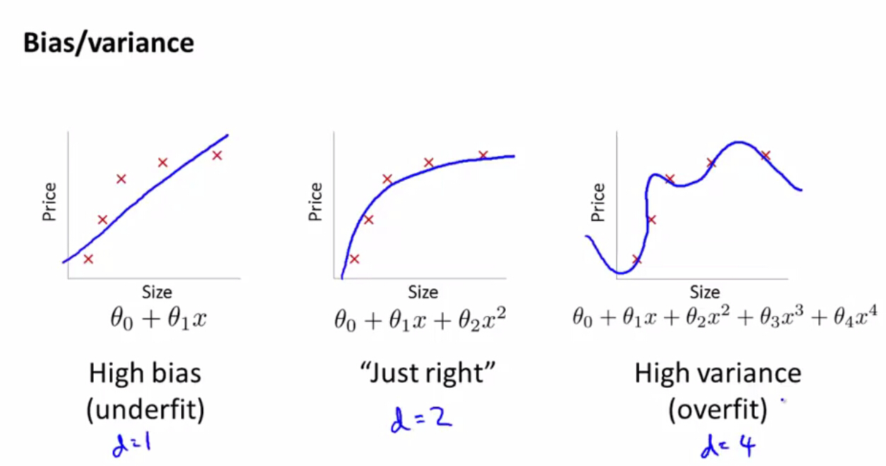
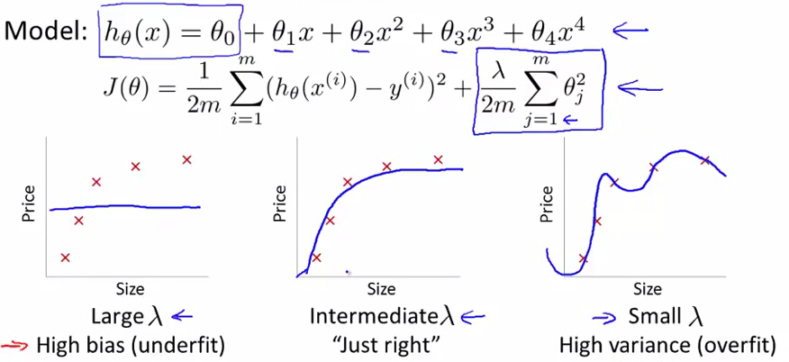
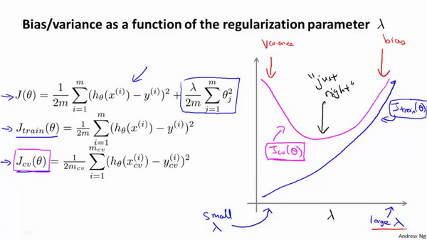

# 
Bias vs Variance 偏差与方差

  

## What
----

  

多项式回归中，如果多项式次数高，则易**过拟合，此时模型出现高方差high variance (overfitting)**：
* $$J_{train}(\theta) \text{ is small}$$
* $$J_{cv}(\theta) \gg J_{test}(\theta)$$

当次数较低时，易出现**欠拟合，此时模型出现高偏差high bias (underfitting)**：
* $$J_{train}(\theta) \text{ is large}$$
* $$J_{cv}(\theta) \approx J_{test}(\theta)$$

偏差与方差分别是用于衡量一个模型泛化误差的两个方面；
1. 偏差指模型预测的期望值与真实值的差，描述模型的拟合能力。

    偏差由于对学习算法做错误假设，或模型复杂度不够。比如真实模型是二次函数，而假设模型为一次函数。由偏差引起的误差在训练上就能体现，或说训练误差主要是由偏差造成。

2. 方差指模型预测的期望值与预测值的差平方和，描述模型的稳定性。

    方差由于模型复杂度相对于训练集过高导致。比如真实模型是二次函数，而假设模型是高次函数。由方差引起的误差体现在测试误差相对训练误差的增量上。

在监督学习中，模型的泛化误差可分解为偏差、方差与噪声之和：

$$
Err(x) = \mathrm{Bias}^2 + \mathrm{Variance} + \mathrm{Irreducible Error}
$$

  

## How to Fix Bias/Variance
----
神经网络拟合能力强，因此它的训练误差（偏差）通常小。但过强拟合能力导致较大方差，使模型测试误差（泛化误差）增大。因此深度学习核心工作之一是研究如何降低模型泛化误差，这类方法统称为正则化方法。

正规化能解决过拟合。$$\lambda$$越大，对参数$$\theta$$惩罚力度越大。但惩罚过重，造成欠拟合，即高偏差。如果$$\lambda$$较小，则意味没有惩罚$$\theta$$，不能解决过拟合，出现高方差：

  

To choose model and regularization term $$\lambda$$, need to:
1. Create a list of lambdas (i.e. $$\lambda \in [0,0.01,0.02,0.04,0.08,0.16,0.32,0.64,1.28,2.56,5.12,10.24]$$);
2. Create a set of models with different degrees or any other variants.
3. Iterate through all $$\lambda$$ and for each $$\lambda$$, go through all models to learn some $$\theta$$.
4. Compute the cross validation error using the learned $$\theta$$ (computed with $$\lambda$$) on the $$J_{CV}(\theta)$$ without regularization or $$\lambda = 0$$.
5. Select the best combo that produces the lowest error on the cross validation set.
6. Using the best combo $$\theta$$ and $$\lambda$$, apply it on $$J_{test}(\theta)$$ to see if it has a good generalization of the problem.

  

下图反映正规化过程中，训练集和交叉验证集误差随$$\lambda$$变化的曲线：

* 随$$\lambda$$增加，训练集误差不断增加，而交叉验证集误差先减小后增加，最终训练集误差和交叉验证集误差近似：偏差 - 欠拟合。
​* 当$$\lambda$$较小时，训练集误差较小而交叉验证集误差较大，即交叉验证集误差远大于训练集误差：方差 - 过拟合。

  

  
