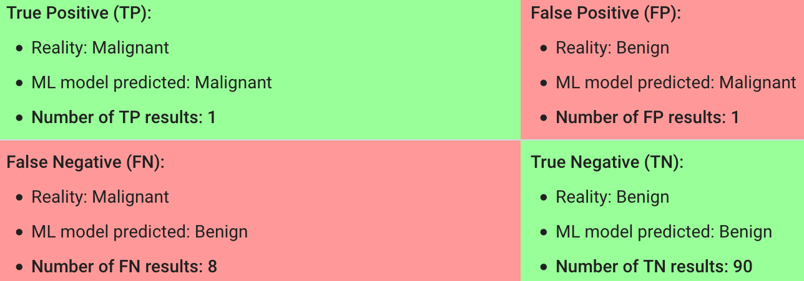

# 
Confusion Matrix

  

## What
----

混淆矩阵：
- True Positive(TP)：正类预测为正类。
- True Negative(TN)：负类预测为负类。
- False Positive(FP)：负类预测为正类，即误报（Type I error）。
- False Negative(FN)：正类预测为负类，即漏报（Type II error）。

 

### Accuracy
**Accuracy** is the fraction of predictions model got right:

$$
\mathrm{Accuracy} = \frac{\mathrm{Number\ of\ correct\ predictions}}{\mathrm{Total\ number\ of\ predictions}}
$$

For binary classification, accuracy can be calculated as follows:

$$
\mathrm{Accuracy} = \frac{TP + TN}{TP + TN + FP + FN}
$$

For the following model that classified 100 tumors as malignant (positive class) or benign (negative class):

$$
\mathrm{Accuracy} = \frac{TP + TN}{TP + TN + FP + FN} = \frac{1 + 90}{1 + 90 + 1 + 8} = 0.91
$$

 

### Precision
**Precision** attempts to answer what proportion of positive identifications was actually correct?

$$
\mathrm{Precision} = \frac{TP}{TP + FP}
$$

For the example:
$$
\mathrm{Precision} = \frac{TP}{TP + FP} = \frac{1}{1+1} = 0.5
$$

 

### Recall
**Recall** attempts to answer what proportion of actual positives was identified correctly?

$$
\mathrm{Recall} = \frac{TP}{TP + FN}
$$

For the example:
$$
\mathrm{Recall} = \frac{1}{1+8} = 0.11
$$

  
