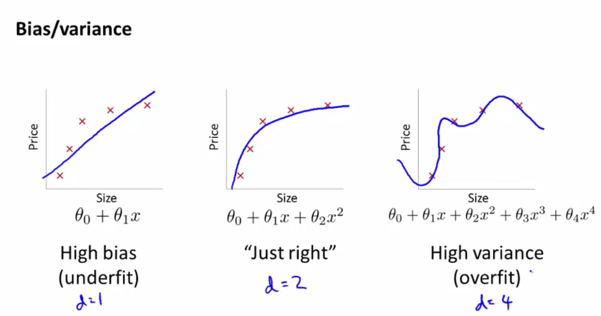

# 
Interview Questions

  

## Bias vs Variance
----

  

多项式回归中，如果多项式次数高，则易过拟合，此时模型出现高方差high variance (overfitting)：
* $$J_{train}(\theta) \text{ is small}$$
* $$J_{cv}(\theta) \gg J_{test}(\theta)$$

当次数较低时，易出现欠拟合，此时模型出现高偏差high bias (underfitting)：
* $$J_{train}(\theta) \text{ is large}$$
* $$J_{cv}(\theta) \approx J_{test}(\theta)$$