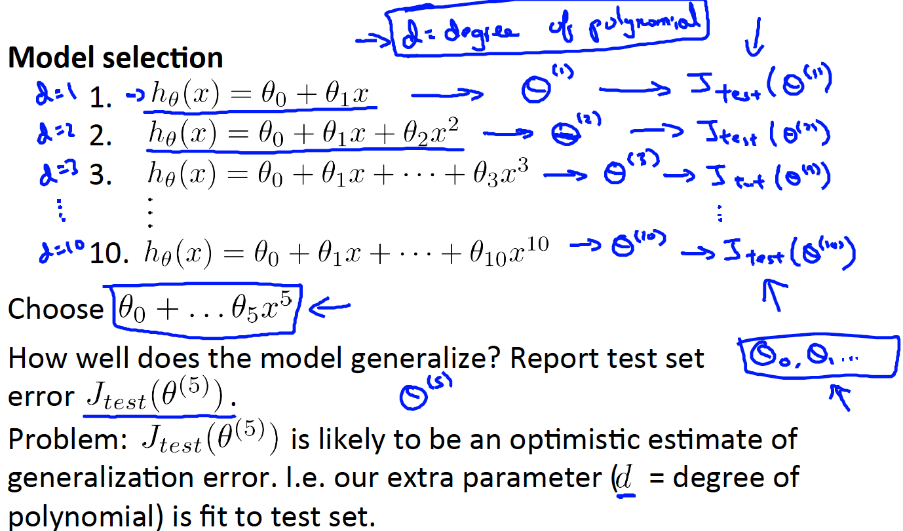
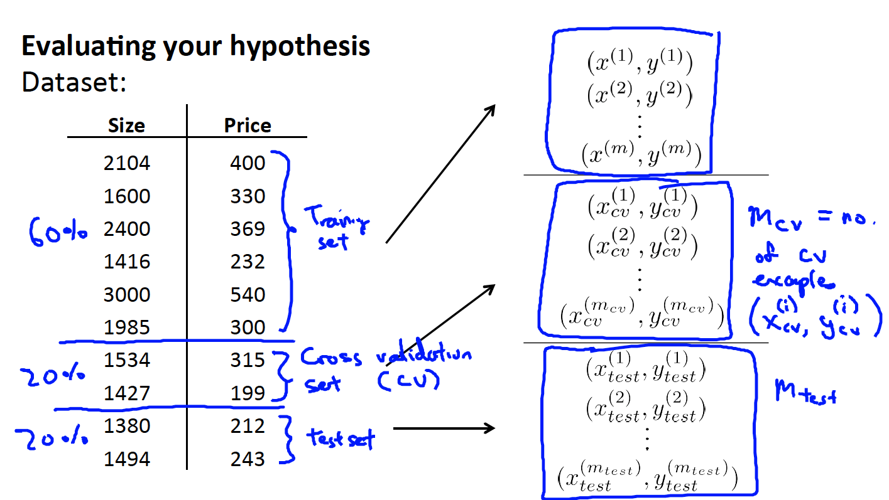

# 
Validation Dataset

  

## Why
----
在多项式回归中，尝试不同多项式次数（ degree ），形成不同的预测模型：

  

计算各模型对应的测试误差，假设$$degree=5$$时，测试误差最小，选出以下模型：

$$
h_{\theta}(x) = \theta_{0} + \theta_{1}x + ... + \theta_{5}x^{5}
$$

$$degree$$的确定，是用于模型选择，如在线性回归中确定$$\theta$$一样。在线性回归中，通过训练集确定模型，测试集来评估模型泛化能力。在多项式回归中，通过训练集获得参数$$\theta$$，而通过测试集确定模型。那么，两个集合用完了，缺少评估模型泛化能力的数据集。因此，引入了交叉验证集（Cross Validation Set）。

> The problem is this will not be a fair estimate of how well hypothesis generalizes based on test set. The reason is what we've done is we've fit this extra parameter _d_, degree of polynomial. We chose the value of _d_ that gave the best possible performance on the test set. So, the performance of parameter vector $$\theta_{5}$$, on the test set, that's likely to be an overly optimistic estimate of generalization error.
> 
> So, because I had fit this parameter _d_ to test set is no longer fair to evaluate hypothesis on test set, because I fit my parameters to this test set, I've chose the degree _d_ of polynomial using the test set. So hypothesis is likely to do better on test set than it would on new examples that it hasn't seen before.

  

## How
----
* 训练集：60%，确定参数$$\theta$$。
* 交叉验证集：20%，模型选择。
* 测试集：20%，评价模型预测能力。

  

  

## 误差函数
----
训练集：

$$
J_{train}(\theta) = \frac{1}{2m} \sum^{m_{train}}_{i=1} (h_{\theta}(x^{(i)}_{train}) - y^{(i)}_{train})^{2}
$$

交叉验证集：

$$
J_{cv}(\theta) = \frac{1}{2m} \sum^{m_{cv}}_{i=1} (h_{\theta}(x^{(i)}_{cv}) - y^{(i)}_{cv})^{2}
$$

测试集：

$$
J_{test}(\theta) = \frac{1}{2m} \sum^{m_{test}}_{i=1} (h_{\theta}(x^{(i)}_{test}) - y^{(i)}_{test})^{2}
$$