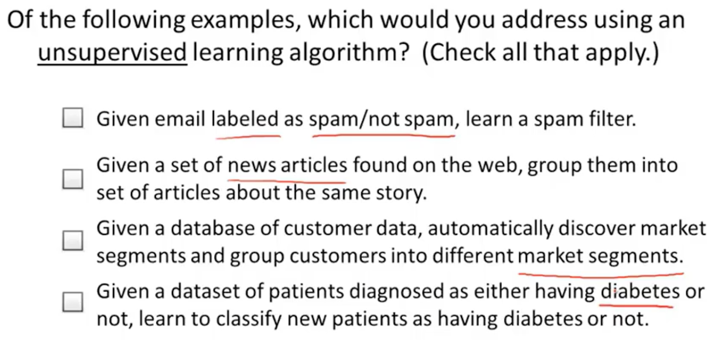

# 
Background

  

## Supervised Learning
----
**（数据集有输入和标签。）**监督学习是输入标记的数据，然后建模拟合，最后让计算机预测未知数据的结果。

一般有两种：
1. 回归问题 Regression：预测一系列**连续值**。

   

2. 分类问题 Classification：预测一系列**离散值**。

    常用的分类器有人工神经网络、SVM、近期邻居法、高斯混合模型、朴素贝叶斯方法、决策树和径向基函数分类。

   

当特征量种类很多的时，计算机内存不够用，可用SVM。**SVM用数学方式能让计算机处理无限多个特征。**

  

## Unsupervised Learning
----
**（数据集只有输入，没有标签。）**相对监督学习，训练集没有人为标注（无反馈），我们不会给出结果或无法得知训练集结果是什么，单纯由计算机通过无监督学习算法自行分析，从而得出结果。

Unsupervised Learning allows us to approach problems with little or no idea what our results should look like. We ca derive structure from data where we don't necessarily know the effect of variables. We can derive this structure by clustering the data based on relationships among the variables in the data. With Unsupervised Learning, there is no feedback based on the prediction results.

无监督学习一般分为两种：
1. 聚类 Clustering
   - 新闻聚合
   - 市场细分
   - 社交网络分析
2. 非聚类
   - 鸡尾酒问题。在鸡尾酒会上，说话声音彼此重叠，很难分辨面前的人说什么。我们很难对这个问题数据标注，而通过无监督学习算法，可将说话者声音同背景音乐分离。

下面问题答案为2和3：

  

## Semi-supervised Learning
----
半监督学习就是利用数据集上已有的模型，对未知数据打标签。