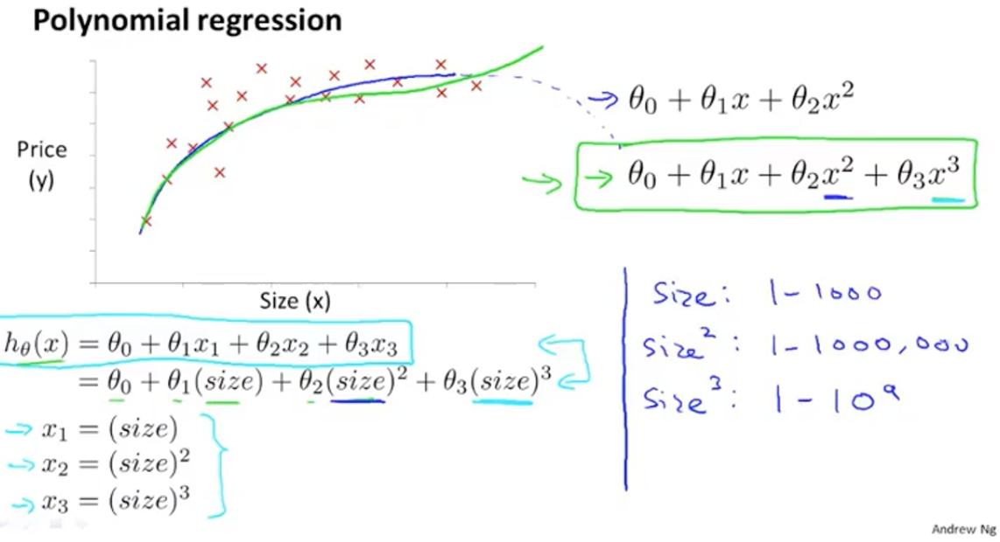

# 
Features and Polynomial Regression

  

特征选取时，也可自己归纳总结定义新特征，用来**取代或拆分**旧的一个或多个特征。比如，对房屋面积特征，可将其拆为长度和宽度两个特征。反之，也可合并长度和宽度两个特征为面积一个特征。

线性回归只能以直线对数据拟合，有时需使用曲线对数据拟合，即**多项式回归（Polynomial Regression）**。

比如，对房屋问题，如果使用二次方模型$$h_{\theta}(x) = \theta_{0} + \theta_{1}x_{1} +  \theta_{2}x_{2}^{2}$$，会遇到二次函数曲线下降，而这不符合实际。因为，房屋价格不会随着面积增大而减小。所以，可以使用三次方模型，$$h_{\theta}(x) = \theta_{0} + \theta_{1}x_{1} + \theta_{2}x_{2}^{2} + \theta_{3}x_{3}^{3}$$或平方根模型，$$h_{\theta}(x) = \theta_{0} + \theta_{1}x_{1} + \theta_{2}x_{2}^{2} + \theta_{3}\sqrt{x_{3}}$$。

使用多项式回归时，**务必要进行特征缩放**。比如上图右下角，$$x_1$$范围为$$[1, 1000]$$，那么$$x_{1}^{2}$$范围为$$[1, 1000000]$$。不用特征缩放，范围更不一致。