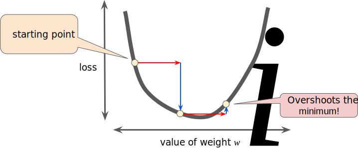

# 
Gradient Descent

  

## Why
----
在特征量很大情况下，即便生成图像，人工也很难读出$$J(\theta)$$最小值，且多数情况无法可视化，故引入梯度下降（Gradient Descent），让计算机自动找出最小化代价函数时对应的$$\theta$$值。

  

  

## How
----
梯度下降思想是：
1. 开始时，随机选择一个参数组合$$( {\theta_{0}},{\theta_{1}},......,{\theta_{n}} )$$作为起始点，计算代价函数。
2. 然后寻找下一个使得代价函数下降最多的参数组合。
3. 不断迭代，直到找到一个局部最小值。

**注意，由于下降情况只考虑当前参数组合，所以无法确定当前局部最小值是否是全局最小值。不同初始参数组合，可能产生不同的局部最小值：**

  

**The gradient descent algorithm is to repeat until convergence:**

$$
\theta_{j} := \theta_{j} - \alpha \frac{\partial}{\partial \theta_{j}} \text{J}(\theta_0, \theta_1)
$$

where $$j = 0, 1$$ represents the feature index number.

计算时要**批量更新$$\theta$$值**，否则结果上有所出入。

  

  

## Learning Rate
----
We make steps down the cost function in the direction with the steepest descent. The size of each step is determined by the parameter $$\alpha$$, which is called **learning rate**.

> 学习速率决定参数值变化速率，即“走多少距离”。偏导部分决定下降方向，即“下一步往哪走”。

For example, the distance between each 'star' represents a step determined by parameter $$\alpha$$. The direction is determined by the partial derivative of $$\mathit{J}(\theta_0, \theta_1)$$. Depending on where one starts on graph, one could end up at different points. 

**Hyperparameters** are the knobs that programmers tweak in machine learning algorithms. If a learning rate is too small, learning will take too long. Conversely, if a learning rate is too large, the next point will perpetually bounce haphazardly across the bottom of the well like a quantum mechanics experiment gone horribly wrong.

  

  

  

## Deep Understanding
----
Regardless of the slope's sign for $$\frac{\partial}{\partial \theta_j} \text{J}(\theta_1)$$, $$\theta_1$$ eventually converges to its minimum value. The following graph shows that when the slope is negative, the value of $$\theta_1$$ increases and when it is positive, the value of $$\theta_1 $$decreases.

  

We should adjust parameter $$\alpha$$ to ensure that the gradient descent converges in a reasonable time. 

  

学习速率只需选定即可，不需运行时动态改变。随着斜率接近0，代价函数变化幅度会越小，直到收敛局部极小值：

  

  

## Gradient Descent For Linear Regression
----

  

将线性回归模型公式代入梯度下降公式可得：

  

当$$j=0, j=1​$$时，线性回归代价函数求导推导过程为：

$$
\begin{split}
\frac{\partial}{\partial\theta_j}J(\theta_1,\theta_2) &= \frac{\partial}{\partial\theta_j}(\frac{1}{2m}\sum\limits_{i=1}^{m}(h_{\theta}(x^{(i)})-y^{(i)})^{2}) \\
&= (\frac{1}{2m} * 2\sum\limits_{i=1}^{m}(h_{\theta}(x^{(i)})-y^{(i)})) * \frac{\partial}{\partial\theta_j}(h_{\theta}(x^{(i)})-y^{(i)}) \\
&= (\frac{1}{m} * \sum\limits_{i=1}^{m} (h_{\theta}(x^{(i)}) - y^{(i)})) * \frac{\partial}{\partial\theta_j} (\theta_0{x_0^{(i)}} + \theta_1{x_1^{(i)}} - y^{(i)})
\end{split}
$$

所以当$$j=0$$时：

$$
\frac{\partial}{\partial\theta_0} J(\theta) = \frac{1}{m} \sum\limits_{i=1}^{m} (h_{\theta}(x^{(i)}) - y^{(i)}) * x_{0}^{(i)}
$$

所以当$$j=1$$时：

$$
\frac{\partial}{\partial\theta_1} J(\theta) = \frac{1}{m} \sum\limits_{i=1}^{m} (h_{\theta}(x^{(i)}) - y^{(i)}) * x_{1}^{(i)}
$$

上文提到的梯度下降都为**批量梯度下降（Batch Gradient Descent）**，即每次计算都使用所有数据集$$\left(\sum\limits_{i=1}^{m}\right)​$$。

由于线性回归函数是凸函数，呈现碗状，即只有一个全局最优值，所以函数定会收敛到全局最小值（学习速率不可过大）。所以，线性回归函数求最小值属于凸函数优化问题。

  

  

  

  

  

## Stochastic Gradient Descent 随机梯度下降
----
In gradient descent, a batch is the total number of examples you use to calculate the gradient in a single iteration. So far, we've assumed that the batch has been the entire data set. A very large batch may cause even a single iteration to take a very long time to compute.

A large data set with randomly sampled examples probably contains redundant data. In fact, redundancy becomes more likely as the batch size grows. Some redundancy can be useful to smooth out noisy gradients, but enormous batches tend not to carry much more predictive value than large batches.

By choosing examples at random from data set, we could estimate a big average from a much smaller one. **Stochastic gradient descent (SGD)** takes this idea to the extreme -- it uses only a single example (a batch size of 1) per iteration. Given enough iterations, SGD works but is very noisy. The term "stochastic" indicates that the one example comprising each batch is chosen at random.

**Mini-batch stochastic gradient descent (mini-batch SGD)** is a compromise between full-batch iteration and SGD. A mini-batch is typically between 10 and 1,000 examples, chosen at random. Mini-batch SGD reduces the amount of noise in SGD but is still more efficient than full-batch.

鉴于批量梯度下降性能问题，引入随机梯度下降（Stochastic Gradient Descent）：

$$
\begin{aligned}
\text{Repeat until convergence} & \{ \\
& \quad \text{for}\ i = 1\ \text{to}\ m\text{:} \\
& \quad\quad \theta_{j} = \theta_{j} + \alpha(y^{(i)} - h_{\theta}(x^{(i)}))x_{j}^{(i)} \\
& \}
\end{aligned}
$$

|            |           概括          |	优点                   |	缺点 |
| ---------- | ---------------------- | ----------------------- | ---- |
| 批量梯度下降 | 减小训练样本总预测代价。   | 能获得最优解，支持并行计算。 | 样本容量大时，性能显著下降。 |
| 随机梯度下降 | 减小每个训练样本预测代价。 |  训练速度快。              | 不一定获得全局最优，常出现抖动和噪音，且不能通过并行计算优化。 |

  

## Gradients
----
The gradient of a function, denoted as follows, is the vector of partial derivatives with respect to all of the independent variables:

$$
\nabla{f}
$$

For instance, if:

$$
f(x,y) = e^{2y}\sin{(x)}
$$

then:

$$
\nabla{f(x,y)} = (\frac{\partial{f}}{\partial{x}}(x,y), \frac{\partial{f}}{\partial{y}}(x,y)) = (e^{2y}\cos{(x)}, 2e^{2y}\sin{(x)})
$$

The number of dimensions in the vector is equal to the number of variables in the formula for $$f$$; in other words, the vector falls within the domain space of the function. For instance, the graph of the following function $$f(x, y)$$:

$$
f(x, y) = 4 + (x-2)^{2} + 2y^{2}
$$

when viewed in three dimensions with $$z = f(x,y)$$ looks like a valley with a minimum at (2, 0, 4):

The gradient of $$f(x, y)$$ is a two-dimensional vector that tells you in which $$(x, y)$$ direction to move for the maximum increase in height. Thus, the negative of the gradient moves you in the direction of maximum decrease in height. In other words, the negative of the gradient vector points into the valley.

In machine learning, gradients are used in gradient descent. We often have a loss function of many variables that we are trying to minimize, and we try to do this by following the negative of the gradient of the function.

Note that a gradient is a vector, so it has both of the following characteristics:
1. a direction
2. a magnitude

The gradient always points in the direction of steepest increase in the loss function. The gradient descent algorithm takes a step in the direction of the negative gradient in order to reduce loss as quickly as possible.

  

## Learning Rate
----
As noted, the gradient vector has both a direction and a magnitude. Gradient descent algorithms multiply the gradient by a scalar known as the **learning rate (step size)** to determine next point. For example, if the gradient magnitude is 2.5 and the learning rate is 0.01, then the gradient descent algorithm will pick the next point 0.025 away from the previous point.

