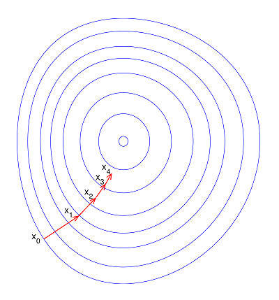

# 
Linear Regression with Multiple Variables

  

## Multiple Features
----

  

参照上图，有$${x}^{(2)}\text{=}\begin{bmatrix} 1416\\\ 3\\\ 2\\\ 40 \end{bmatrix}, {x}^{(2)}_{1} = 1416$$

  

为计算方便，假设$$x_0^{(i)} = 1$$。对$$\theta_0$$，和单特征一样，将其看作基础数值。例如，房价基础价格。参数向量维度为$$n+1$$，在特征向量中添加$$x_{0}$$后，其维度变为$$n+1$$。运用线性代数，可简化$$h$$：

$$
h_\theta(x)=\begin{bmatrix}\theta_0\; \theta_1\; ... \;\theta_n \end{bmatrix}\begin{bmatrix}x_0 \newline x_1 \newline \vdots \newline x_n\end{bmatrix}= \theta^T x
$$

  

## Gradient Descent for Multiple Variables
----

  

多变量代价函数类似于单变量代价函数，即$$J({\theta_{0}}, {\theta_{1}}, ..., {\theta_{n}}) = \frac{1}{2m}\sum\limits_{i=1}^{m}( h_{\theta} (x^{(i)}) - y^{(i)})^{2}$$，其中$$h_\theta(x) = \theta^{T}x$$。

多变量梯度下降公式为：

$$
\begin{align*} & \text{repeat until convergence:} \; \lbrace \newline \; &\theta_{j} := \theta_{j} - \alpha\frac{\partial}{\partial\theta_{j}} J(\theta_{0}, \theta_{1}, ..., \theta_{n}) \newline \rbrace \end{align*}
$$

解出偏导得：

$$
\begin{align*}& \text{repeat until convergence:} \; \lbrace \newline \; & \theta_j := \theta_j - \alpha \frac{1}{m} \sum\limits_{i=1}^{m} (h_\theta(x^{(i)}) - y^{(i)}) \cdot x_j^{(i)} \; & \text{for j := 0,1...n}\newline \rbrace\end{align*}​
$$

可展开为：

$$
\begin{aligned} & \text{repeat until convergence:} \; \lbrace \newline \; & \theta_0 := \theta_0 - \alpha \frac{1}{m} \sum\limits_{i=1}^{m} (h_\theta(x^{(i)}) - y^{(i)}) \cdot x_0^{(i)}\newline \; & \theta_1 := \theta_1 - \alpha \frac{1}{m} \sum\limits_{i=1}^{m} (h_\theta(x^{(i)}) - y^{(i)}) \cdot x_1^{(i)} \newline \; & \theta_2 := \theta_2 - \alpha \frac{1}{m} \sum\limits_{i=1}^{m} (h_\theta(x^{(i)}) - y^{(i)}) \cdot x_2^{(i)} \newline & \vdots \newline \; & \theta_n := \theta_n - \alpha \frac{1}{m} \sum\limits_{i=1}^{m} (h_\theta(x^{(i)}) - y^{(i)}) \cdot x_n^{(i)} &\newline \rbrace \end{aligned}
$$

同单变量梯度下降，计算时需**同时更新**所有参数。

因为$$h_\theta(x)= \theta^T x$$，则得到同时更新参数的向量化实现：

$$
\theta = \theta - \alpha \frac{1}{m}(X^T(X\theta-y))
$$

> $$X$$: 训练集数据，$$m\times(n+1)$$维矩阵（包含基本特征$$x_0=1$$）。

  

## 特征值缩放 Feature Scaling
----
### Why
在原始资料中，各变数范围不同。对机器学习，若没标准化，目标函数无法适当运作。比如，多数分类器利用两点距离计算差异，若其中一个特征有非常广范围，那两点间差异会被该特征左右。因此，所有特征都该标准化。

另一个理由是特征缩放能加速梯度下降收敛。如不归一化，各维特征跨度差距大，目标函数会是“扁”的：

  

梯度下降时，梯度方向会偏离最小值方向，走很多弯路。如果归一化，每一步梯度方向基本指向最小值，可大步前进，目标函数就“圆”了：

  

特征缩放目的是使各特征值范围尽量一致。

 

### How
最简单方式是缩放特征范围到$$[0, 1]$$或$$[-1, 1]$$：

$$
x^{'} = \frac{x-\text{min}(x)}{\text{max}(x)-\text{min}(x)}
$$

  

 

均值归一化（mean normalization）：

$$
x^{'} = \frac{x-\text{mean}(x)}{\text{max}(x)-\text{min}(x)}
$$

  

对于特征的范围，不一定需$$-1 \leqslant x \leqslant 1​$$，类似$$1\leqslant x \leqslant 3​$$等也可取。而诸如$$-100 \leqslant x \leqslant 100$$，$$-0.00001 \leqslant x \leqslant 0.00001​$$显得过大和过小了。

**另外，一旦采用特征缩放，需对所有输入采用特征缩放，包括训练集、测试集和预测输入等。**

  

## Learning Rate
----
两种方法确定函数是否收敛：
1. 多次迭代收敛法
  - 无法确定需要多少次迭代
  - 较易绘制关于迭代次数的图像
  - 根据图像易预测所需的迭代次数
2. 自动化测试收敛法（比较阈值）
  - 不易选取阈值
  - 代价函数近乎直线时无法确定收敛情况

对梯度下降，一般采用多次迭代收敛法得出最小化代价函数参数值。自动化测试收敛法（如设定$$J\left(\theta\right) < {10}^{-3}$$时判定收敛）几乎不被使用。

可通过绘制**代价函数关于迭代次数的图像**，可视化梯度下降过程，借助图形发现代价函数趋向于多少时能趋于收敛：

  

It has been proven that if learning rate $$ \alpha $$ is sufficiently small, then $$ \text{J}(\theta_0) $$ will decrease on every iteration.

  

对于学习速率$$\alpha$$，下图中，左图可能表明$$\alpha$$过大，代价函数无法收敛。右图可能表明$$\alpha$$过小，代价函数收敛太慢。当然，$$\alpha$$够小时，代价函数在每轮迭代后定会减少。

  

通过不断改变$$\alpha$$值，绘制并观察图像，并以此确定合适的学习速率。尝试时，可取的$$\alpha$$值如$$0,001,\;0.003,\;0.01,\;0.03,\;0.1,\;\dots$$。