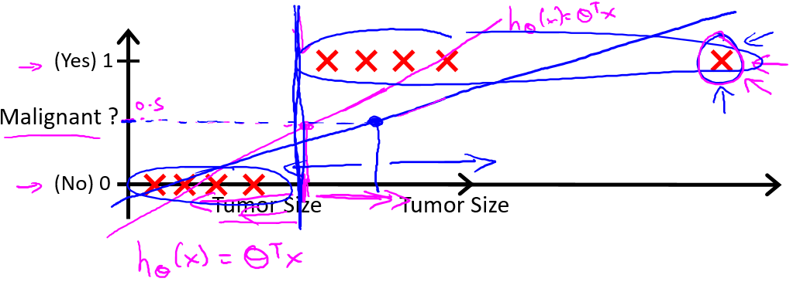

# 
Classification and Representation

  

在分类问题中，预测的结果是离散值（结果是否属于某一类），**逻辑回归算法（Logistic Regression）用于解决分类问题**：

- 垃圾邮件判断
- 金融欺诈判断
- 肿瘤诊断

肿瘤诊断问题：

肿瘤诊断问题是二元分类问题（binary class problems）。定义$$y \in\lbrace 0, 1\rbrace$$，其中0表示负向类（negative class），代表恶性肿瘤，1为正向类（positive class）。如图，定义最右边的样本为**偏差项**。

未加入偏差项时，线性回归算法给出品红色的拟合直线，若规定：
* 当$$h_\theta(x) \geqslant 0.5$$，预测$$y = 1$$，正向类；
* 当$$h_\theta(x) \lt 0.5$$，预测$$y = 0$$，负向类。

即以0.5为阈值（threshold），则可根据线性回归结果，得到分类结果$$y$$。

加入偏差项，线性回归算法给出靛青色的拟合直线。如果阈值仍为0.5，算法在某些情况下给出错误结果。不仅如此，线性回归算法值域为全体实数集（$$h_\theta(x) \in R$$），则当线性回归函数给出诸如$$h_\theta(x) = 10000, h_\theta(x) = -10000$$等很大/很小（负数）数值时，结果$$y \in \lbrace 0, 1\rbrace$$，显得怪异。

区别于线性回归算法，**逻辑回归算法是一个分类算法，其输出值永远在0到1间**，即$$h_\theta(x) \in (0,1)$$。