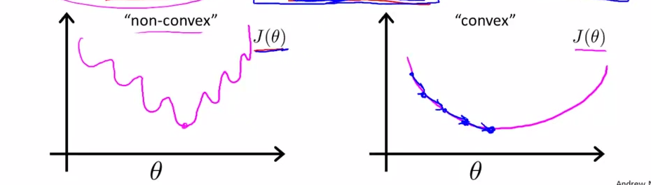
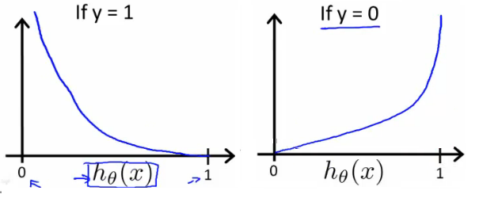
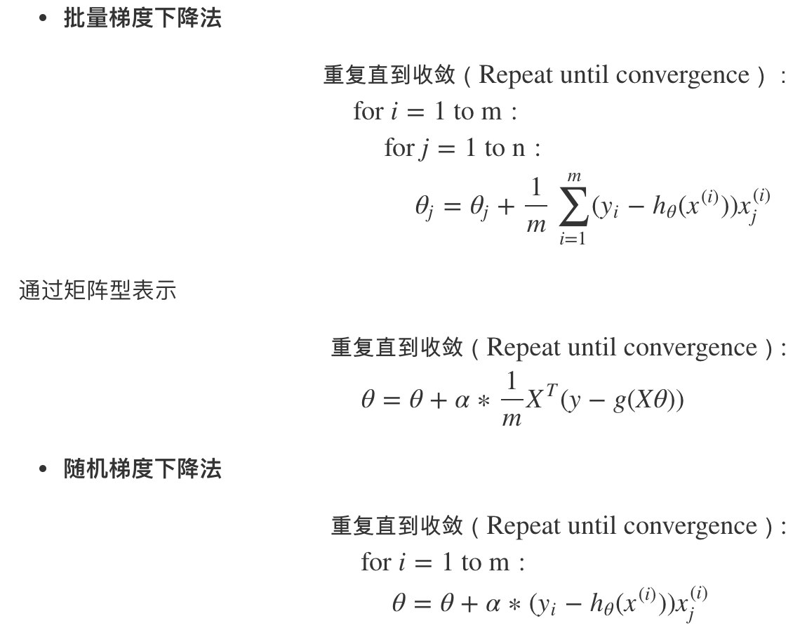
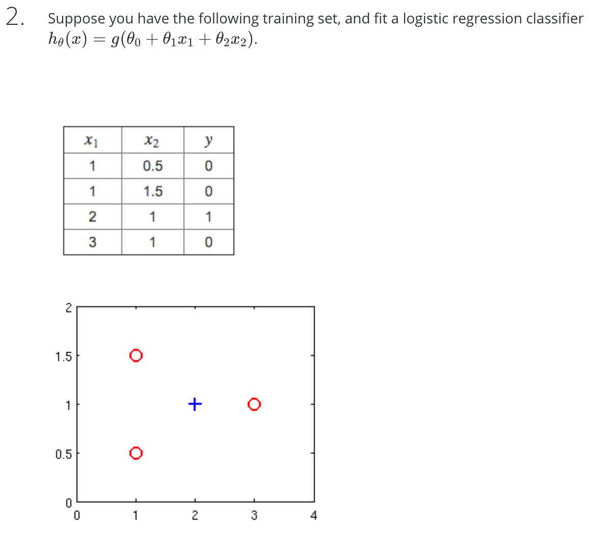
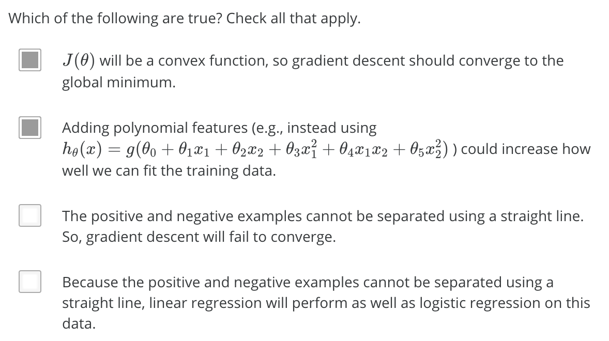
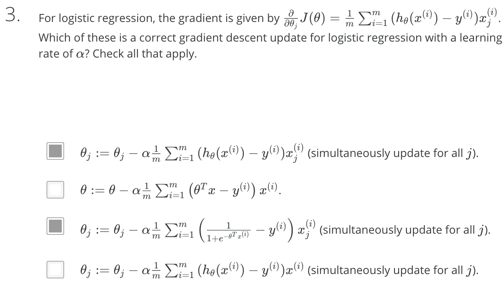
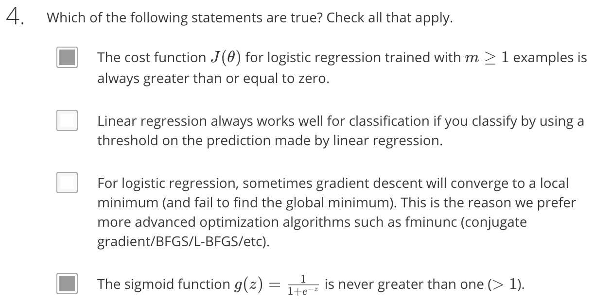

# 
Cost Function & Gradient Descent

  

## Cost Function
----
如果用线性回归代价函数：$$J(\theta)=\frac{1}{2m}\sum\limits_{i=1}^{m}(h_{\theta}(x^{(i)})-y^{(i)})^{2}$$，其中$$h_\theta(x) = g(\theta^{T}x)$$，可绘制关于$$J(\theta)$$图像如下左图。回忆线性回归平方损失函数，其是一个二次凸函数（碗状）。二次凸函数只有一个局部最小点，即全局最小点。下左图有许多局部最小点，这样梯度下降算法无法确定收敛点是全局最优。

  

对逻辑回归，更换平方损失函数为**对数损失函数**，可由统计学最大似然估计法推出代价函数$$J(\theta)$$：

$$
J(\theta) = \dfrac{1}{m} \sum_{i=1}^m \mathrm{Cost}(h_\theta(x^{(i)}),y^{(i)}) \\
\mathrm{Cost}(h_\theta(x),y) =
  \begin{cases}
    -\log(h_\theta(x))       & \quad \text{if } y=1 \\
    -\log(1-h_\theta(x))  & \quad \text{if } y=0
  \end{cases}
$$

该函数等价于：

$$
\begin{split}
\mathrm{Cost}(h_{\theta}(x),y) &= -y\log(h_{\theta}(x)) - (1-y)\log(1-h_{\theta}(x)) \\
&= (\log(g(X\theta)))^{T})y + \log(1-g(X\theta))^{T}(1-y)
\end{split}
$$

代价函数随预测值$$h_{\theta}x$$变化为：

  

如左图，当训练集结果为$$y=1$$（正样本）时，随着假设函数趋向$$1$$，代价函数趋于$$0$$，意味拟合程度好。如果假设函数趋于0，则给出一个很高代价，拟合程度差。算法会根据其纠正$$\theta$$值。右图$$y=0$$同理。

> The equation for Cost Function is closely related to Shannon's Entropy measure from Information Theory. It is also the negative logarithm of the likelihood function, assuming a Bernoulli distribution of $$y$$. Indeed, minimizing the loss function yields a maximum likelihood estimate.

  

## 最小化代价函数
----
与线性回归一致，也使用梯度下降法来最小化代价函数：

  

  

## Simplified Cost Function and Gradient Descent
----
对二元分类问题，把代价函数简化为一个函数：

$$
\mathrm{Cost}(h_{\theta}(x), y)=-y \times log(h_{\theta}(x)) - (1-y) \times log(1-h_{\theta}(x))
$$

当$$y = 0$$，左边式子整体为0。当$$y = 1$$，则$$1-y=0$$，右边式子整体为0，和上面分段函数一样，而一个式子计算起来更方便。

$$
J(\theta) = - \frac{1}{m} \displaystyle \sum_{i=1}^{m} [y^{(i)}log(h_{\theta}(x^{(i)})) + (1 - y^{(i)})log(1 - h_{\theta}(x^{(i)}))]
$$

向量化实现：

$$
h = g(X\theta) \\
J(\theta) = \frac{1}{m} (-y^{T}log(h)-(1-y)^{T}log(1-h))
$$

为最优化$$\theta$$，仍使用梯度下降法，算法同线性回归中一致：

$$
\text{repeat until convergence: }\lbrace \\
\theta_{j} := \theta_{j} - \alpha \frac{\partial}{\partial{\theta_{j}}}J({\theta}) \\
\rbrace
$$

解出偏导得：

$$
\begin{align*}& \text{repeat until convergence:} \; \lbrace \newline \; & \theta_j := \theta_j - \alpha \frac{1}{m} \sum\limits_{i=1}^{m} (h_\theta(x^{(i)}) - y^{(i)}) \cdot x_j^{(i)} \; & \text{for j := 0,1...n}\newline \rbrace\end{align*}
$$

虽形式上梯度下降算法同线性回归一样，但其中假设函不同，即$$h_\theta(x) = g(\theta^{T}x)$$，不过求导后的结果也相同。

向量化实现：$$\theta := \theta - \frac{\alpha}{m} X^{T} (g(X \theta ) - y)$$

 

### Quiz

  

## 代价函数求导过程
----
首先，

$$
J(\theta) = - \frac{1}{m} \sum_{i=1}^m [y^{(i)}log (h_\theta (x^{(i)})) + (1 - y^{(i)})log (1 - h_\theta(x^{(i)}))]
$$

令$$f(\theta) = y^{(i)}log(h_{\theta}(x^{(i)})) + ( 1-y^{(i)})log(1-h_{\theta}(x^{(i)}))$$。由于$$h_\theta(x) = g(z)$$，$$g(z) = \frac{1}{1+e^{(-z)}}$$，则

$$
\begin{split}
f(\theta) &= y^{(i)}log(\frac{1}{1+e^{-z}})+(1-y^{(i)})log(1-\frac{1}{1+e^{-z}}) \\
&= -y^{(i)} log(1 + e^{-z}) - (1-y^{(i)})log(1+e^{z})
\end{split}
$$

因为$$z=\theta^Tx^{(i)}$$，对$$\theta_j$$求偏导没有$$\theta_j$$的项，求偏导为0，都消去得：

$$
\frac{\partial{z}}{\partial{\theta_{j}}} = \frac{\partial}{\partial{\theta_{j}}}(\theta^{T}x^{(i)})=x^{(i)}_{j}
$$

所以有：

$$
\begin{split}
\frac{\partial}{\partial{\theta_{j}}}f(\theta) &= \frac{\partial}{\partial{\theta_{j}}}[-y^{(i)}log(1+e^{-z})-(1-y^{(i)})log(1+e^{z})] \\
&= -y^{(i)} \frac{\frac{\partial}{\partial{\theta_{j}}}(-z)e^{-z}}{1+e^{-z}} - (1-y^{(i)}) \frac{\frac{\partial}{\partial{\theta_{j}}}(z)e^{z}}{1+e^{z}} \\
&= -y^{(i)} \frac{-x^{(i)}_{j}e^{-z}}{1+e^{-z}} - (1-y^{(i)})\frac{x^{(i)}_{j}}{1+e^{-z}} \\
&= (y^{(i)} \frac{e^{-z}}{1+e^{-z}} - (1-y^{(i)}) \frac{1}{1+e^{-z}})x^{(i)}_{j} \\
&= (\frac{y^{(i)}(e^{-z}+1)-1}{1+e^{-z}})x^{(i)}_{j} \\
&=(y^{(i)} - \frac{1}{1+e^{-z}})x_{j}^{(i)} \\
&=(y^{(i)} - h_{\theta}(x^{(i)}))x_{j}^{(i)} \\
&=-(h_{\theta}(x^{(i)}) - y^{(i)})x_{j}^{(i)}
\end{split}
$$

则可得代价函数导数：

$$
\frac{\partial}{\partial{\theta_{j}}} J(\theta) = -\frac{1}{m} \sum\limits_{i=1}^{m} {\frac{\partial}{\partial{\theta_{j}}}f(\theta)} = \frac{1}{m} \sum\limits_{i=1}^{m} (h_\theta(x^{(i)}) - y^{(i)}) \cdot x_{j}^{(i)}
$$
