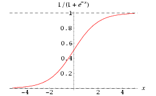
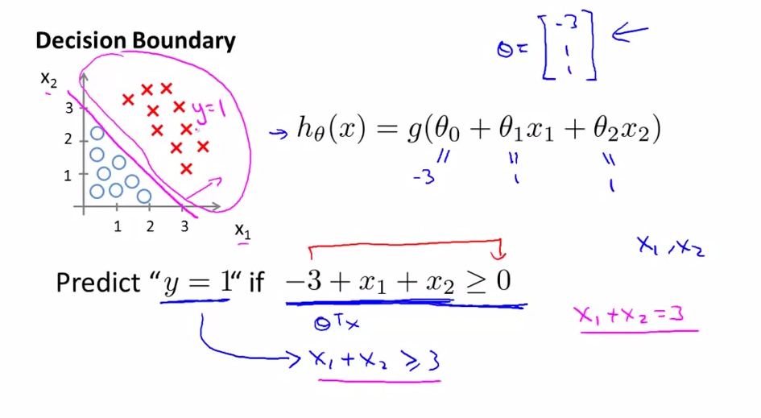
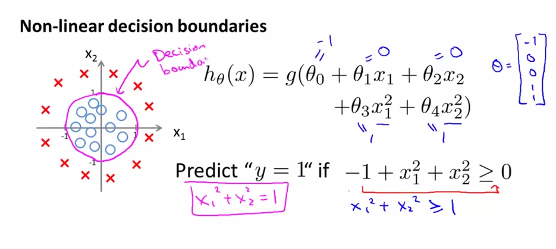

# 
Classification and Representation

  

## Hypothesis Representation
----
为使$$h_\theta(x) \in(0, 1)$$，引入逻辑回归模型，定义假设函数

$$
h_\theta(x)=g(z)=g(\theta^{T}x)
$$

其中，$$z=\theta^{T}x$$是分类边界，且$$g(z)=\frac{1}{1+e^{-z}}$$。对比线性回归函数$$h_\theta(x)=\theta^{T}x$$，$$g$$表示逻辑函数，复合起来，称为逻辑回归函数。

**逻辑函数是S形函数，将所有实数映射到$$(0, 1)$$范围。**$$g(z)$$是Sigmoid Function，亦称Logic Function： 

  

可看到，预测函数$$h_\theta(x)$$被限制在区间$$(0, 1)$$，且Sigmod是一个很好的阀值函数，阀值为0.5。

应用Sigmoid函数，则逻辑回归模型：$$h_{\theta}(x)=g(\theta^Tx) =\frac{1}{1+e^{-\theta^Tx}}$$。模型中，$$h_\theta(x)$$作用是根据输入$$x$$及参数$$\theta$$，计算输出$$y=1$$的可能性（estimated probability）。概率学表示为：

$$
h_\theta(x) = P(y=1 | x ; \theta) = 1 - P(y=0 | x ; \theta) \\
\text{其中} P(y = 0 | x;\theta) + P(y = 1 | x ; \theta) = 1
$$

以肿瘤诊断为例，$$h_\theta(x)=0.7$$表示$$70\%$$概率恶性肿瘤。

  

## Decision Boundary
----
决策边界是用来划清界限的边界。边界形态可以是点、线或平面。决策边界是预测函数$$h_{\theta}(x)$$的属性，而不是训练集属性。因为能作出划清类间界限的只有$$h_{\theta}(x)$$，而训练集只用来训练和调节参数。

 

### 线性决策边界
逻辑回归有假设函数$$h_\theta ( x )=g(z)=g(\theta^{T}x )$$。规定$$0.5$$为阈值：

$$
h_\theta(x) \geq 0.5 \Rightarrow y = 1 \\
h_\theta(x) < 0.5 \Rightarrow y = 0
$$

观察Sigmoid函数图像得当$$g(z) \geq 0.5$$，有$$z \geq 0$$，即$$\theta^Tx \geq 0$$。

同线性回归不同点在于：

$$
z \to +\infty, e^{-\infty} \to 0 \Rightarrow g(z)=1 \\
z \to -\infty, e^{\infty}\to \infty \Rightarrow g(z)=0
$$

线性预测函数$${h_\theta}( x )=g( {\theta_0}+{\theta_1}{x_1}+{\theta_{2}}{x_{2}})​$$是下图模型假设函数：

  

要进行分类，那么只要$${\theta_0}+{\theta_1}{x_1}+{\theta_{2}}{x_{2}}\geq0$$时，就预测$$y = 1$$，即预测为正向类。

如果取$$\theta = \begin{bmatrix} -3\\1\\1\end{bmatrix}$$，有$$z = -3+{x_1}+{x_2}$$。当$$z \geq 0$$ 即$${x_1}+{x_2} \geq 3$$时，易绘制图中品红色直线，即**决策边界**，为正向类（红叉数据）给出$$y=1$$分类预测结果。

 

### 非线性决策边界
为拟合下图数据，建模多项式假设函数：

$$
{h_\theta}( x )=g( {\theta_0}+{\theta_1}{x_1}+{\theta_{2}}{x_{2}}+{\theta_{3}}x_{1}^{2}+{\theta_{4}}x_{2}^{2} )
$$

取$$\theta = \begin{bmatrix} -1\\0\\0\\1\\1\end{bmatrix}$$，决策边界对应一个在原点处的单位圆（$${x_1}^2+{x_2}^2 = 1$$）。如此给出分类结果，如图中品红色曲线：

  

当然，通过一些更为复杂的多项式，还能拟合那些图像显得非常怪异的数据，使得决策边界形似碗状、爱心状等等。

  