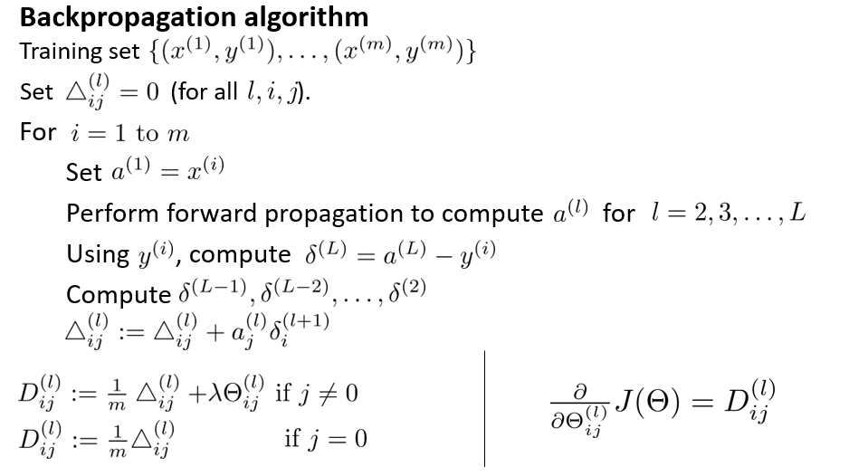
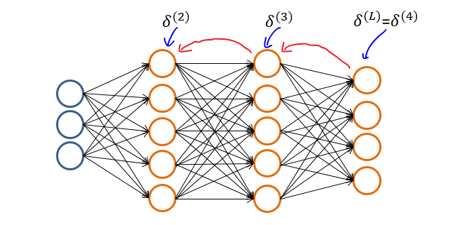

# 
Back Propagation

  

## Why
----
与回归问题一样，也需通过最小化代价函数$$J(\Theta)$$来优化预测精度。但由于神经网络允许多个隐含层，即各层神经元都会产出预测。因此，不能直接用传统回归梯度下降法最小化$$J(\Theta)$$，而需逐层考虑预测误差且逐层优化。为此，在多层神经网络，使用反向传播算法（Backpropagation Algorithm）优化预测。

另一种解释是，神经网络代价函数看上去虽不复杂，但注意到其中$$h_\Theta(x)$$求取实际上由前向传播算法求得。即需从输入层开始，根据每层间的权重矩阵$$\Theta$$依次计算激活单元的值$$a$$。在最优化代价函数时，必然也需最优化每层权重矩阵。

**注意，反向传播算法最优化的是权重，不是输入**。

  

## How
----
反向传播算法，即从输出层开始不断向前迭代，根据上一层误差依次计算当前层误差，以求得代价函数偏导。

反向传播算法计算每一层权重矩阵的偏导是$$\frac{\partial}{\partial\Theta}J(\Theta)$$，算法实际上是对代价函数求导的拆解。

1. 对训练集$$\lbrace (x^{(1)}, y^{(1)}) \cdots (x^{(m)}, y^{(m)})\rbrace$$，初始化每层间误差和矩阵$$\Delta$$，即令所有$$\Delta^{(l)}_{i,j}=0$$，使每个$$\Delta^{(l)}$$为一个全零矩阵。

2. 遍历所有样本实例，对于每个样本实例：

   1. 运行前向传播算法，得到初始预测$$a^{(L)}=h_\Theta(x)$$ 。

   2. 运行反向传播算法，从输出层开始计算每一层预测的**误差（error）**，以此来求取偏导。

      

      输出层误差为预测与训练集结果差值：$$\delta^{(L)} = a^{(L)} - y$$。对隐藏层中每一层误差，都通过上一层误差来计算：$$\delta^{(l)} = (\Theta^{(l)})^T\delta^{(l+1)} .*\ \frac{\partial a^{(l)}}{\partial z^{(l)}}\; \; \; \; \;  \text{for }l := L-1, L-2,\dots,2.$$

      隐藏层中，$$a^{(l)}$$为增加偏置单元后$$g(z^{(l)})$$，$$a^{(l)}$$与$$\Theta^{(l)}$$维度匹配，得以完成矩阵运算。即对隐藏层，有$$a^{(l)} = (g(z^{(l)})$$添加偏置单元$$a^{(l)}_0 = 1)$$。

      解得$$\frac{\partial}{\partial z^{(l)}}g(z^{(l)})=g'(z^{(l)})=g(z^{(l)}) .* \ (1-g(z^{(l)}))$$，则有$$\delta^{(l)} = (\Theta^{(l)})^T\delta^{(l+1)} .*\ a^{(l)} .*\ (1-a^{(l)}), \ \ a^{(l)}_0 = 1$$。

      根据以上公式依次计算每一层误差$$\delta^{(L)}, \delta^{(L-1)},\dots,\delta^{(2)}$$。

   3. 依次求解并累加误差$$\Delta^{(l)}_{i,j} := \Delta^{(l)}_{i,j} + a_j^{(l)} \delta_i^{(l+1)}$$，向量化实现为$$\Delta^{(l)} := \Delta^{(l)} + \delta^{(l+1)}(a^{(l)})^T$$。

3. 遍历全部样本实例，求解完$$\Delta$$后，最后求得偏导$$\frac \partial {\partial \Theta_{i,j}^{(l)}} J(\Theta)=D_{i,j}^{(l)}$$

   - $$D^{(l)}_{i,j} := \dfrac{1}{m}\left(\Delta^{(l)}_{i,j} + \lambda\Theta^{(l)}_{i,j}\right), \text{ if }j\neq0$$
   - $$D^{(l)}_{i,j} := \dfrac{1}{m}\Delta^{(l)}_{i,j}, \text{ if } j=0$$（对应偏置单元）

其中：
* $$\delta^{(l)}$$：第$$l$$层误差向量。
* $$\delta^{(l)}_i$$：第$$l$$层第$$i$$个激活单元误差。
* $$\Delta^{(l)}_{i,j}$$：从第$$l$$层第$$j$$个单元映射到第$$l+1$$层第$$i$$个单元的权重代价偏导（所有样本实例之和）。
* $$D^{(l)}_{i,j}$$：$$\Delta^{(l)}_{i,j}$$的样本均值与正则化项之和。
* 注：无需计算$$\delta^{(1)}$$，因为输入没有误差。
