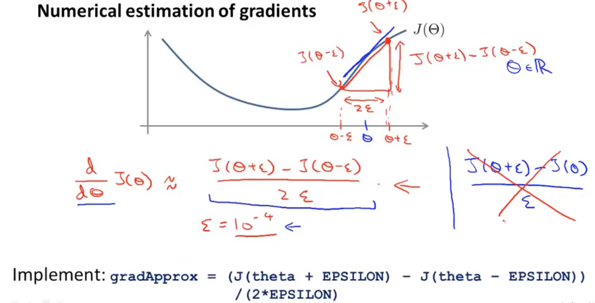

# <center>Gradient Checking for Back Propagation</center>


<br></br>

由于反向传播算法复杂，在小细节容出错，从而无法得到最优解，故引入梯度检验。梯度检验采用数值估算（Numerical Estimation）梯度方法，被用于验证反向传播算法正确性。



$$J(\theta)$$在$$\theta$$处倒数$$\dfrac{\partial}{\partial\theta}J(\theta)$$为该点斜率，如上图蓝线所示。

在点$$\theta$$附近的小区间$$[\theta - \epsilon, \theta + \epsilon]$$（$$\epsilon$$足够小），构造如图所示的红色直角三角形。此时，该三角形斜边的斜率近似于蓝线斜率。即可通过求红色斜边斜率来近似$$\dfrac{\partial}{\partial\theta}J(\theta)$$：

$$
\dfrac{\partial}{\partial\theta}J(\theta) \approx \frac{J(\theta+\epsilon) - J(\theta-\epsilon)}{2\epsilon}
$$

其中，$$\epsilon$$为极小值。由于太小时易出现数值运算问题，一般取$$10^{-4}$$。

对矩阵$$\theta$$有：

$$
\dfrac{\partial}{\partial\theta_j}J(\theta) \approx \dfrac{J(\theta_1, \dots, \theta_j + \epsilon, \dots, \theta_n) - J(\theta_1, \dots, \theta_j - \epsilon, \dots, \theta_n)}{2\epsilon}
$$

含有梯度检验的BP算法为：
1. 由BP获得展开的$$DVec$$：

    $$
    DVec = [D^{1}, D^{2}, D^{3}, ...D^{n}]
    $$

2. 计算梯度近似$$gradApprox$$，$$\theta_{j}$$是$$\theta^{j}$$的展开：

    $$
    \dfrac{\partial}{\partial\theta}J(\theta) \approx \dfrac{J(\theta + \epsilon) - J(\theta - \epsilon)}{2\epsilon}
    $$

    $$
    gradApprox = [\dfrac{\partial}{\partial\theta_{1}}J(\theta), \dfrac{\partial}{\partial\theta_{2}}J(\theta),..., \dfrac{\partial}{\partial\theta_{n}}J(\theta)]
    $$

3. 比较$$gradApprox$$与$$DVec$$相似程度（比如可用欧式距离）。

代码：

```octave
epsilon = 1e-4;
for i = 1:n,
  thetaPlus = theta;
  thetaPlus(i) += epsilon;
  thetaMinus = theta;
  thetaMinus(i) -= epsilon;
  gradApprox(i) = (J(thetaPlus) - J(thetaMinus))/(2*epsilon);
end
```

得出$$gradApprox$$梯度向量后，将其同之前计算的偏导$$D$$比较，如果相等或很接近，即没有问题。

> 确认算法没有问题后（一般只需运行一次），由于数值估计的梯度检验效率很低，所以一定要禁用它*。