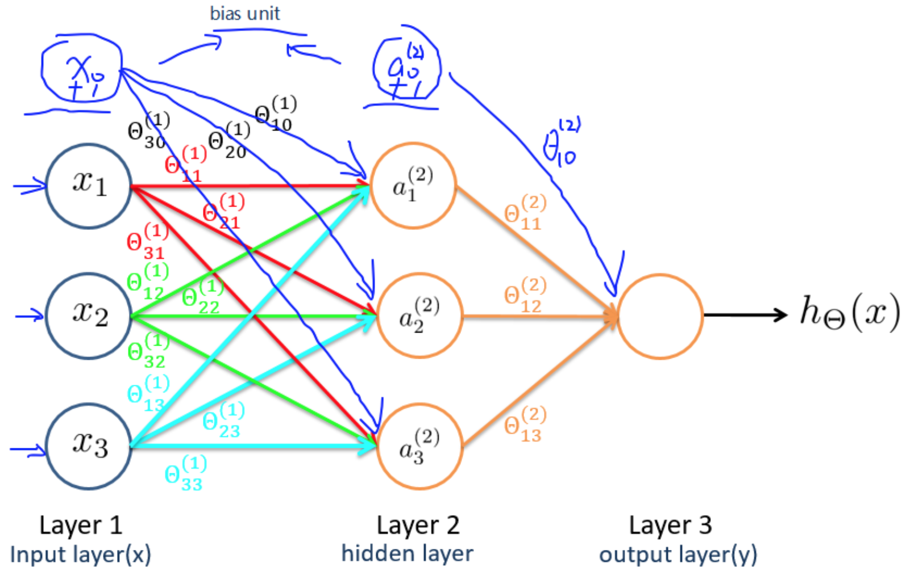

# 
Neural Networks

  

## Terms
----

  

- $$x_0​$$：偏置单元 bias unit，$$x_0​=1$$。
- $$\Theta$$：权重 weight，即参数。
- $$g​$$：激活函数，即逻辑函数等。
- $$a^{(j)}_i$$：第$$j$$层第$$i$$个激活单元。
- 输入层：对应于训练集中的特征 $x$。
- 输出层：对应于训练集中的结果 $y$。
- $$\Theta^{(j)}$$：从第$$j$$层映射到第$$j+1$$层时权重矩阵。
- $$\Theta^{(j)}_{v,u}$$：从第$$j$$层第$$u$$个单元映射到第$$j+1$$层第$$v$$个单元权重。
- $$s_j$$：第$$j$$层激活单元数目（不含偏置单元）。

注意，如果第$$j$$层有$$s_j$$个单元，第$$j+1$$层有$$s_{j+1}$$个单元，那么$$\Theta^{(j)}$$是$$s_{j+1} \times (s_j+1)$$维权重矩阵。即每一层权重矩阵大小非固定。其中，$$+1$$来自偏置单元，意味输出层不包含偏置单元，但输入层和隐藏层需增加偏置单元。

依据所给模型有：
1. $$Size(\Theta^{(1)})=s_{j+1} \times (s_j + 1) =s_2 \times (s_1 + 1) = 3 \times 4$$
2. $$Size(\Theta^{(2)})=s_3 \times (s_2 + 1) = 1 \times 4$$

  

## Methdology
----
应用神经网络有步骤：

1. 神经网络建模
   - 选取特征，确定特征向量$$x$$维度，即输入单元数量。
   - 鉴别分类，确定预测向量$$h_\Theta(x)$$维度，即输出单元数量。
   - 确定隐藏层有几层及每层隐藏层有多少个隐藏单元。

   > 默认情况下，隐藏层至少有一层。层数越多意味着效果越好，计算量越大。

2. 训练神经网络

   1. 随机初始化初始权重矩阵。
   2. 应用前向传播计算初始预测。
   3. 计算代价函数$$J(\Theta)$$。
   4. 应用后向传播计算$$J(\Theta)$$偏导数。
   5. 使用梯度检验检查算法正确性。用完就禁用它。
   6. 丢给最优化函数最小化代价函数
      > 由于神经网络的代价函数非凸，最优化时不一定收敛在全局最小值。高级最优化函数确保收敛在某个**局部**最小值。

  

## Quiz
----

