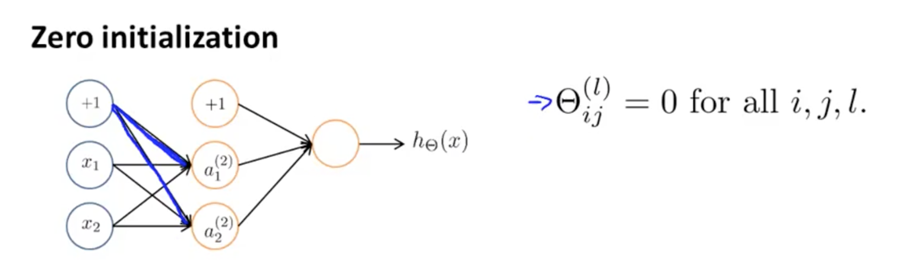

# <center>Parameter Initialization</center>

<br></br>


## Why - 0值初始化
----
逻辑回归中常会初始化所有权值为0，假如在神经网络也采用0值初始化：



则得$$a_{1}^{(1)} = a_{2}^{(2)}$$，$$\delta_{1}^{(1)} = \delta_{2}^{(1)}$$，于是$$\frac{\partial}{\partial\Theta^{(1)}_{01}J(\Theta)} = \frac{\partial}{\partial\Theta^{(1)}_{02}J(\Theta)}$$。更新后的权值为$$\Theta^{(1)}_{01} = \Theta^{(1)}_{02}$$。

即每次迭代，所有权值数值一样。意味隐含层神经元激活值也一样，即无论隐含层层数和各层神经元有多少，由于各层神经元激活值大小一样，相当于各层只有一个有效神经元（特征），失去了神经网络特征扩展和优化的本意。

<br></br>


## How
----
随机初始化权重矩阵也用于打破对称性（Symmetry Breaking），使$$\Theta^{(l)}_{ij} \in [-\epsilon,\epsilon]$$。当然，初始权重波动不能太大，一般在极小值$$\epsilon​$$范围内，即$$\Theta^{(l)}_{i,j} \in [-\epsilon, \epsilon]​$$。

代码：

```matlab
# If the dimensions of Theta1 is 10x11, Theta2 is 10x11 and Theta3 is 1x11.

Theta1 = rand(10,11) * (2 * INIT_EPSILON) - INIT_EPSILON;
Theta2 = rand(10,11) * (2 * INIT_EPSILON) - INIT_EPSILON;
Theta3 = rand(1,11) * (2 * INIT_EPSILON) - INIT_EPSILON;
```

* `rand(m,n)`：返回一个在区间$$(0,1)$$均匀分布的随机矩阵。
* $$\epsilon$$：和梯度下降中$$\epsilon$$没有联系，只是一个任意实数，给定权重矩阵初始化值的范围。