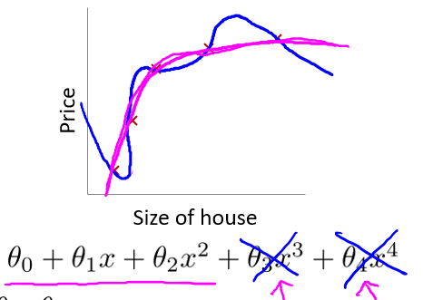

# 
Cost Function

  

有时由于特征数量过多，过拟合时很难选出要保留的特征，这时可用正则化方法。比如$$\theta_0 + \theta_1x + \theta_2x^2 + \theta_3x^3 + \theta_4x^4$$在不减少特征的情况下，**如果能消除类似$$\theta_3x^3$$、$$\theta_4x^4$$等复杂部分，复杂函数就变简单了**。

为保留各参数信息，不修改假设函数，改而修改代价函数：

$$
min_\theta\ \dfrac{1}{2m}\sum_{i=1}^m (h_\theta(x^{(i)}) - y^{(i)})^2 + 1000\cdot\theta_3^2 + 1000\cdot\theta_4^2
$$

上式中，在代价函数中增加$$\theta_3$$和$$\theta_4$$惩罚项（Penalty Term）$$1000\cdot\theta_3^2 + 1000\cdot\theta_4^2$$。如果要最小化代价函数，需极大减小$$\theta_3$$和$$\theta_4$$，从而使假设函数中$$\theta_3x^3$$和$$\theta_4x^4$$参数非常小。

  

**如果无法决定减少哪个参数，可统一惩罚除了$$\theta_0$$外的所有参数。**

代价函数：

$$
J(\theta) = \frac{1}{2m}[\sum\limits_{i=1}^{m} (h_{\theta}(x^{(i)}) - y^{(i)})^{2} + \lambda \sum\limits_{j=1}^{n}{\theta_{j}^{2}]
$$

* $$\lambda$$：正则化参数（Regularization Parameter），$$\lambda > 0$$。
* $$\sum\limits_{j=1}^{n}$$：不惩罚基础参数$$\theta_0$$。
* $$\lambda \sum\limits_{j=1}^{n}{\theta_{j}^{2}}$$：正则化项。

$$\lambda$$正则化参数类似学习速率，需自行选择合适值：

- 过大
  - 模型欠拟合（假设可能变成近乎$$x = \theta_0$$直线）。
  - 无法正常去过拟问题。
  - 梯度下降可能无法收敛。

- 过小
  - 无法避免过拟合。

> 正则化符合奥卡姆剃刀（Occam's razor）原理。在所有可能选择的模型中，能很好解释已知数据且十分简单才是最好的模型，也就是应该选择的模型。从贝叶斯估计角度，正则化项对应于模型先验概率。可假设复杂模型有较大先验概率，简单模型有较小先验概率。

> 正则化是结构风险最小化策略的实现，是去过拟合问题典型方法。虽看起来多一个参数多一重麻烦，其有自动选取正则化参数方法。模型越复杂，正则化参数值越大。
