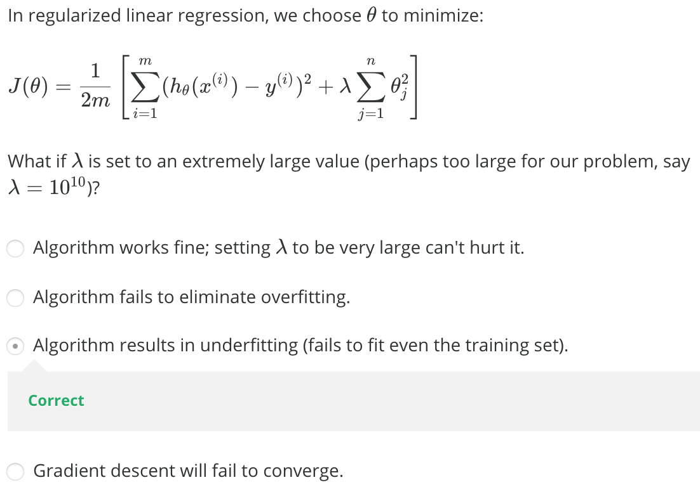

# <center>Regularized Linear Regression</center>

<br></br>


## Cost Function
----
线性回归中，预测代价为：

$$
J(\theta) = \frac{1}{2m}\sum_{i=1}^{m}(h_{\theta}(x^{(i)}) - y^{(i)})^{2} \tag 1
$$

为在最小化$$J(\theta)$$过程中，也尽可能使$$\theta$$变小，把式1改为：

$$
\begin{split}
J(\theta) &= \frac{1}{2m}\sum_{i=1}{m} (h_{\theta}(x^{(i)}))^{2} + \lambda \sum_{i=1}^{n}\theta_{j}^{2} \\
&= \frac{1}{2m}(X\theta - y)^{T}(X\theta - y) + \lambda \sum_{i=1}^{n}\theta_{j}^{2}
\end{split}
$$

其中，参数$$\lambda$$主要完成：
1. 保证对数据拟合良好。
2. 保证$$\theta$$够小，避免过拟合。

> $$\theta$$越大，要使$$J(\theta)$$变小，惩罚力度要变大。这样$$\theta$$会被惩罚得越惨（越小）。即要避免过拟合，应增大$$\lambda$$值。

<br></br>


## Gradent Descent
----
那么，梯度下降也发生相应变化：

$$
\begin{align*} & \text{Repeat}\ \lbrace \newline
& \ \ \ \ \theta_0 := \theta_0 - \alpha\ \frac{1}{m}\ \sum_{i=1}^m (h_\theta(x^{(i)}) - y^{(i)})x_0^{(i)} \newline
& \ \ \ \ \theta_j := \theta_j - \alpha\ \left[ \left( \frac{1}{m}\ \sum_{i=1}^m (h_\theta(x^{(i)}) - y^{(i)})x_j^{(i)} \right) + \frac{\lambda}{m}\theta_j \right], \ \ \ j \in \lbrace 1,2...n\rbrace \tag 2 \newline
& \ \ \ \text{即：} \newline
& \ \ \ \ \theta = \theta - \alpha (\frac{1}{m}X^{T}(y-X\theta) + \frac{\lambda}{m}\theta_{j}), \ \ j \ne 0 \newline
\newline & \rbrace
\end{align*}
$$

其中，式2等价于：

$$
\theta_{j} = \theta_{j}(1 - \alpha \frac{\lambda}{m}) - \alpha\frac{1}{m}\sum_{i=1}^{m} [h_{\theta}(x^{(i)}) - y^{(i)}]x_{j}^{(i)}
$$

因为$$1-\alpha\frac{\lambda}{m} < 1$$，故而梯度下降每次更新$$\theta$$同时也会减小$$\theta$$值，达到Regularization 目的。

如果使用正规方程，则使$$J(\theta)$$最小化的$$\theta$$值为：

$$
\begin{align*}& \theta = \left( X^TX + \lambda \cdot L \right)^{-1} X^Ty \newline& \text{where}\ \ L = \begin{bmatrix} 0 & & & & \newline & 1 & & & \newline & & 1 & & \newline & & & \ddots & \newline & & & & 1 \newline\end{bmatrix}\end{align*}
$$

其中：
* $$\lambda\cdot L$$：正则化项。
* $$L$$：第一行第一列为0的$$n+1$$维单位矩阵。

所谓的正则化可解决正规方程法中不可逆问题，即增加$$\lambda \cdot L$$正则化项后，可保证$$X^TX + \lambda \cdot L$$可逆（invertible），即使$$X^TX$$不可逆（non-invertible）。 

Octave：
```matlab
>> L = eye(5)
>> L(1,1) = 0

L =

     0     0     0     0     0
     0     1     0     0     0
     0     0     1     0     0
     0     0     0     1     0
     0     0     0     0     1
```

<br></br>


## Quiz
----
