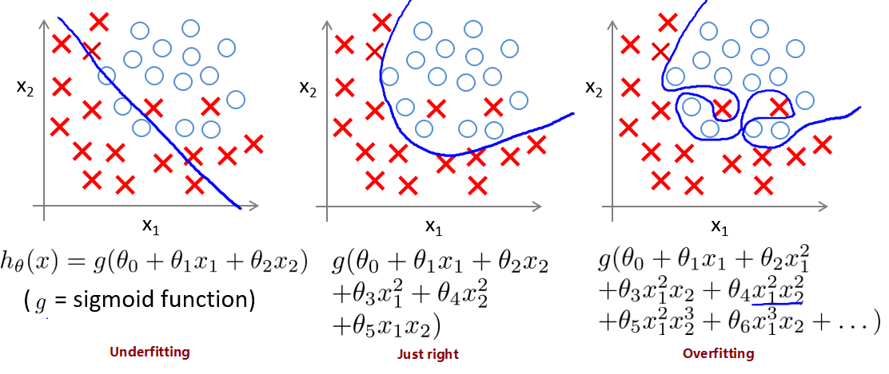
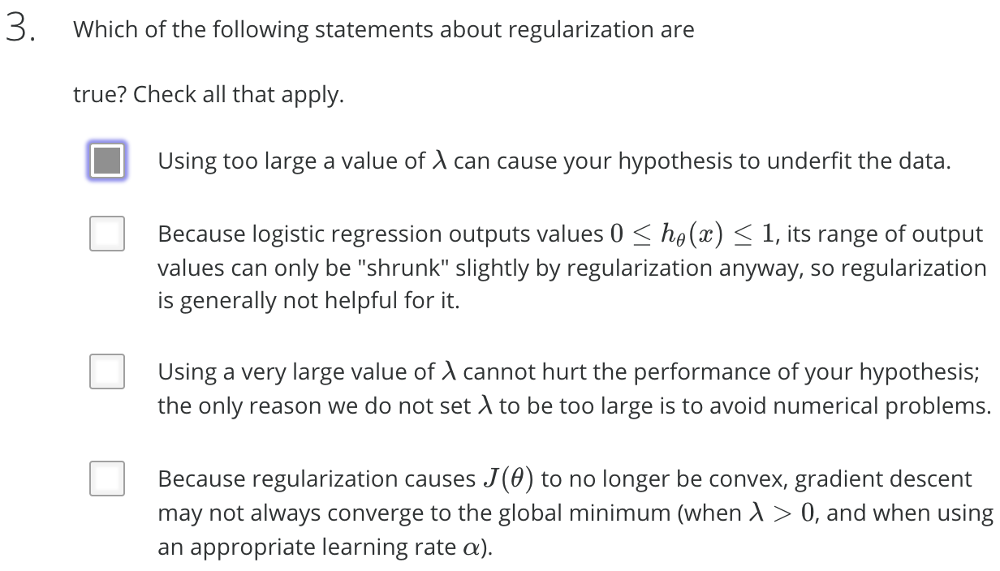

# 
Regularization

  

## 拟合问题
----
线性模型：

  

逻辑分类模型：

  

为度量拟合表现，引入：

* 偏差 Bias

    模型预测值与真实值偏离程度。偏差低意味着较好反应训练集数据情况。

* 方差 Variance

    模型预测值离散程度或变化范围。方差越大，数据分布越分散，函数波动越大，泛化能力越差。方差低意味着拟合曲线稳定性高，波动小。

避免过拟合方法有：

1. 减少特征数量

    * 手动选取需保留的特征。
    * 使用模型选择算法选取合适特征（如PCA算法）。
    * 减少特征的方式易丢失有用的特征信息。

2. 正则化 Regularization

    * 可保留所有参数。
    * 减少/惩罚各参数大小，以减轻各参数对模型影响程度。
    * 当有很多参数对模型只有轻微影响时，正则化方法表现很好。

  

## Quiz
----

|       | Statement | Explanation |
| ----- | --------- | ----------- |
| False | Using a very large value $$\lambda$$ can't hurt hypothesis performance; the only reason we don't set to be too large is to avoid numerical problem. | Using a very large value of $$\lambda$$ can underfit training set. |
| False | Because regularization causes $$J(\theta)$$ to no longer be convex, gradient descent may not always converge to global minimum (when $$\lambda > 0$$, and when using an appropriate learning rate $$\alpha$$). | Regularized logistic regression and regularized linear regression are both convex, and thus gradient descent will still converge to the global minimum. |
| True | Using too large a value of $$\lambda$$ can cause hypothesis to underfit data. | A large value of results in a large $$\labmda$$ regularization penalty and thus a strong preference for simpler models which can underfit data. |
| False | Because logistic regression outputs values $$0 <= h_{0} <= 1$$, its range of output values can only be "shrunk" slighly by regularization anyway, so regularization is generally not helpful for it.  |  |