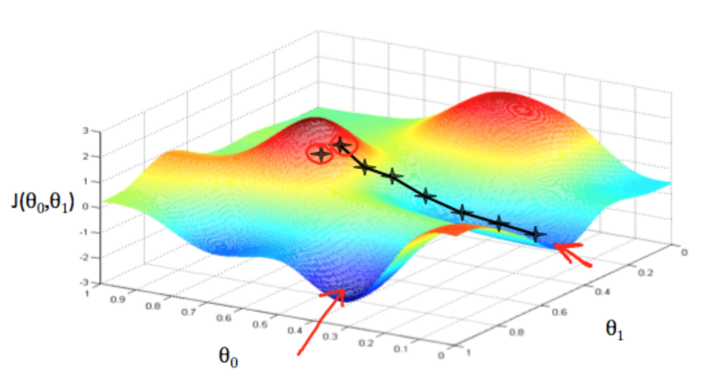
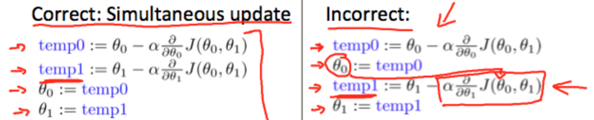
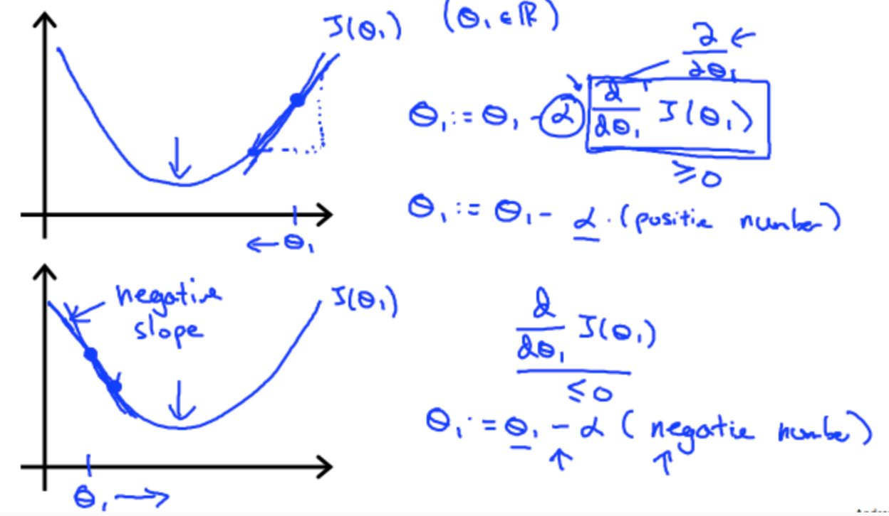
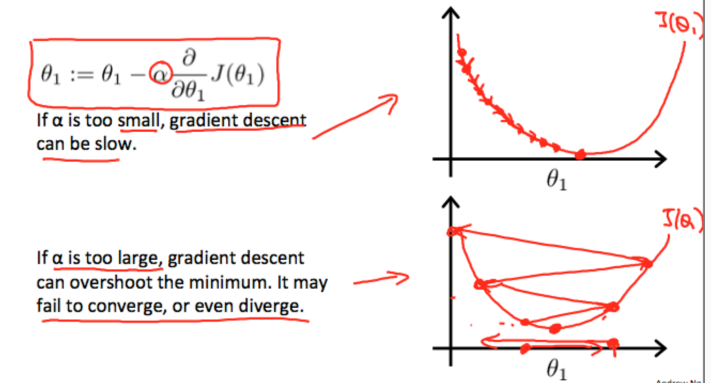
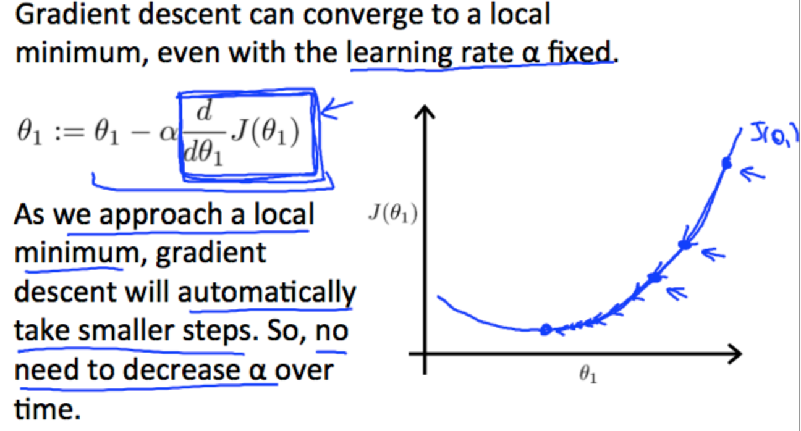

# 
Gradient Descent

  

Now we need to estimate the parameters in the hypothesis function. That's where gradient descent comes in.

Imagine that we graph our hypothesis function based on its fields $$\theta_0$$ and $$\theta_1$$. We are not graphing _x_ and _y_ itself, but the parameter range of our hypothesis function and the cost resulting from selecting a particular set of parameters.

We put $$\theta_0$$ on the _x_ axis and $$\theta_1$$ on the _y_ axis, with the cost function on the vertical _z_ axis. The points on our graph will be the result of the cost function using our hypothesis with those specific theta parameters.

  

 

We will know that we have succeeded when our cost function is at the very bottom of the pits in our graph, i.e. when its value is the minimum. The red arrows show the minimum points in the graph.

The way we do this is by taking the derivative (the tangential line to a function) of our cost function. The slope of the tangent is the derivative at that point and it will give us a direction to move towards.

We make steps down the cost function in the direction with the steepest descent. *The size of each step is determined by the parameter $$\alpha$$, which is called the learning rate.*

For example, the distance between each 'star' in the graph above represents a step determined by our parameter $$\alpha$$. A smaller $$\alpha$$ would result in a smaller step and a larger $$\alpha$$ results in a larger step. The direction in which the step is taken is determined by the partial derivative of $$\mathit{J}(\theta_0, \theta_1)$$. Depending on where one starts on the graph, one could end up at different points. The image above shows us two different starting points that end up in two different places. 

The gradient descent algorithm is to repeat until convergence:

$$
\theta_j := \theta_j - \alpha \frac{\mathrm d}{\mathrm d \theta_j} (\mathit{J}(\theta_0, \theta_1))
$$

where $$j = 0, 1$$ represents the feature index number.

At each iteration _j_, one should simultaneously update the parameters $$\theta_1$$, $$\theta_2$$, ..., $$\theta_n$$. Updating a specific parameter prior to calculating another one on the j(th) iteration would yield to a wrong implementation. 

  

 

Regardless of the slope's sign for $$\frac{\mathrm d}{\mathrm d \theta_j} \mathit{J}(\theta_1)$$, $$\theta_1$$ eventually converges to its minimum value. The following graph shows that when the slope is negative, the value of $$\theta_1$$ increases and when it is positive, the value of $$\theta_1$$ decreases.

  

 

On a side note, we should adjust our parameter $$\alpha$$ to ensure that the gradient descent algorithm converges in a reasonable time. Failure to converge or too much time to obtain the minimum value imply that our step size is wrong.

  

 

The intuition behind the convergence is that $$\frac{\mathrm d}{\mathrm d \theta_j} \mathit{J}(\theta_1)$$ approaches 0 as we approach the bottom of our convex function. At the minimum, the derivative will always be 0 and thus we get: 

$$
\theta_1 := \theta_1 - \alpha * 0
$$

  

 

When specifically applied to the case of linear regression, a new form of the gradient descent equation can be derived. We can substitute our actual cost function and our actual hypothesis function and modify the equation to (repeat until convergence):

$$ \theta_0 := \theta_0 -\alpha \frac{1}{m} \sum_{i=1}^{m}(h_\theta{x_i}-y_i) $$

$$ \theta_1 := \theta_1 -\alpha \frac{1}{m} \sum_{i=1}^{m}((h_\theta{x_i}-y_i)x_i) $$

where _m_ is the size of the training set, $$\theta_0$$ is a constant that will be changing simultaneously with $$\theat_1$$ and $$x_i$$, yiare values of the given training set.

Note that we have separated out the two cases for $$\theta_j$$ into separate equations for $$\theta_0$$ and $$\theta_1$$; and that for $$\theta_1$$ we are multiplying $$x_i$$ at the end due to the derivative. 

$$ \frac{d}{d\theta_j}\mathit{J}(\theta) = \frac{d}{d\theta_j}\frac{1}{2}(\mathit{h}_\theta(x)-y)^2 = (\mathit{h}_\theta(x)-y)x_j $$