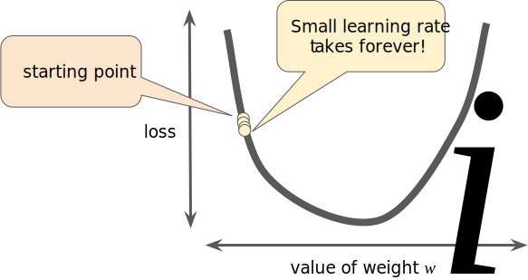

# 
Gradient Descent

  

Imagine that we graph our hypothesis function based on its fields $$\theta_0$$ and $$\theta_1$$. We are not graphing $$x$$ and $$y$$ itself, but the parameter range of our hypothesis function and the cost resulting from selecting a particular set of parameters. We put $$\theta_0$$ on $$x$$ axis and $$\theta_1$$ on $$y$$ axis, with the cost function on vertical $$z$$ axis. The points on our graph will be the result of the cost function using our hypothesis with those specific $$\theta$$ parameters.

  

We will know that we have succeeded when our cost function is at the very bottom of the pits in graph.

The way we do this is by taking the derivative of cost function. The slope of the tangent is the derivative at that point and it will give us a direction to move towards. We make steps down the cost function in the direction with the steepest descent. The size of each step is determined by the parameter $$\alpha$$, which is called **learning rate**.

For example, the distance between each 'star' represents a step determined by parameter $$\alpha$$. The direction is determined by the partial derivative of $$\mathit{J}(\theta_0, \theta_1)$$. Depending on where one starts on graph, one could end up at different points. 

**The gradient descent algorithm is to repeat until convergence:**

$$
\theta_{j} := \theta_{j} - \alpha \frac{\partial}{\partial \theta_{j}} \text{J}(\theta_0, \theta_1)
$$

where $$j = 0, 1$$ represents the feature index number.

At each iteration _j_, one should simultaneously update the parameters $$\theta_1$$, $$\theta_2$$, ..., $$\theta_n$$. Updating a specific parameter prior to calculating another one on the j(th) iteration would yield to a wrong implementation. 

  

 

Regardless of the slope's sign for $$\frac{\partial}{\partial \theta_j} \text{J}(\theta_1)$$, $$\theta_1$$ eventually converges to its minimum value. The following graph shows that when the slope is negative, the value of $$\theta_1$$ increases and when it is positive, the value of $$\theta_1 $$decreases.

  

 

We should adjust parameter $$\alpha$$ to ensure that the gradient descent converges in a reasonable time. 

  

 

The intuition behind the convergence is that $$\frac{\partial}{\partial \theta_j} \mathrm{J}(\theta_1)$$ approaches $$0$$ as we approach the bottom of convex function. At the minimum, the derivative will always be $$0$$ and thus we get: 

$$
\theta_1 := \theta_1 - \alpha \times 0
$$

  

 

When specifically applied to the case of linear regression, a new form of the gradient descent equation can be derived. We can substitute actual cost function and actual hypothesis function and modify the equation to (repeat until convergence):

$$
\theta_0 := \theta_0 -\alpha \frac{1}{m} \sum_{i=1}^{m}(h_\theta{x_i}-y_i)
$$

$$
\theta_1 := \theta_1 -\alpha \frac{1}{m} \sum_{i=1}^{m}((h_\theta{x_i}-y_i)x_i)
$$

where _m_ is the size of the training set, $$ \theta_0 $$ is a constant that will be changing simultaneously with $$ \theta_1 $$ and $$ x_i $$, $$ y_i $$ are values of the given training set. 

$$
\frac{\partial}{\partial \theta_j}\text{J}(\theta) = \frac{\partial}{\partial \theta_j}\frac{1}{2}(\text{h}_\theta(x)-y)^2 = (\text{h}_\theta(x)-y)x_j
$$

  

## Stochastic Gradient Descent
----
In gradient descent, a batch is the total number of examples you use to calculate the gradient in a single iteration. So far, we've assumed that the batch has been the entire data set. A very large batch may cause even a single iteration to take a very long time to compute.

A large data set with randomly sampled examples probably contains redundant data. In fact, redundancy becomes more likely as the batch size grows. Some redundancy can be useful to smooth out noisy gradients, but enormous batches tend not to carry much more predictive value than large batches.

By choosing examples at random from data set, we could estimate a big average from a much smaller one. **Stochastic gradient descent (SGD)** takes this idea to the extreme--it uses only a single example (a batch size of 1) per iteration. Given enough iterations, SGD works but is very noisy. The term "stochastic" indicates that the one example comprising each batch is chosen at random.

**Mini-batch stochastic gradient descent (mini-batch SGD)** is a compromise between full-batch iteration and SGD. A mini-batch is typically between 10 and 1,000 examples, chosen at random. Mini-batch SGD reduces the amount of noise in SGD but is still more efficient than full-batch.

  

## Gradients
----
The gradient of a function, denoted as follows, is the vector of partial derivatives with respect to all of the independent variables:

$$
\nabla{f}
$$

For instance, if:

$$
f(x,y) = e^{2y}\sin{(x)}
$$

then:

$$
\nabla{f(x,y)} = (\frac{\partial{f}}{\partial{x}}(x,y), \frac{\partial{f}}{\partial{y}}(x,y)) = (e^{2y}\cos{(x)}, 2e^{2y}\sin{(x)})
$$

The number of dimensions in the vector is equal to the number of variables in the formula for $$f$$; in other words, the vector falls within the domain space of the function. For instance, the graph of the following function $$f(x, y)$$:

$$
f(x, y) = 4 + (x-2)^{2} + 2y^{2}
$$

when viewed in three dimensions with $$z = f(x,y)$$ looks like a valley with a minimum at (2, 0, 4):

The gradient of $$f(x, y)$$ is a two-dimensional vector that tells you in which $$(x, y)$$ direction to move for the maximum increase in height. Thus, the negative of the gradient moves you in the direction of maximum decrease in height. In other words, the negative of the gradient vector points into the valley.

In machine learning, gradients are used in gradient descent. We often have a loss function of many variables that we are trying to minimize, and we try to do this by following the negative of the gradient of the function.

Note that a gradient is a vector, so it has both of the following characteristics:
1. a direction
2. a magnitude

The gradient always points in the direction of steepest increase in the loss function. The gradient descent algorithm takes a step in the direction of the negative gradient in order to reduce loss as quickly as possible.

  

## Learning Rate
----
As noted, the gradient vector has both a direction and a magnitude. Gradient descent algorithms multiply the gradient by a scalar known as the **learning rate (step size)** to determine next point. For example, if the gradient magnitude is 2.5 and the learning rate is 0.01, then the gradient descent algorithm will pick the next point 0.025 away from the previous point.

**Hyperparameters** are the knobs that programmers tweak in machine learning algorithms. If a learning rate is too small, learning will take too long. Conversely, if a learning rate is too large, the next point will perpetually bounce haphazardly across the bottom of the well like a quantum mechanics experiment gone horribly wrong.

