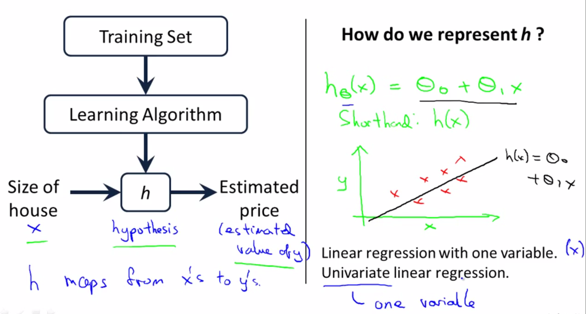
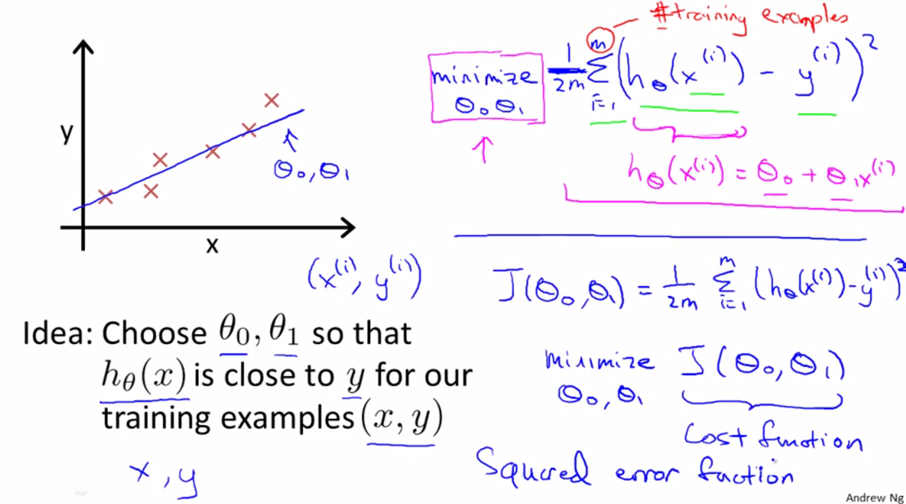
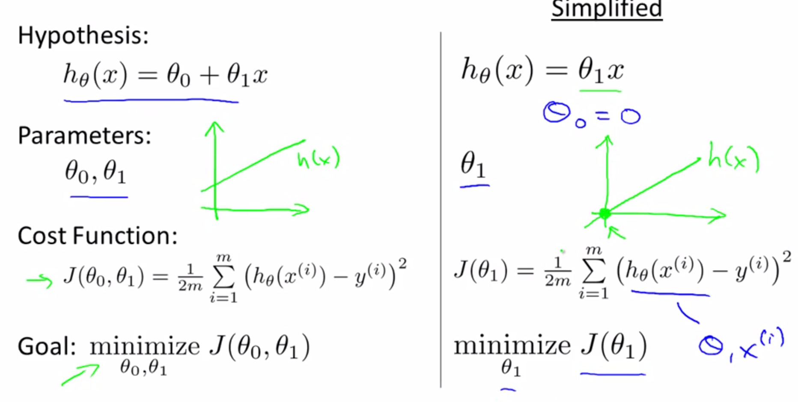
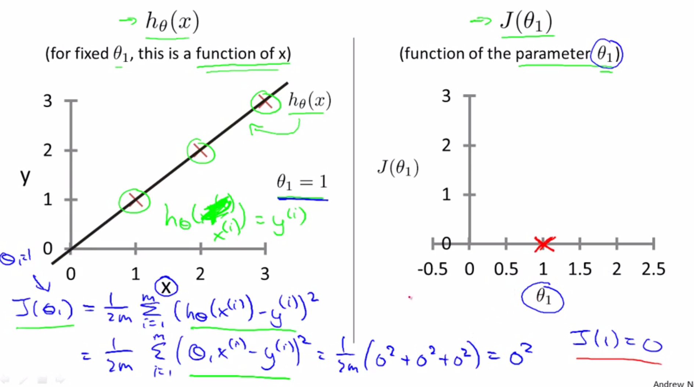
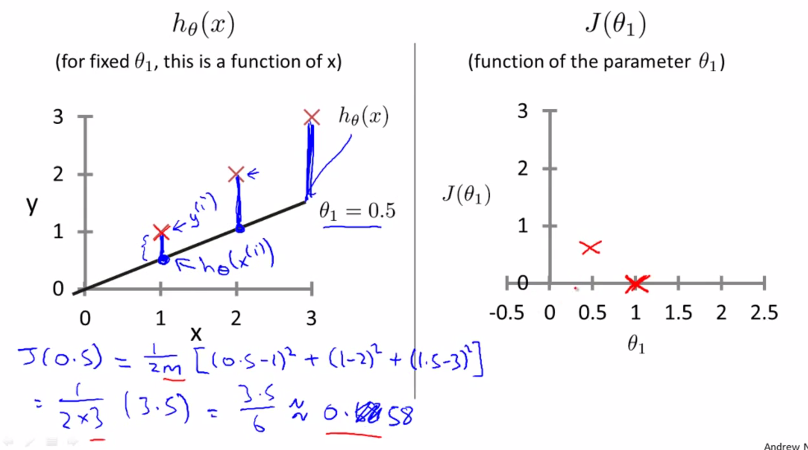
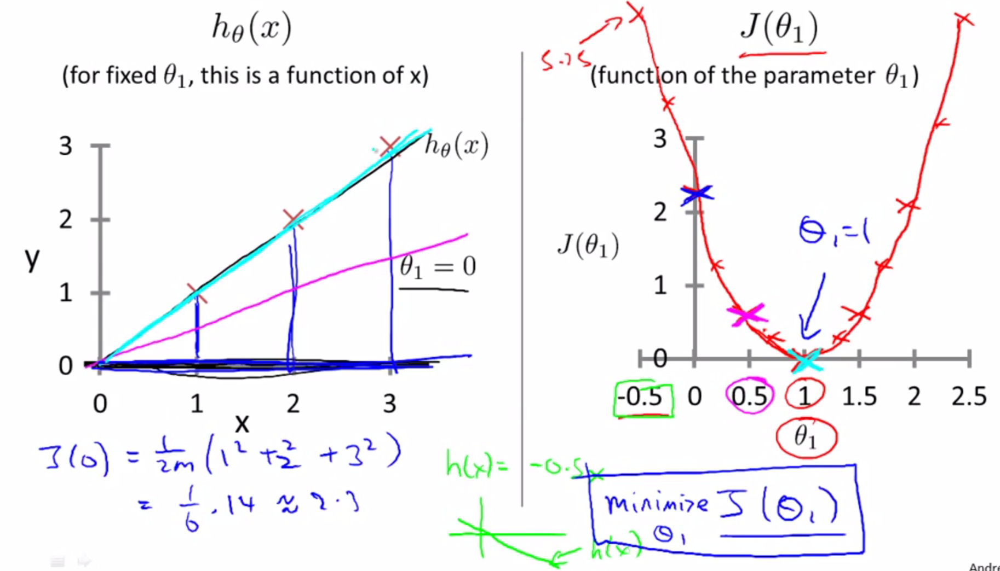
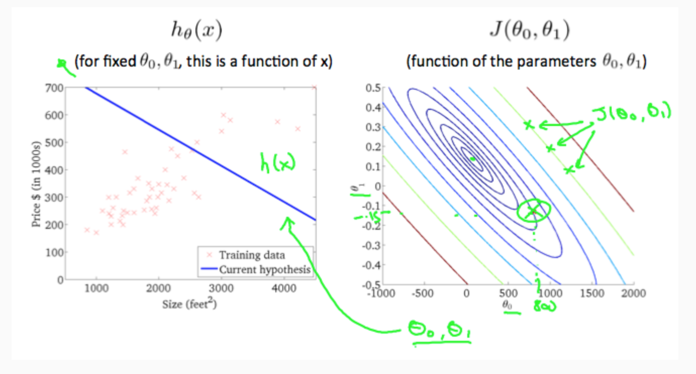
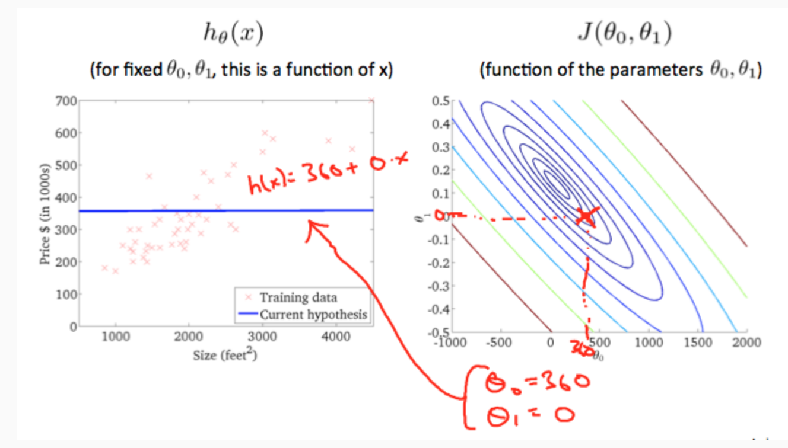
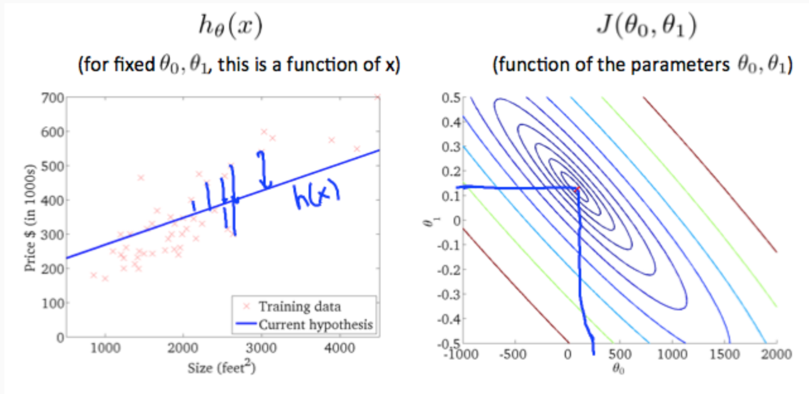

# 
Model Representation and Cost Function

  

## Model Representation
----

  

  

## Cost Function
----
**Mean square error (MSE)** is the average squared loss per example over the whole dataset:

$$
MSE = \frac{1}{N} \sum_{(x,y) \in D}^{}(y-prediction(x))^2
$$

where:
* $$(x,y)$$ is an example in which
  * $$x$$ is the set of features that the model uses to make predictions.
  * $$y$$ is the example's label.
* $$prediction(x)$$ is a function of the weights and bias in combination with the set of features $$x$$.
* $$D$$ is a data set containing many labeled examples, which are $$(x,y)$$ pairs.
* $$N$$ is the number of examples in $$D$$.

A cost function takes an average difference of all the results of the hypothesis with inputs from _x_'s and the actual output _y_'s.

$$
\mathit{J}(\theta_0, \theta_1) = \frac{1}{2m} \sum_{i=1}^{m}(\hat{y_i}-y_i)^2 = \sum_{i=1}^{m} (h_\theta(x_i)-y_i)^2
$$

To break it apart, it is $$\frac{1}{2}\bar{x}$$ where $$\bar{x}$$ is the mean of the squares of $$h_\theta(x_i)−y_i$$, or the difference between the predicted value and the actual value. The following image summarizes what the cost function does: 

  

 

If we try to think of it in visual terms, our training data set is scattered on the x-y plane. We are trying to make a straight line (defined by $$h_\theta(x)$$) which passes through these scattered data points. 

  

 

Our objective is to get the best possible line. Ideally, the line should pass through all the points of our training data set. In such a case, the value of $$\mathit{J}(\theta_0, \theta_1)$$ will be 0.

  

 

When $$\theta_1=1$$, we get a slope of 1 which goes through every single data point in our model. Conversely, when $$\theta_1=0.5$$, we see the vertical distance from our fit to the data points increase. 

  

 

This increases our cost function to 0.58. Plotting several other points yields to the following graph: 

  

 

Thus as a goal, we should try to minimize the cost function. In this case, $$\theta_1=1$$ is our global minimum. 

A contour plot is a graph that contains many contour lines. A contour line of a two variable function has a constant value at all points of the same line. An example of such a graph is the one to the right below.

  

 

Taking any color and going along the 'circle', one would expect to get the same value of the cost function. For example, the three green points found on the green line above have the same value for $$\mathit{J}(\theta_0, \theta_1)$$ and as a result, they are found along the same line. The circled _x_ displays the value of the cost function for the graph on the left when $$\theta_0 = 800$$ and $$\theta_1= -0.15$$. Taking another $$h(x)$$ and plotting its contour plot, one gets the following graphs:

  

 

When $$\theta_0 = 360$$ and $$\theta_1 = 0$$, the value of $$\mathit{J}(\theta_0, \theta_1)$$ in the contour plot gets closer to the center thus reducing the cost function error. Now giving our hypothesis function a slightly positive slope results in a better fit of the data.

  

 