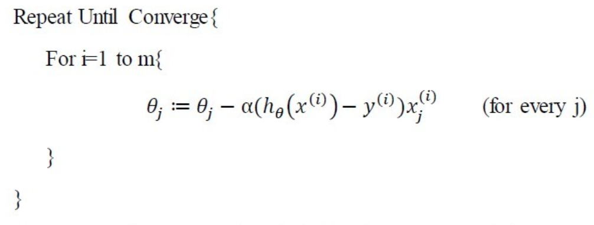

# 
Model Representation and Cost Function

  

## 符号定义
----
1. _m_：训练数据大小
2. _x_：输入变量，向量
3. _y_：输出变量，实数
4. $$ (x, y) $$：一个训练实例
5. $$ (x^{i}, y^{i}) $$：第$$ i $$个训练实例

  

## 梯度下降算法
----
假设训练集使用线性回归解决，函数如下：

$$
\begin{split}
h(x) &= \theta_0 + \theta_1x_1 + \theta_2x_2 \\
&= \sum_{i=0}^{2}\theta_ix_i \\
&= h_\theta(x)
\end{split} \tag 1
$$

 

其中，$$ h_\theta(x) $$为以$$ \theta $$为参数。对于一般问题，公式如下：

$$ 
h_\theta(x) = \sum_{i=0}^{n}\theta_ix_i = \theta^Tx \tag 2
$$

 

然后，可以定义目标函数，即要优化的函数为：

$$
J(\theta) = \frac{1}{2} \sum_{i=1}^{m}(h_\theta(x^i) - y^i)^2 \tag 3
$$

 

找出使这个函数值最小的参数值，即为拟合训练集最佳参数。使用梯度下降法（Gradient Descent）求参数，更新规则为：

$$
\theta_j := \theta_j - \alpha \frac{\partial}{\partial\theta_j}J(\theta) \tag 4
$$

当只有一个训练样例时，偏导数计算公式如下：

$$
\begin{split}
\frac{\partial}{\partial\theta_j}J(\theta) &= \frac{\partial}{\partial\theta_j} \frac{1}{2} (h_\theta(x)-y)^2 \\
&= (h_\theta(x)-y) \frac{\partial}{\partial\theta_j} \sum_{i=0}^{n}\theta_i x_i \\
&= (h_\theta(x)-y)x_j 
\end{split} \tag 5
$$

将公式5结果代入公式4，得到：

$$
\theta_j := \theta_j - \alpha(h_\theta(x)-y)x_j \tag 6
$$

公式6针对只有一个训练实例时的情况，称为**最小二乘法（LMS，Least Mean Squares），Widrow-Hoff学习规则。**

考虑所有_m_个训练实例，更新规则为：

$$
\theta_j := \theta_j - \alpha \sum_{i=0}^{m}(h_\theta(x^i)-y^i)x_j^i \tag 7
$$

其中$$ \alpha $$是学习速率。运用该规则直至收敛，即为**批梯度下降算法（batch gradient descent）**。收敛的判断有两种规则：
1. 判断两次迭代后参数变化
2. 判断两次迭代后目标函数变化

梯度下降算法会导致局部极致点产生，解决方法是随机初始化，寻找多个最优点结果，并在这些最优点中找最终结果。

对于公式7，数据量大时每迭代一次要遍历全部数据一次，导致速度变慢。解决方法是采用：

  

意为更新参数时，不必遍历整个数据集，只需一个实例就够了。该算法可达到较高的效果，但遍历次数变多，不能精确收敛到最优值。此为**增量梯度下降（incremental gradient descent）或随机梯度下降（stochastic gradient descent）。**

  
