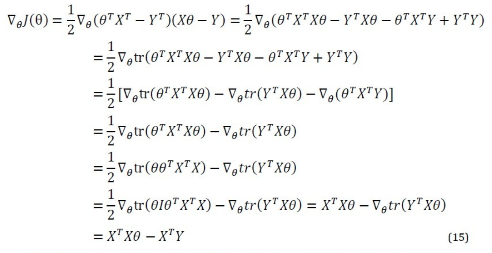

# 
Model Representation and Cost Function

  

## 符号定义
----
1. _m_：训练数据大小
2. _x_：输入变量，向量
3. _y_：输出变量，实数
4. $$ (x, y) $$：一个训练实例
5. $$ (x^{i}, y^{i}) $$：第$$ i $$个训练实例

  

## 梯度下降算法
----
假设训练集使用线性回归解决，函数如下：

$$
\begin{split}
h(x) &= \theta_0 + \theta_1x_1 + \theta_2x_2 \\
&= \sum_{i=0}^{2}\theta_ix_i \\
&= h_\theta(x)
\end{split} \tag 1
$$

 

其中，$$ h_\theta(x) $$为以$$ \theta $$为参数。对于一般问题，公式如下：

$$ 
h_\theta(x) = \sum_{i=0}^{n}\theta_ix_i = \theta^Tx \tag 2
$$

 

然后，可以定义目标函数，即要优化的函数为：

$$
J(\theta) = \frac{1}{2} \sum_{i=1}^{m}(h_\theta(x^i) - y^i)^2 \tag 3
$$

 

找出使这个函数值最小的参数值，即为拟合训练集最佳参数。使用梯度下降法（Gradient Descent）求参数，更新规则为：

$$
\theta_j := \theta_j - \alpha \frac{\partial}{\partial\theta_j}J(\theta) \tag 4
$$

当只有一个训练样例时，偏导数计算公式如下：

$$
\begin{split}
\frac{\partial}{\partial\theta_j}J(\theta) &= \frac{\partial}{\partial\theta_j} \frac{1}{2} (h_\theta(x)-y)^2 \\
&= (h_\theta(x)-y) \frac{\partial}{\partial\theta_j} \sum_{i=0}^{n}\theta_i x_i \\
&= (h_\theta(x)-y)x_j 
\end{split} \tag 5
$$

将公式5结果代入公式4，得到：

$$
\theta_j := \theta_j - \alpha(h_\theta(x)-y)x_j \tag 6
$$

公式6针对只有一个训练实例时的情况，称为**最小二乘法（LMS，Least Mean Squares），Widrow-Hoff学习规则。**

考虑所有_m_个训练实例，更新规则为：

$$
\theta_j := \theta_j - \alpha \sum_{i=0}^{m}(h_\theta(x^i)-y^i)x_j^i \tag 7
$$

其中$$ \alpha $$是学习速率。运用该规则直至收敛，即为**批梯度下降算法（batch gradient descent）**。收敛的判断有两种规则：
1. 判断两次迭代后参数变化
2. 判断两次迭代后目标函数变化

梯度下降算法会导致局部极致点产生，解决方法是随机初始化，寻找多个最优点结果，并在这些最优点中找最终结果。

对于公式7，数据量大时每迭代一次要遍历全部数据一次，导致速度变慢。解决方法是采用：

  

意为更新参数时，不必遍历整个数据集，只需一个实例就够了。该算法可达到较高的效果，但遍历次数变多，不能精确收敛到最优值。此为**增量梯度下降（incremental gradient descent）或随机梯度下降（stochastic gradient descent）。**

  

## 正规方程法
----
梯度下降算法是求目标函数最优值的一种解放。也可以直接求参数值而不用迭代，此为**正规方程法**。

定义梯度符号为$$ \nabla $$，则J的梯度表示为：

$$
\nabla_\theta J = \begin{bmatrix} \frac{\partial J}{\partial\theta_0} & \cdots & \frac{\partial J}{\partial\theta_n} \end{bmatrix}^{\rm T} \in \mathbb{R}^{n+1} \tag 8
$$

再比如，对于一个函数映射（$$ m \times n $$的矩阵到实数的映射）：

$$
\mathit{f}:\mathbb{R}^{m \times n} \to \mathbb{R}
$$

则f的梯度表示为：

$$
\nabla_A f(A) = 
\begin{bmatrix}
\frac{\partial f}{\partial A_11 } & \cdots & \frac{\partial f}{\partial A_{1n}} \\
\vdots & \ddots & \vdots \\
\frac{\partial f}{\partial A_{m1}} & \cdots & \frac{\partial f}{\partial A_{mn}}
\end{bmatrix}
\tag 9$$

其中A是$$ m \times n$$矩阵。比如对于$$2 \times 2$$矩阵A，有函数f，定义为：

$$
f(A)=\frac{3}{2}A_{11}+5A^{2}_{12}+A_{21}A_{22}
$$

则得到：

$$
\nabla_a f(A) = 
\begin{bmatrix}
\frac{3}{2} & 10A_{12} \\
A_{22} & A_{21}
\end{bmatrix}
$$

对于$$n \times n$$矩阵，定义矩阵迹为：

$$
\text{trA} = \sum_{i=1}^{n}A_{ii}
\tag {10}
$$

把梯度和迹组合，得到如下性质：
1. trAB = trBA
2. trABC = trCAB = trBCA
3. trA = tr$$ \text{A}^{T} $$
4. tr(A + B) = tr(A) + tr(B)
5. traA = a * trA
6. tra = a
    其中，a是一个实数，A、B和C为$$n \times n $$矩阵
7. $$ \nabla_A \text{trAB} = \text{B}^{T} $$
8. $$ \nabla_{A^{T}}f(A) = (\nabla_Af(A))^{T} $$
9. $$ \nabla_{A}trABA^{T}C = CAB + C^{T}AB^{T} $$

 

### 矩阵表示目标函数
训练数据集合是$$ m \times n $$矩阵，其中m是样本个数，n为每个样本的维度。对于每个样本目标值，按照顺序排列为$$ m \times 1 $$向量。因而，数据矩阵为：

$$
X = 
\begin{bmatrix}
(x^{1})^{T} \\
\vdots \\
(x^{m})^{T}
\end{bmatrix}
\tag {11}
$$

$$
Y = \begin{bmatrix} y^{1} & \cdots & y^{m} \end{bmatrix}^{\rm T} \tag {12}
$$

因此，可以得到：

$$
X\theta - Y = 
\begin{bmatrix}
(x^{1})^{T}\theta \\
\vdots \\
(x^{m})^{T}\theta
\end{bmatrix}
-
\begin{bmatrix}
y^{1} \\
\vdots \\
y^{m}
\end{bmatrix}
=
\begin{bmatrix}
h_{\theta}(x^{1}) - y^{1} \\
\vdots \\
h_{\theta}(x^{m}) - y ^{m}
\end{bmatrix}
\tag {13}
$$

所以，得到目标函数J向量表达为：

$$
J(\theta) = \frac{1}{2} (X\theta - Y)^{T}(X\theta - Y) = \frac{1}{2} \sum^{m}{i=1}(h_{\theta}(x^{i}) - y^{i})^{2}
\tag {14}
$$

可以得到计算J的梯度公式推导：

  

公式15中：
1. 第一行展开；
2. 第二行应用性质6；
3. 第三行应用性质4，且$$ Y^{T}Y $$为常数；
4. 第四行应用性质3；
5. 第五行应用性质1；
6. 第六行的I是单位矩阵，并应用性质9和7.

得到结果后，令导数为0，得到：

$$
X^{T}X\theta = X^{T}Y \to \theta = (X^{T}X)^{-1}X^{T}Y
\tag {16}
$$

从而，求出了参数，这种方法称为正规方程组。