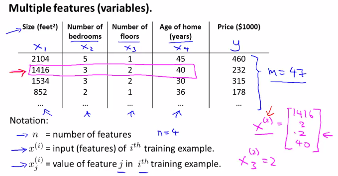
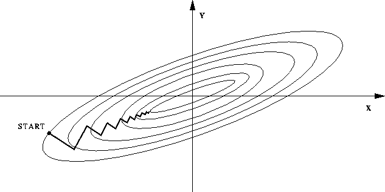
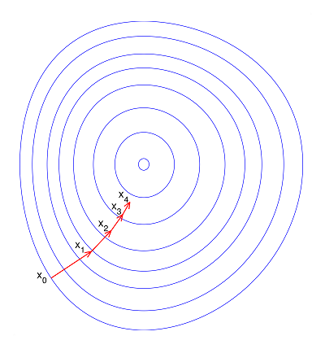
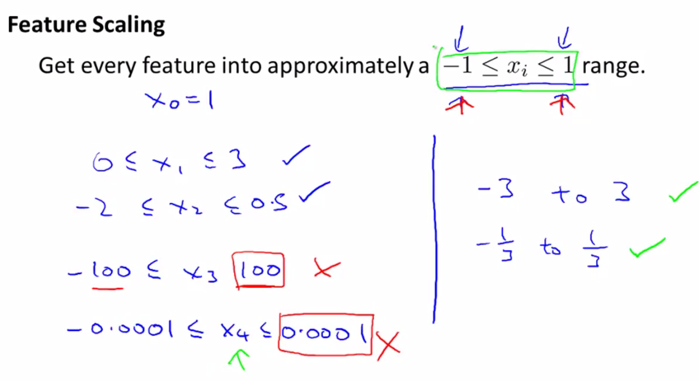
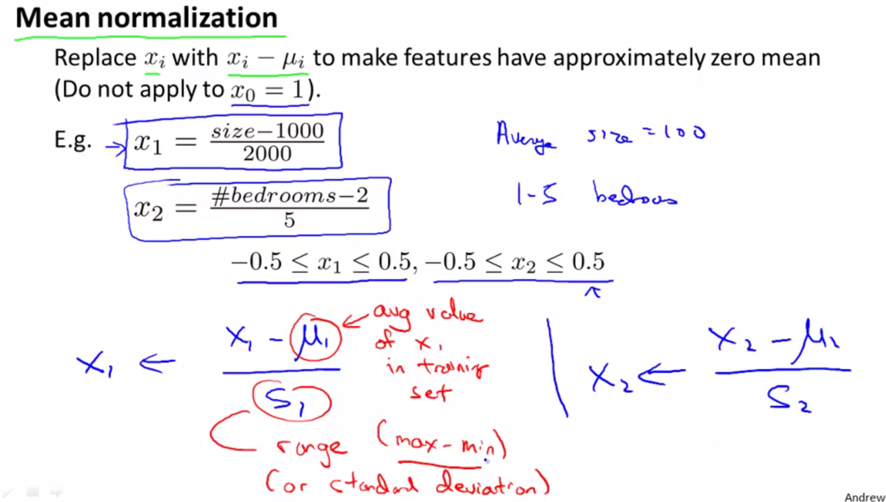
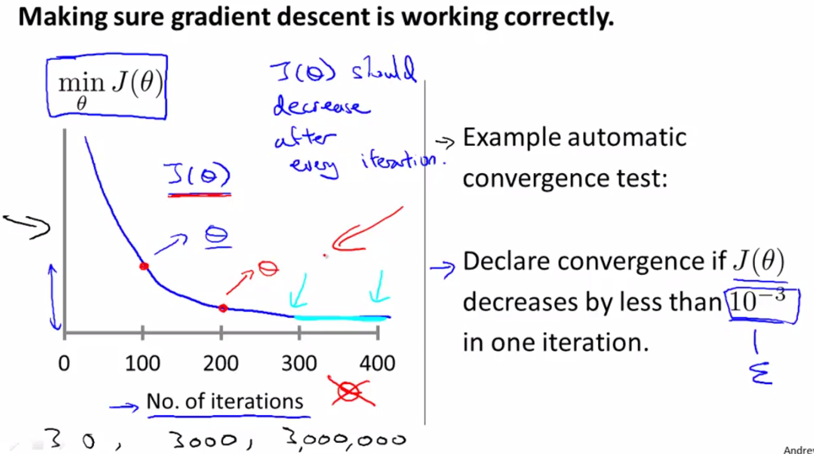
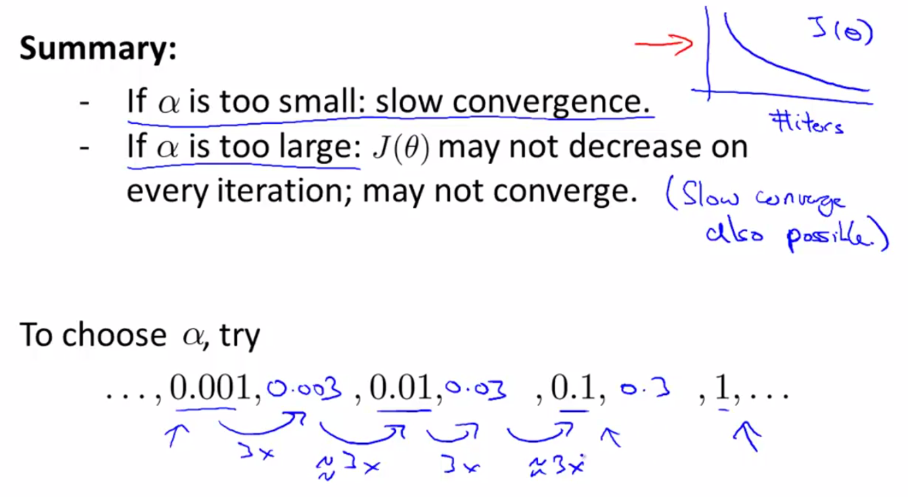
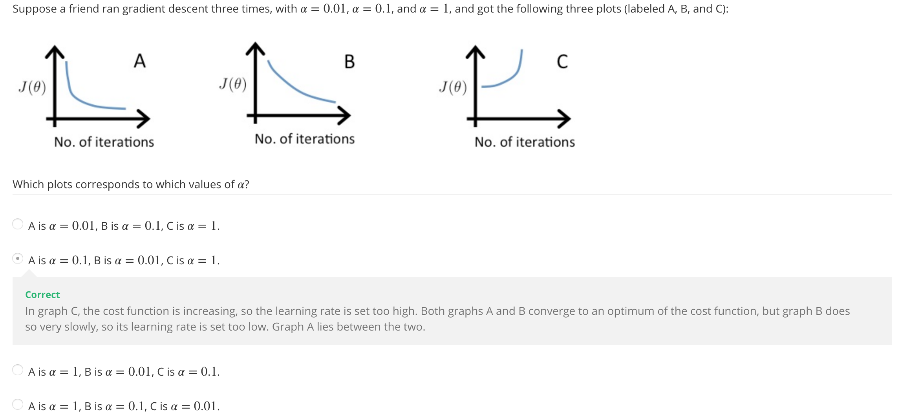

# 
Multiple Features

  

## Definition
----

  

 

  

  

## Gradient Descent for Multiple Variables
----

  

  

## Feature Scaling
----
特征缩放是因为在原始资料中，各变数范围不同。对于机器学习，若没有标准化，目标函数会无法适当运作。举例来说，多数分类器利用两点距离计算差异，若其中一个特征有非常广的范围，那两点间差异会被该特征左右。因此，所有特征都该标准化。

另外一个做特征缩放的理由是能加速梯度下降法的收敛。如果不归一化，各维特征的跨度差距很大，目标函数就会是“扁”的：

  

 

这样，进行梯度下降的时候，梯度的方向就会偏离最小值的方向，走很多弯路。如果归一化了，每一步梯度的方向都基本指向最小值，可以大踏步地前进，目标函数就“圆”了：

  

 

最简单方式是缩放特征范围到[0, 1]或[-1, 1]：

$$
x^{'} = \frac{x-\text{min}(x)}{\text{max}(x)-\text{min}(x)}
$$

 

  

 

For mean normalization:

$$
x^{'} = \frac{x-\text{mean}(x)}{\text{max}(x)-\text{min}(x)}
$$

 

  

  

## Learning Rate
----

  

 

It has been proven that if learning rate $$ \alpha $$ is sufficiently small, then $$ \text{J}(\theta_0) $$ will decrease on every iteration.

  

 

  

 

  

 