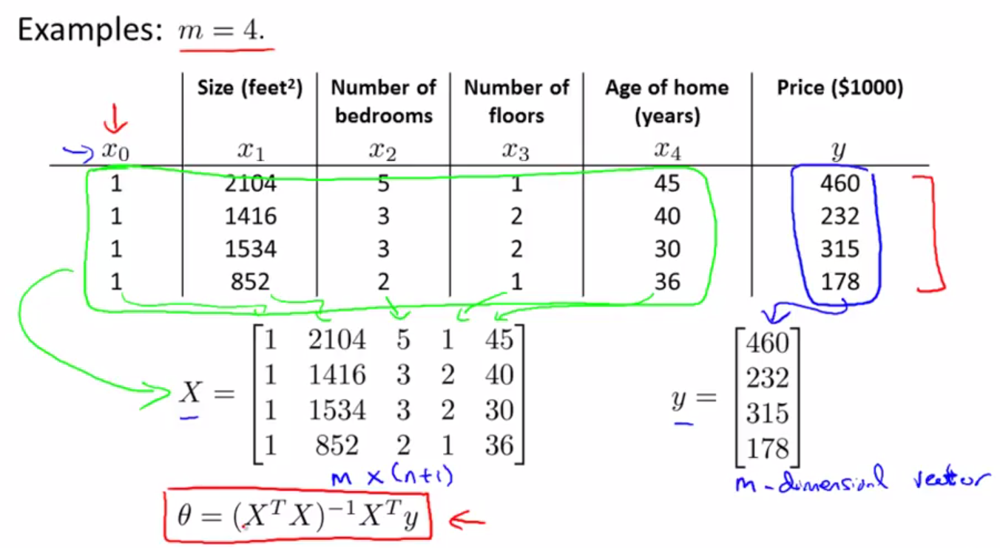
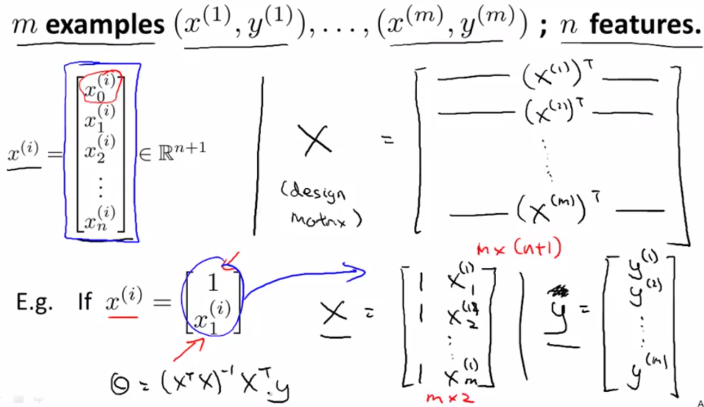
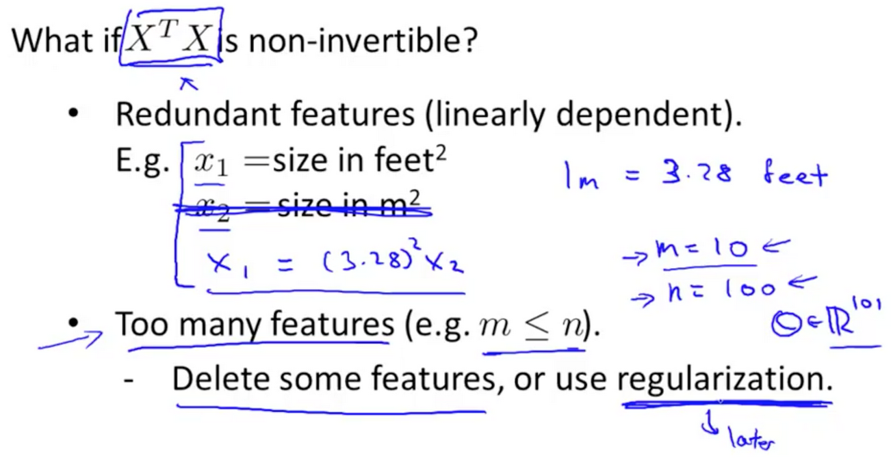

# 
Normal Equation

  

之前用梯度下降求最优值，缺点是需要很多次迭代才能得到全局最优解，而正规方程可以避免这些。

首先，在数据集前加上一列$$ x_0 $$，值都为1；然后将所有变量放入矩阵$$ X $$中(包括$$ x_0 $$)；再将输出值放入向量$$ y $$中；最后通过如下公式算出$$ \theta $$值。

$$
\theta = (X^{T}X)^{-1}X^{T}y
$$

  

 

  

 

> There is **no need** to do feature scaling with the normal equation.

  

## Gradient Descent vs Normal Equation
----
$$
\begin{array}{c|c}
\mathbf{Gradient Descent} & \mathbf{Normal Equation} \\
\hline
\text{Need learning rate} & \text{No need to choose learning rate} \\
\text{Many iterations} & \text{No iteration} \\
\text{O}(kn^2) & \text{O}(n^3) \text{, need to calculate } (X^TX)^{-1} \\
\text{Work well when n is large} & \text{Slow if n is very large}
\end{array}
$$

  

## Normal Equation Noninvertibility
----
当$$ X^TX $$不可逆时，可能是使用了冗余特征，或使用太多特征(特征数量超过样本数量)。对于这种情况可以删掉一些特征或使用正则化：

  

 