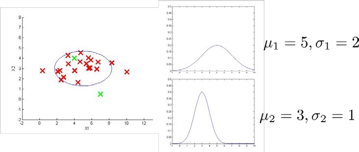
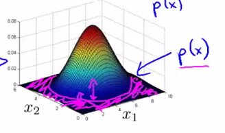
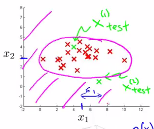

# 
Algorithm

  

## What
----
采用**高斯分布**异常检测算法流程如下：

1. 选择足够反映异常样本的特征$$x_j$$。
2. 对各特征进行参数估计：

$$
\begin{align*}
\mu_j &= \frac{1}{m}\sum\limits_{i=1}^mx_j^{(i)} \\
\delta^2_j &= \frac{1}{m}\sum\limits_{i=1}^m(x_j^{(i)}-\mu)^2
\end{align*}
$$

3. 对新样本$$x$$，计算$$p(x)$$。如果$$p(x) < \epsilon$$，认为$$x$$是异常样本。

$$
p(x)=\prod\limits_{j=1}^np(x_j;\mu_j,\delta_j^2)=\prod\limits_{j=1}^n\frac{1}{\sqrt{2\pi}\delta_j}exp(-\frac{(x_j-\mu_j)^2}{2\delta_j^2})
$$

  

## Example
----
假定有两个特征$$x_1$$和$$x_2$$，都服从高斯分布，且通过参数估计获得分布参数：

    </img>

则模型$$p(x)$$能由如下热力图反映，越热的地方是正常样本的概率越高。参数$$\epsilon$$描述一个截断高度，当概率落到截断高度以下（紫色区域），则为异常样本：

    </img>

将$$p(x)$$投影到特征$$x_1$$和$$x_2$$所在平面，紫色曲线反映$$\epsilon$$的投影。它是一条截断曲线，落在曲线外的是异常样本：

    </img>

