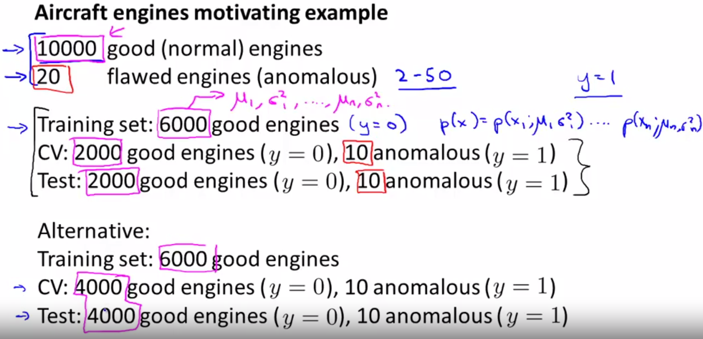
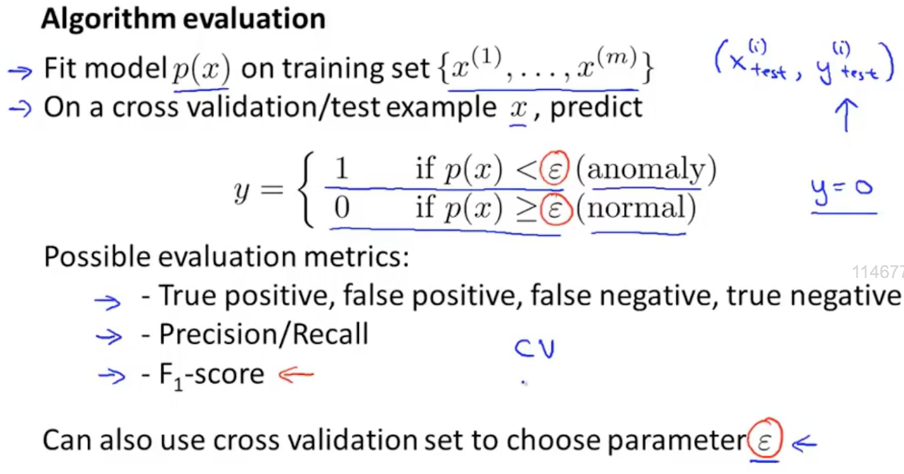
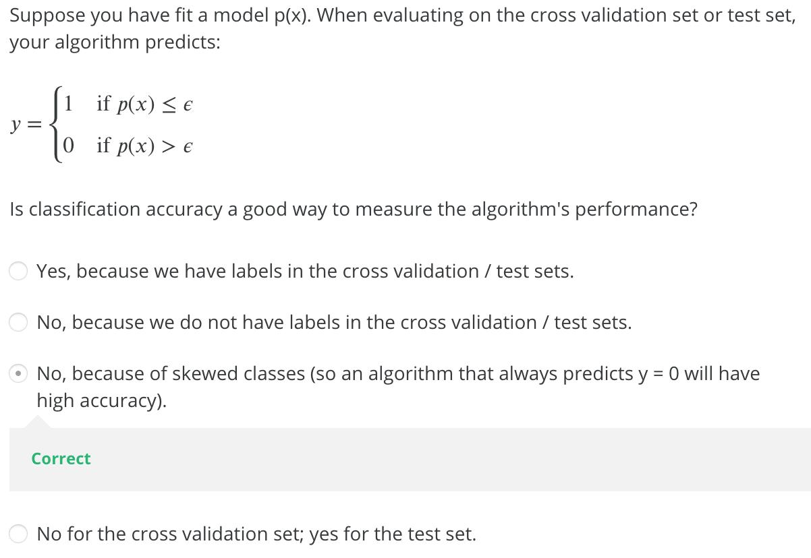

# 
Anomaly Detection

  

## Evaluation
----
异常检测算法是非监督学习算法，意味着无法根据结果变量$$y$$值确定数据是否真的异常。所以，需另一种方法检验算法有效性。开发异常检测系统时，从带标记（异常或正常）数据着手，从其中选择一部分正常数据构建训练集，用剩下正常数据和异常数据混合的数据构成交叉检验集和测试集。

    </img>

具体评价方法：
1. 根据测试集数据，估计特征平均值和方差并构建函数。
2. 对交叉检验集，尝试使用不同$$\epsilion$$作为阀值，并预测数据是否异常。根据$$F_1$$或查准率与查全率比例来选择$$\epsilion$$。 
3. 选出$$\epsilion$$后，针对测试集进行预测，计算异常检验系统的值，或查准率与查全率之比。

    </img>

  

## Anomaly Detection vs Supervised Learning
----
| 异常检测 | 监督学习 |
| ------- | ------ |
| 数据分布均匀，有大量正负数据。 | 数据非常偏斜，异常样本远少于正常样本。 |
| 异常类型不一，很难根据现有异常样本（即正样本）拟合判断异常样本形态。 | 足够多实例，够用于训练算法。 |

常见场景：
| 异常检测 | 监督学习 |
| ------- | ------ |
| 故障检测 | 垃圾邮件检测 |
| 判断零部件是否异常 | 癌症分类 |

  

## Exercises
----
