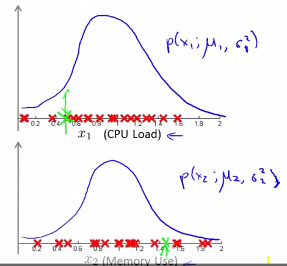
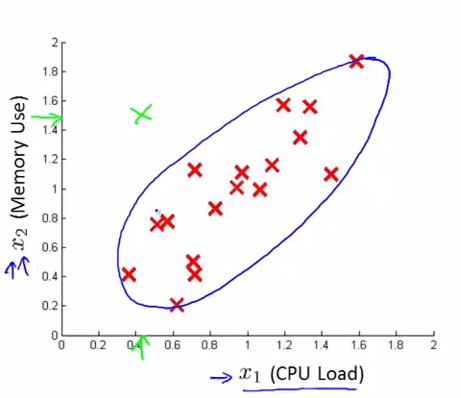
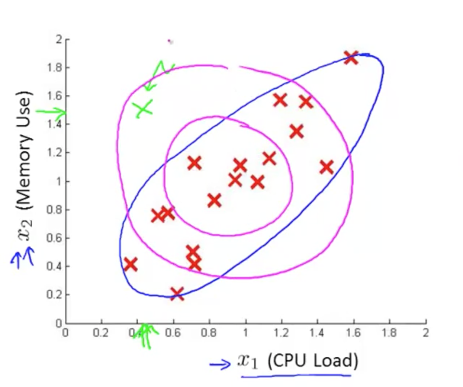
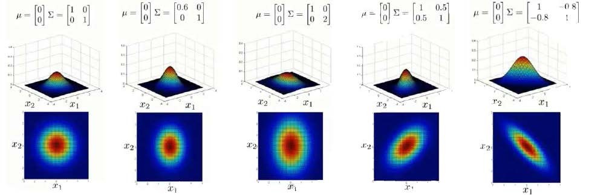
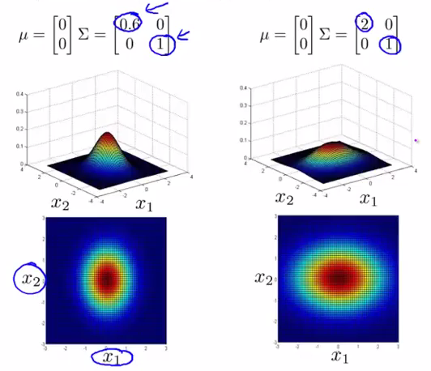
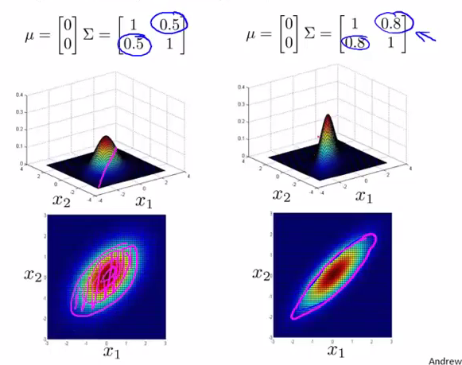
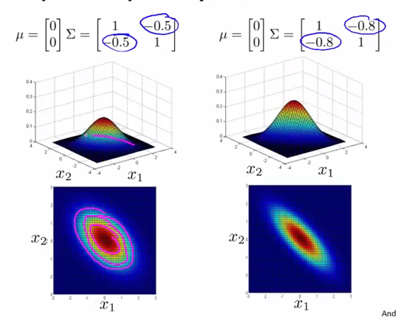
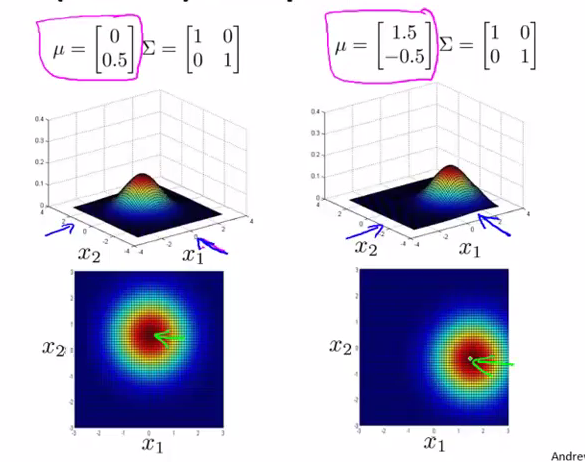
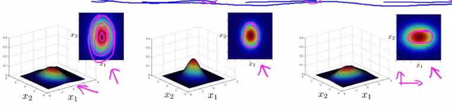

# 
Multivariate Gaussian Distribution

  

## What
----
在服务器监控问题中，获得一个服务器样本$$x$$且计算了$$p(x_1;\mu_1,\delta_1^2)$$及$$p(x_2;\mu_2\delta_2^2)$$，认为该服务器CPU负载和内存使用都在正常范围内，认为该服务器运转正常：

    </img>

但截断边界将该样本截在正常样本之外，认为异常：

    </img>

错误截端的原因在于高斯分布模型截断边界太固定。如果决策边界能放缩旋转等，变换到紫色位置，就不会被错分为异常：

    </img>

为此，引入多元高斯分布模型。

  

## How
----
多元高斯分布模型定义：

$$
p(x;\mu,\Sigma)=\frac{1}{(2\pi)^{\frac{n}{2}}|\Sigma|^\frac{1}{2}}exp(-\frac{1}{2}(x-\mu)^T\Sigma^{-1}(x-\mu))
$$

* $$\mu$$表示样本均值，其每个单元都是原特征矩阵一行数据均值。
* $$\Sigma$$是样本协方差矩阵。
* $$[\Sigma]$$是定矩阵。
* $$\Sigma_1$$是逆矩阵。

 

### 参数
协方差矩阵是如何影响模型的：

    </img>

从左往右：
1. 一般的高斯分布模型。
2. 通过协方差矩阵，令特征1有较小的偏差，同时保持特征2的偏差。
3. 通过协方差矩阵，令特征2有较大的偏差，同时保持特征1的偏差。
4. 通过协方差矩阵，在不改变两个特征原有偏差基础上，增加两者正相关性。
5. 通过协方差矩阵，在不改变两个特征原有偏差基础上，增加两者负相关性。

- 改变$$\Sigma$$主对角线数值可不同方向宽度拉伸：

    </img>

- 改变$$\Sigma$$次对角线数值可旋转分布图像：

    </img>

    </img>

- 改变$$\mu$$可对分布图像位移：

    </img>

  

## 算法流程
----

1. 选择一些足够反映异常样本的特征$$x_j$$。

2. 对各样本进行参数估计：

    $$
    \begin{align*}
    \mu &= \frac{1}{m}\sum\limits_{i=1}^mx^{(i)} \\
    \Sigma &= \frac{1}{m}\sum\limits_{i=1}^m(x^{(i)}-\mu)(x^{(i)}-\mu)^T
    \end{align*}
    $$

3. 当新样本$$x$$到来时，计算$$p(x)$$。如果$$p(x) < \epsilon$$，认为$$x$$异常。

    $$
    p(x)=\frac{1}{(2\pi)^{\frac{n}{2}}|\Sigma|^\frac{1}{2}}exp(-\frac{1}{2}(x-\mu)^T\Sigma^{-1}(x-\mu))
    $$

  

## 多元高斯分布 vs 一般高斯分布
----
一般的高斯分布只是多元高斯分布约束，它将多元高斯分布等高线约束到如下所示同轴分布（概率密度等高线沿着轴向）：

    </img>

| 原高斯分布 | 多元高斯分布 |
| -------- | ---------- |
|  |  |
| 计算代价低，适应大规模特征。 | 计算代价高；训练集较小时也适用。 |
|        | 必须有$$m>n$$，否则协方差矩阵不可逆。通常需$$m>10n$$，另外特征冗余也会导致协方差矩阵不可逆。 |

| 一般高斯模型         | 多元高斯模型     |
| :----------------- | :------------- |
| $$\begin{align*} p(x) &= p(x_1;\mu_1, \delta^2_1)p(x_2;\mu_2, \delta^2_2) \cdots p(x_n;\mu_n, \delta^2_n) \\ &= \prod\limits_{j=1}^np(x_j;\mu_j,\delta_j^2) \\ &= \prod\limits_{j=1}^n\frac{1}{\sqrt{2\pi}\delta_j}exp(-\frac{(x_j-\mu_j)^2}{2\delta_j^2}) \end{align*}$$ | $$p(x)=\frac{1}{(2\pi)^{\frac{n}{2}}|\Sigma|^\frac{1}{2}}exp(-\frac{1}{2}(x-\mu)^T\Sigma^{-1}(x-\mu))$$ |
| 不能捕捉特征间相关性，但可通过将特征组合来解决。 | 利用协方差矩阵$$\Sigma$$自动捕捉特征间相关性。 |
| 计算复杂度低，适用高维特征。 | 计算复杂。 |
| 在样本数目$$m$$较小时也工作良好。 | 需$$\Sigma$$可逆，即$$m > n$$，且各特征不能线性相关，如不能存在$$x_2 = 3x_1$$或$$x_3 = x_1 + 2x_2$$。 |
