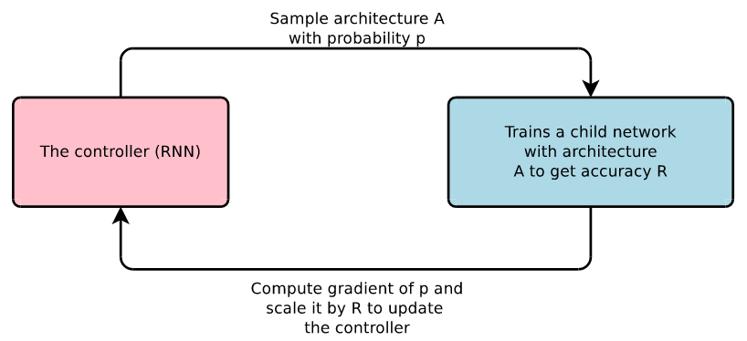
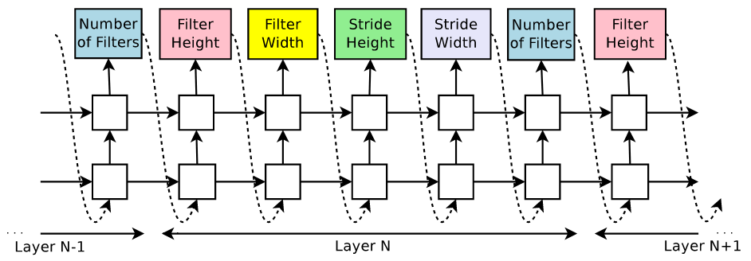
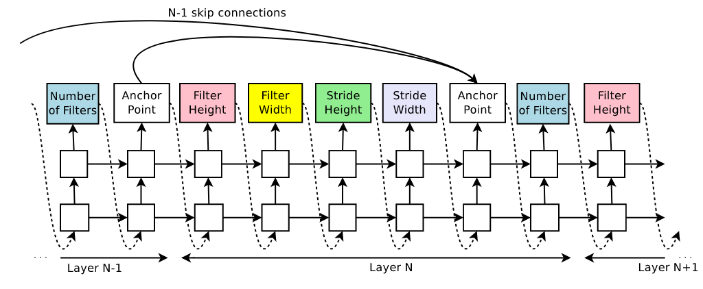
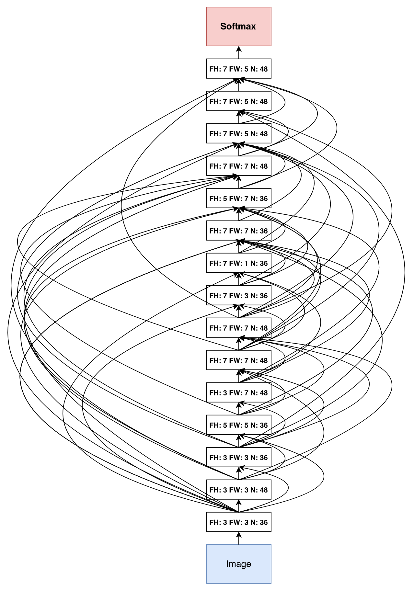
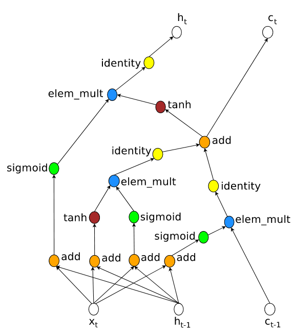
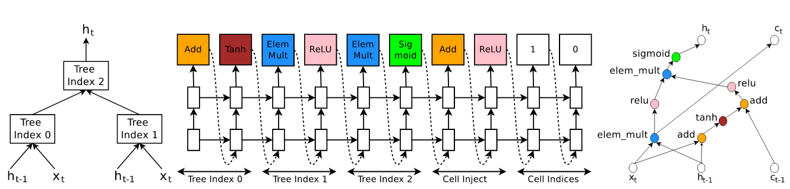
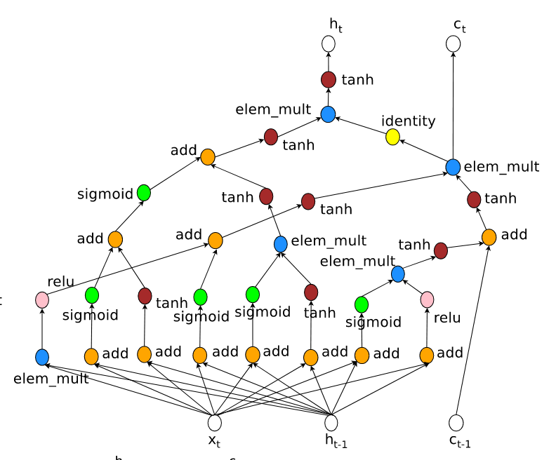
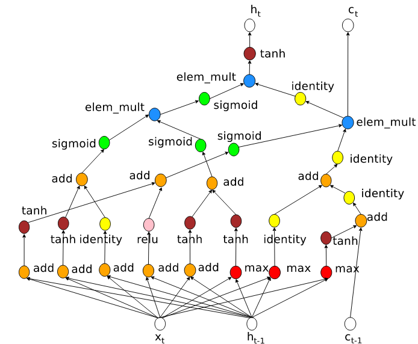

# 
Neural Architecture Search

  

[Zoph B, Le Q V. Neural architecture search with reinforcement learning[J]. arXiv preprint arXiv:1611.01578, 2016.](https://openreview.net/pdf?id=r1Ue8Hcxg)

## What
----
NAS算法目的是使用强化学习寻找最优网络，包括图像分类网络卷积部分（表示层）和RNN的类似LSTM的cell。由于神经网络一般采用堆叠block方式搭建，这种堆叠的超参数可通过序列表示，而序列表示方式是RNN所擅长的。

简单而言，其步骤为：
1. NAS使用一个RNN构成的控制器（controller）以概率$$p$$随机采样一个网络结构$$A$$；
2. 在CIFAR-10训练网络并得到其在验证集上的精度$$R$$；
3. 使用$$R$$更新控制器参数；
4. 如此循环直到模型收敛。

  

## How
----
### NAS-CNN
首先考虑最简单的CNN，即只有卷积层构成。这种网络易用控制器表示，即将控制器分成$$N$$段，每段有若干个输出，每个输出表示CNN的一个超参数。例如Filter的高、宽、横向纵向步长及Filter数量：

了解了控制器结构及控制器如何生成卷积网络，剩下是如何更新控制器参数$$\theta_c$$。

控制器每生成一个网络可看做一个action，记做$$a{1:T}$$，其中$$T$$是要预测的超参数数量。模型收敛时，其在验证集上精度是$$R$$，使用$$R$$作为强化学习奖励信号。即通过调参$$\theta_c$$最大化$$R$$期望：

$$
J(\theta_c) = E_{P(a_{1:T};\theta_{c})}[R]
$$

由于$$R$$不可导，所以需一种可更新$$\theta_c$$的策略。NAS中采用REINFORCE rule：

$$
\nabla_{\theta_c}J(\theta_{c}) = \sum^{T}_{t=1}E_{P(a_{1:T};\theta_{c})}[\nabla_{\theta_{c}}\mathrm{log}P(a_{t}|a_{(t-1):1};\theta_{c})R]
$$

上式近似等价于：

$$
\frac{1}{m}\sum^{m}_{k=1}\sum^{T}_{t=1}\nabla_{\theta_c}\mathrm{log}P(a_{t}|a_{(t-1):1};\theta_c)R_k
$$

其中$$m$$是每个batch中网络的数量。

上式是梯度的无偏估计，但方差较大，为减小方差，算法使用更新值：

$$
\frac{1}{m}\sum^{m}_{k=1}\sum^{T}_{t=1}\nabla_{\theta_c}\mathrm{log}P(a_{t}|a_{(t-1):1};\theta_c)(R_k-b)
$$

基线$$b$$是以前架构精度的指数移动平均值。

上面得到的控制器的搜索空间是不包含跳跃连接（skip connection）的，所以不能产生类似ResNet或Inception之类的网络。NAS通过在控制器添加注意力机制来添加跳跃连接：

在第$$N$$层，添加$$N-1$$个anchor来确定是否需在该层和之前某一层添加跳跃连接。anchor是通过两层隐节点状态和sigmoid函数来完成判断：

$$
P(\mathrm{Layer j is an input to layer i}) = \mathrm{sigmoid}(v^{T}\mathrm{thanh}(W_{prev} * h_j + W_{curr} * h_i))
$$

其中$$h_j$$是第$$j$$层隐层节点状态，$$j \in [0, N-1]$$。$$W_{prev}$$，$$W_{curr}$$和$$v^T$$是可学习参数，跳跃连接的添加不会影响更新策略。由于添加跳跃连接，由训练得到的参数可能产生许多问题。例如某层和其它所有层没有产生连接等，所以有几个问题需注意：

1. 如果一个层和之前所有层没有跳跃连接，那么这层作为输入层；
2. 如果一个层和之后所有层没有跳跃连接，那么这层作为输出层，并和所有输出层拼接后作为分类器输入；
3. 如果输入层拼接了多个尺寸输入，则通过将小尺寸输入加值为0的padding方式进行尺寸统一。

除了卷积和跳跃连接，例如池化和Dropout等策略也可通过相同方式添加到控制器，只不过需引入更多策略相关参数。

训练后，在CIFAR-10得到的卷积网络如图所示。

可发现NAS和DenseNet有很多相通地方：
1. 都是密集连接；
2. Feature Map个数都比较少；
3. Feature Map间采用拼接方式连接。

在生成NAS实验中，网络加入了BN和跳跃连接。卷积核的高范围是$$[1,3,5,7]$$，宽范围是$$[1,3,5,7]$$，个数范围是$$[24,36,48,64]$$，步长为固定为1和在$$[1,2,3]$$中两种情况，控制器使用的是有35个隐层节点的LSTM。

 

### NAS-RNN
采用强化学习方法同样生成了RNN中类似于LSTM的一个Cell。控制器参数更新方法和前述类似。

传统RNN输入是$$x_t$$和$$h_{t-1}$$，输出是$$h_t$$，计算方式是$$h_t = \mathrm{tanh}(W_{1}x_t + W_{2}h_{t-1})$$。LSTM输入是$$x_t$$，$$h_{t-1}$$及单元状态$$c_{t-1}$$，输出是$$h_t$$和$$c_t$$。LSTM的处理可看做将$$x_t$$，$$h_{t-1}$$和$$c_{t-1}$$作为叶子节点的树结构。

和LSTM一样，NAS-RNN也需输入一个$$c_{t-1}$$并输出一个$$c_t$$，并在控制器最后两个单元中控制如何使用$$c_{t-1}$$及如何计算$$c_t$$。

在这个树结构中有两个叶子节点和一个中间节点，叶子节点索引是0和1，中间节点索引是2。控制器需预测3个block，每个block包含一个操作（加或点乘等）和一个激活函数（ReLU和Sigmoid等）。在3个block之后接的是一个Cell inject，用于控制$$c_{t-1}$$的使用。最后是一个Cell indices，确定哪些树用于计算$$c_t$$。

详解上图：

1. 控制器为索引为0的树预测的操作和激活函数分别是Add和tanh，即$$a_0 = \mathrm{tanh}(W_1 * x_t + W_2 * h_{t-1})$$；
2. 控制器为索引为1的树预测的操作和激活函数分别是ElemMult和ReLU，即$$a_1 = \mathrm{ReLU}((W_3 * x_t) \odot (W_4 * h_{t-1}))$$；
3. 控制器为Cell Indices的第二个元素的预测值为0，Cell Inject的预测值是add和ReLU，即$$a_0$$值需更新为$$a_{0}^{new} = \mathrm{ReLU}(a_0 + c_{t-1})$$；
4. 控制器为索引为2的树预测的操作和激活函数分别是ElemMult和Sigmoid，即$$a_2 = \mathrm{sigmoid}(a^{new}_{0} \odot a_1)$$，因为$$a_2$$是最大的树索引，所以$$h_t=a_2$$；
5. 控制器为Cell Indices的第一个元素预测值是1，即$$c_t$$要使用索引为1的树在使用激活函数的值，即$$c_t = (W_3 * x_t) \odot (W_4 * h_{t-1})$$。

上例使用base 2超参作为例子讲解。实际中使用base 8，得到下图两个RNN单元。左侧是不包含max和sin的搜索空间，右侧是包含max和sin的搜索空间（控制器没有选择sin）。

  