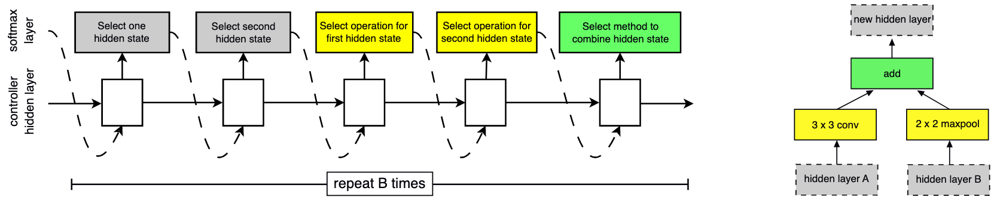
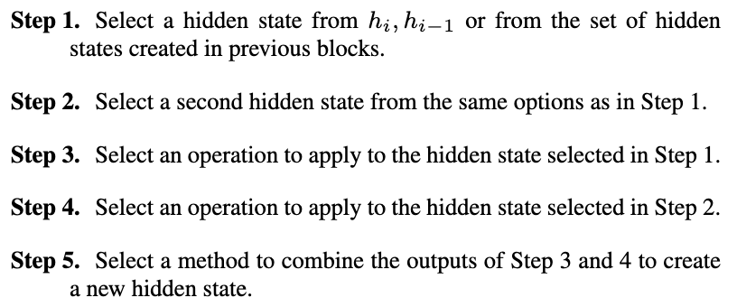
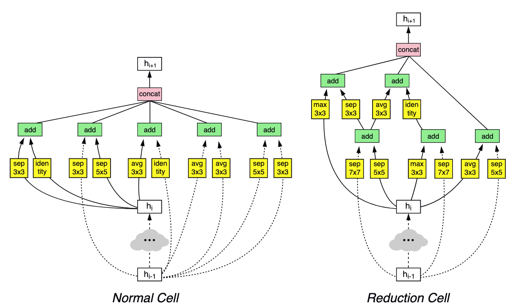
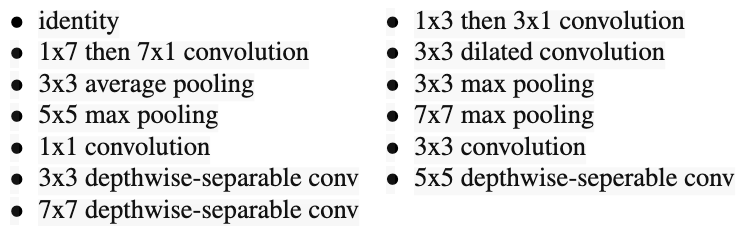
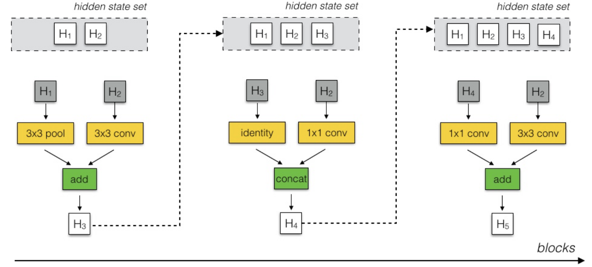
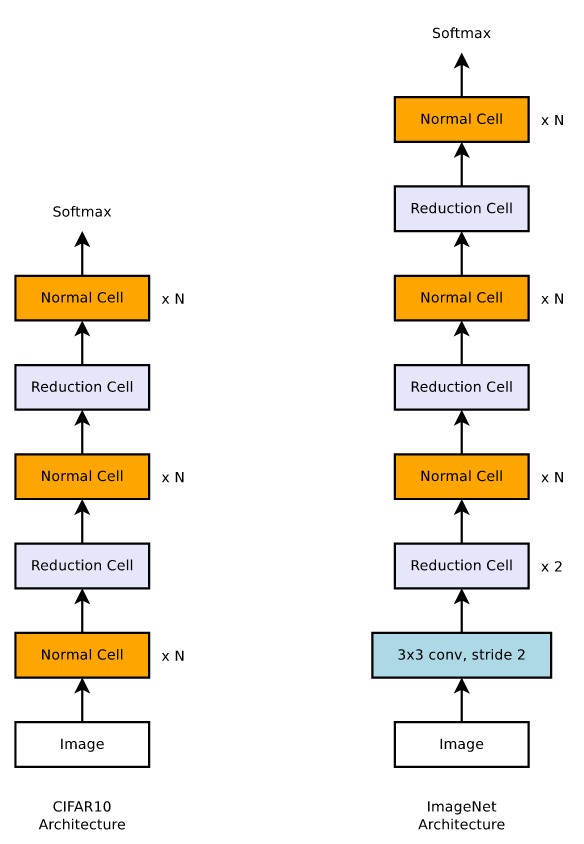
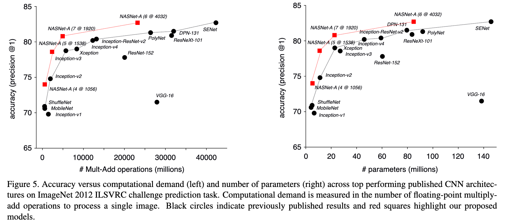
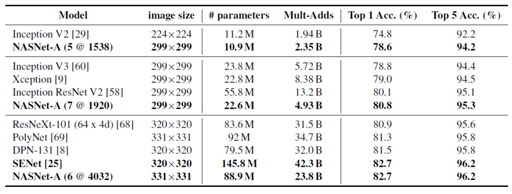

# 
NASNet

  

* [Learning Transferable Architectures for Scalable Image Recognition](https://arxiv.org/pdf/1707.07012.pdf)

  

## Why
----
NAS提出的计算代价相当昂贵，仅在CIFAR-10就需500台GPU运行28天。很难迁移到大数据集。在目前的行规，如果不能在ImageNet上取得state-of-the-art结果，网络结构很难令人信服。

为将NAS迁移到大数据集乃至ImageNet，这篇文章提出在小数据（CIFAR-10）上学习一个网络单元（Cell），然后通过堆叠更多这些网络单元形式将网络迁移到更大数据集。这篇文章最大贡献是介绍如何使用强化学习学习网络单元。

  

## How
----
### NASNet Controller Model Architecture
**在NASNet，完整的网络结构需手动设计，NASNet学习的是完整网络中被堆叠、被重复使用的网络单元。**为便于将网络迁移到不同数据集，需学习两种类型网络块：
1. Normal Cell：输出Feature Map和输入Feature Map的尺寸相同；
2. Reduction Cell：输出Feature Map对输入Feature Map进行一次降采样，对使用Input Feature作为输入的操作（卷积或者池化）会默认步长为2。

NASNet控制器结构如图所示，每个网络单元由$$B$$个网络块（block）组成，实验中$$B=5$$。每个块的具体形式如图右侧，有并行的两个卷积组成，它们由控制器决定选择哪些Feature Map作为输入（灰色）及使用哪些运算（黄色）来计算输入的Feature Map。最后由控制器决定如何合并这两个Feature Map。

NASNet网络单元计算分为5步：
1. 从第$$h_{i-1}$$个Feature Map或第$$h_i$$个Feature Map或之前已生成的网络块中选择一个Feature Map作为hidden layer A输入；
2. 采用和1类似的方法为Hidden Layer B选择一个输入；
3. 为1的Feature Map选择一个运算；
4. 为2的Feature Map选择一个运算；
5. Select a method to combine the outputs of Step 3 and 4 to create a new hidden state.

在3，4中可选择的运算有：

- The above is only for ONE block.

- The controller RNN is a one-layer LSTM with 100 hidden units at each layer and $$2×5B$$ softmax predictions for the two convolutional cells (where $$B$$ is typically 5) associated with each architecture decision.

- Each of the $$10B$$ predictions of the controller RNN is associated with a probability. The joint probability of a child network is the product of all probabilities at these $$10B$$ softmaxes. This joint probability is used to compute the gradient for the controller RNN.

- The gradient is scaled by the validation accuracy of the child network to update the controller RNN such that the controller assigns low probabilities for bad child networks and high probabilities for good child networks.

在5中可以选择的合并操作有
1. 单位加；
2. 拼接。

最后所有生成的Feature Map通过拼接操作合成一个完整的Feature Map。

为让控制器同时预测Normal Cell和Reduction Cell，RNN有$$2 * 5 * B$$个输出，其中前$$5 * B$$个输出预测Normal Cell的$$B$$个块，后$$5 * B$$个输出预测Reduction Cell的$$B$$个块。RNN使用的是单层100个隐层节点的LSTM。

 

### Search Space

- Each block consists of the controller selecting a pair of hidden states (dark gray), operations to perform on those hidden states (yellow) and a combination operation (green).

- The resulting hidden state is retained in the set of potential hidden states to be selected on subsequent blocks.

 

### NASNet强化学习
思路和NAS相同，几个细节：

- NASNet迁移学习时使用的优化策略是Proximal Policy Optimization（PPO）；
- 尝试了均匀分布的搜索策略，效果略差于策略搜索。

 

### Scheduled Drop Path
在优化类似于Inception的多分支结构时，以一定概率随机丢弃部分分支是避免过拟合的一种策略，例如DropPath。但DropPath对NASNet不非常有效。在NASNet的Scheduled Drop Path中，丢弃的概率随训练时间增加线性增加。

 

### 其它超参
NASNet强化学习搜索空间大大减小，很多超参由算法写死或人为调整。这里介绍一下NASNet需人为设定的超参。

- 激活函数使用ReLU。实验表明ELU non-linearity效果略优于ReLU；
- 全部使用Valid卷积，padding值由卷积核大小决定；
- Reduction Cell的Feature Map的数量需乘以2，Normal Cell数量不变；
- Normal Cell的重复次数$$n$$人为设定；
- 深度可分离卷积在深度卷积和单位卷积中间不使用BN或ReLU；
- 所有卷积遵循ReLU->卷积->BN的计算顺序；
- 为保持Feature Map数量一致性，必要时添加1 x 1卷积。

堆叠Cell得到的CIFAR_10和ImageNet的实验结果如图所示：

- In NASNet, though the overall architecture is predefined as shown above, the blocks or cells are not predefined by authors. Instead, they are searched by reinforcement learning search method.
- Normal Cell: Convolutional cells that return a feature map of the same dimension.
- Reduction Cell: Convolutional cells that return a feature map where the feature map height and width is reduced by a factor of two.
- **Only the structures of (or within) the Normal and Reduction Cells are searched by the controller RNN.**

  

## Experimental Results
----

- The architectures from CIFAR-10 are transferred to ImageNet, but all ImageNet models weights are trained from scratch.

- NASNets achieve state-of-the-art performances with fewer floating point operations and parameters than comparable architectures.

- The convolutional cells discovered with CIFAR-10 generalize well to ImageNet problems.

- Importantly, the largest model achieves a new state-of-the-art performance for ImageNet (82.7%) based on single, non-ensembled predictions, surpassing previous best published result (DPN) by 1.2%. Among the unpublished works (SENet), NASNet is on par with the best reported result of 82.7% .