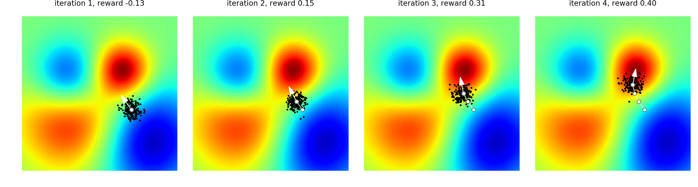

# <center>AutoML</center>

<br></br>


## 神经网络进化
----
不管是遗传算法还是进化策略，都采取进化理论的某些重要部分。比如遗传算法有来自父母的两组神经网络，通过将两个神经网络交叉配对，产生宝宝神经网络。然后将宝宝神经网络变异获取新能力。最后将所有宝宝们适者生存。如果使用进化策略，先固定神经网络结构。让这个结构蚕卵，生出很多和原始神经网络结构相同，但联结强度不同的网络。这些宝宝网络中有好有坏，进化策略中下一代爸爸是所有宝宝的综合体。这个综合体中，好宝宝联结占更多比例，坏宝宝占更少比例。通过这种形式，让好宝宝渐渐主宰生存环境。

反向传播和靠计算梯度的神经网络适合监督学习。这方面，使用进化理论的神经网络暂时比不上梯度神经网络。

梯度下降中，需要的只是梯度。因为梯度指明优化方向。所以如果是监督学习，优化非常快。而神经网络进化使用是另一种手段。用原始点创造出很多新点，通过新点确定下一代起点在哪。循环再不断继续。如果在监督学习，需不断产生非常多新网络，测试新网络，比梯度法慢。但不使用梯度法好处是有效避免局部最优。此外，因为涉及很多宝宝，可将宝宝利用计算机并行能力有效计算。

1. 固定神经网络形态 (Topology)，改变参数 (weight)：

    通过不断尝试变异，修改链接中间weight，改变神经网络预测结果，保留预测结果更准确的。OpenAI在2017年将进化策略 (Evolution Strategy) 衍生到神经网络，不断进化神经网络参数。实验结果够媲美强化学习方法，比如Q-learning和Policy Gradient。

2. 修改参数和形态：

    除了参数，形态能改变。NEAT算法是这种。因为能变化形态，所以在NEAT中，不存在神经层。

<br></br>


## NEAT算法
---- 
> * [Evolving Neural Networks through Augmenting Topologies](http://nn.cs.utexas.edu/downloads/papers/stanley.ec02.pdf)
> * [Efficient Evolution of Neural Network Topologies](http://nn.cs.utexas.edu/downloads/papers/stanley.cec02.pdf)

典型的遗传算法，步骤：
1. 使用创新号码（Innovation ID）对神经网络直接编码（direct coding）。
2. 根据Innovation ID交叉配对（crossover）。
3. 对神经元（node），神经链接（link）进行基因突变（mutation）。
4. 保留生物多样性（Speciation）。比如，不好的网络突然变异成厉害的。
5. 通过初始化只有input连着output的神经网络减小神经网络大小。即从最小的神经网络结构开始发展。


上图可想象成如何通过DNA（图中Genome）编译神经网络。Node genes是神经网络每个节点的定义。`Connect.Genes`是对每个节点与节点链接是什么样的形式，从输入节点In到输出节点Out，这个链接参数 (weight) 是多少。输出节点的值是`Out = In * weight`。这条链接是要被使用 (Enabled) 还是不被使用 (DISABE)。最后是这条链接专属的创新号。

通过上面Genome能搭建出神经网络。可看出有一个2-5 DISAB链接，原因是在2-5之间已变异出一个4节点。所以2-5通过4相链接。需将原来2-5链接disable。


变异可以有节点变异和链接变异。如果新加的节点像6在原链接上的突变节点，那么原来的3-5链接要被disable。


关于crossover，两个父母通过创新号对齐，双方都有的innovation随机选一个。如果双方有对方没有的Innovation，直接全部遗传给后代.

图上出现disjoint和excess基因，是因为如果要区分种群不同度，来选择要保留的种群时，需通过这个计算。

<br></br>


## 进化策略与神经网络
----
Evolution Strategy较于Genetic Algorithm更加注重mutation，且其中使用正态分布。OpenAI提出的能替代强化学习的ES可终结如下：
1. 固定神经网络结构。
2. 使用正态分布来扰动（perturb）神经网络链接参数。
3. 使用扰动的网络在环境中收集奖励。
4. 用奖励或效用诱导参数更新幅度。



如果是找到图中最红地方，ES是在自己周围随机繁殖后代。有些后代会靠近红色地方，有些不会。修改ES神经网络参数，让它更像好后代参数。

<br></br>


## Feature Engineering
----  
### feature-tools  
https://github.com/Featuretools/featuretools

用关系数据库数据集中的模式解决特征工程。使用深度特征合成（DFS）算法，遍历关系数据库模式描述的数据关系路径。DFS遍历时，通过应用于数据的操作（如sum、average、count）生成合成特征。

例如，它可对来自给定客户ID的事务列表进行sum操作。不过这是一个深度操作，算法可遍历更深层特征。featuretools优势在于可靠性及在使用时间序列数据时处理信息泄漏的能力。

<br>


### boruta-py
https://github.com/scikit-learn-contrib/boruta_py

是Brouta特征消减策略的实现。其中问题以“完全相关”方式构建，算法保留对模型有显著贡献的所有特征。与其他很多特征消减算法使用的“最小化最优”特征集相反。

Boruta通过创建由目标特征的随机排序值组成的合成特征来确定特征重要性，然后在原始特征集上训练基于简单树的分类器和在合成特征中替换目标特征的特征集。所有特征的性能差异被用于计算相关性。

<br>


### categorical-encoding
https://github.com/scikit-learn-contrib/categorical-encoding

这个库扩展很多实现scikit-learn数据转换器接口的分类编码方法，并实现常见分类编码方法。还可直接与pandas一起使用，计算缺失值，及处理训练集之外的变换值。

<br>


### tsfresh
https://github.com/blue-yonder/tsfresh

专注于基于时间序列数据生成特征。它从时间序列数据中提取描述时间序列趋势的特征列表。这些特征包括像方差一样简单的特征和与近似熵一样复杂的特征。这个库能从数据中提取趋势，让机器学习算法更易解释时间序列数据集。它通过假设检验获取大量生成的特征集，并将其消减到最能解释趋势的特征。

tsfresh与pandas和sklearn兼容，主要功能是它的可伸缩数据处理能力。

<br>


### Trane
https://github.com/HDI-Project/Trane

可处理存储在关系数据库中的时间序列数据，用于表述时间序列问题。数据科学家可通过指定数据集元信息让这个引擎表述数据库的时间序列数据的监督问题。这个过程通过json描述，数据科学家在文件中描述列和数据类型。框架会处理文件并生成可能的预测问题，而这些问题又用于修改数据集。这个项目可以半自动化的方式生成其他特征。

<br>


### FeatureHub
https://github.com/HDI-Project/FeatureHub

建立在JupyterHub上，可让数据科学家在开发特征工程方法时协作。FeatureHub自动给生成的特征打分，以确定模型总体价值。

<br></br>


## Hyperprarmeter Tuning
----
### Skopt
https://scikit-optimize.github.io/

包括随机搜索、贝叶斯搜索、决策森林和梯度提升树。提供了可靠的优化方法，不过这些模型在给定较小的搜索空间和良好的初始估计值时表现最佳。

<br>


### Hyperopt
https://github.com/hyperopt/hyperopt-sklearn

可调整笨拙的条件或受约束的搜索空间。支持跨机器并行化，用MongoDb作为存储超参数组合结果的中心数据库。这个库通过hyperopt-sklearn和hyperas实现，而这两个模型选择和优化库又分别基于scikit-learn和keras构建。

<br>


### simple(x)
https://github.com/chrisstroemel/Simple  

是贝叶斯优化算法替代方案。与贝叶斯搜索一样，simple(x) 用尽可能少样本进行优化，并将计算复杂度从$$n^{3}$$降低到$$\log{n}$$。因此对大型搜索空间有用。这个库使用单形（$$n$$维三角形）而不是超立方体（$$n$$维立方体）对搜索空间建模，避免计算成本高昂的高斯过程。

<br>


### Ray.tune
https://github.com/ray-project/ray/tree/master/python/ray/tune

主要针对深度学习和强化学习模型。它结合尖端算法，如超频（最低限度训练可用于确定超参数效果的模型算法）、基于人口的训练（在共享超参数同时调整多个模型算法）、响应面算法和中值停止规则（如果模型性能低于中值就停止）。

<br>


### Chocolate
https://github.com/AIworx-Labs/chocolate

是分散的（支持没有中央主节点的并行计算集群）超参数优化库。使用公共数据库联合各个任务的执行，支持网格搜索、随机搜索、准随机搜索、贝叶斯搜索和协方差矩阵自适应进化策略。功能包括支持受约束的搜索空间和优化多个损失函数（多目标优化）。

<br>


### GpFlowOpt
https://github.com/GPflow/GPflowOpt

基于GpFlow的高斯过程优化器。GpFlow使用Tensorflow在GPU运行高斯过程任务的库。

<br>


### FAR-HO
https://github.com/lucfra/FAR-HO

包含一组运行在Tensorflow上的基于梯度的优化器。提供对Tensorflow中基于梯度的超参数优化器访问，允许在GPU或其他计算环境中模型训练和超参数优化。

<br>


### Xcessiv
https://github.com/reiinakano/xcessiv

用于大规模模型开发、执行和集成的框架。能通过单个GUI管理大量机器学习训练、执行和评估。还提供多个集成工具，用于组合模型实现最佳性能。它提供贝叶斯搜索参数优化器，支持高水平并行，且支持与TPOT集成。

<br>


### HORD 
https://github.com/ilija139/HORD

它为黑盒模型生成一个代理函数，并使用代理函数生成可能接近理想的超参数，以消减对完整模型的评估。与parzen estimator、SMAC和高斯过程相比，它表现出更高一致性和更低错误率。适用于极高维度情况。

<br>


### ENAS-pytorch
https://github.com/ilija139/HORD

使用pytorch实现高效的神经架构搜索。通过共享参数实现最快的网络，适用于深度学习架构搜索。

<br></br>


## Full Pipeline
----
### ATM
https://github.com/HDI-Project/ATM

Auto-Tune Models工作量很小。使用穷举搜索和超参数优化执行模型选择。仅支持分类问题，并支持AWS分布式计算。

<br>


### MLBox
https://github.com/AxeldeRomblay/MLBox

除现有框架已实现的特征工程外，还提供数据收集、数据清理和训练测试漂移检测。使用Tree Parzen Estimator优化模型类型超参数。

<br>

### auto_ml
https://github.com/ClimbsRocks/auto_ml

使用基于进化网格搜索方法完成特征处理和模型优化。通过利用高度优化库，如XGBoost、TensorFlow、Keras、LightGBM和sklearn，提高速度。

<br>

### auto-sklearn
https://github.com/automl/auto-sklearn

使用贝叶斯搜索优化机器学习管道中使用的数据预处理器、特征预处理器和分类器。多个管道经过训练并整合成一个完整模型。

<br>


### H2O
https://github.com/h2oai/h2o-3

Java开发的机器学习平台，在与机器学习库类似的抽象级别上运行。提供一个自动机器学习模块，利用自身包含的算法创建机器学习模型。

优势在于能形成大型计算机集群，从而进行大规模伸缩。还支持与Python、JavaScript、Tableau、R和TensorFlow集成。

<br>


### TPOT
https://github.com/EpistasisLab/tpot

TPOT（基于树的管道优化工具）用于查找和生成最佳数据科学管道代码的遗传编程框架。TPOT从sklearn获取算法。TPOT优势在于其独特的优化方法，提供更多独特管道。还提供一个将训练好的管道转换为代码的工具，对于希望进一步调整生成模型的数据科学家是一个好处。


灰色区域用TPOT实现自动处理。实现该部分的自动处理需遗传算法。

```bash
# installing DEAP, update_checker and tqdm 
pip install deap update_checker tqdm
# installling TPOT 
pip install tpot
```

用Big Mart Sales数据集（https://datahack.analyticsvidhya.com/contest/practice-problem-big-mart-sales-iii/）。先快速下载训练和测试文件：

```python
import numpy as np 
import pandas as pd 
import matplotlib.pyplot as plt 
%matplotlib inline 
from sklearn import preprocessing 
from sklearn.metrics import mean_squared_error

## preprocessing 
### mean imputations 
train['Item_Weight'].fillna((train['Item_Weight'].mean()), inplace=True)
test['Item_Weight'].fillna((test['Item_Weight'].mean()), inplace=True)
### reducing fat content to only two categories 
train['Item_Fat_Content'] = train['Item_Fat_Content'].replace(['low fat','LF'], ['Low Fat','Low Fat']) 
train['Item_Fat_Content'] = train['Item_Fat_Content'].replace(['reg'], ['Regular']) 
test['Item_Fat_Content'] = test['Item_Fat_Content'].replace(['low fat','LF'], ['Low Fat','Low Fat']) 
test['Item_Fat_Content'] = test['Item_Fat_Content'].replace(['reg'], ['Regular']) 
train['Outlet_Establishment_Year'] = 2013 - train['Outlet_Establishment_Year'] 
test['Outlet_Establishment_Year'] = 2013 - test['Outlet_Establishment_Year'] 

train['Outlet_Size'].fillna('Small',inplace=True)
test['Outlet_Size'].fillna('Small',inplace=True)

train['Item_Visibility'] = np.sqrt(train['Item_Visibility'])
test['Item_Visibility'] = np.sqrt(test['Item_Visibility'])

col = ['Outlet_Size','Outlet_Location_Type','Outlet_Type','Item_Fat_Content']
test['Item_Outlet_Sales'] = 0
combi = train.append(test)
for i in col:
    combi[i] = number.fit_transform(combi[i].astype('str'))
    combi[i] = combi[i].astype('object')
train = combi[:train.shape[0]]
test = combi[train.shape[0]:]
test.drop('Item_Outlet_Sales',axis=1,inplace=True)

## removing id variables 
tpot_train = train.drop(['Outlet_Identifier','Item_Type','Item_Identifier'],axis=1)
tpot_test = test.drop(['Outlet_Identifier','Item_Type','Item_Identifier'],axis=1)
target = tpot_train['Item_Outlet_Sales']
tpot_train.drop('Item_Outlet_Sales',axis=1,inplace=True)

# finally building model using tpot library
from tpot import TPOTRegressor
X_train, X_test, y_train, y_test = train_test_split(tpot_train, target, train_size=0.75, test_size=0.25)

tpot = TPOTRegressor(generations=5, population_size=50, verbosity=2)
tpot.fit(X_train, y_train)
print(tpot.score(X_test, y_test))
tpot.export('tpot_boston_pipeline.py')
```

一旦代码运行完成，`tpot_exported_pipeline.py`将会放入用于路径优化的Python代码。`ExtraTreeRegressor`可最好解决这个问题：

```python
## predicting using tpot optimised pipeline
tpot_pred = tpot.predict(tpot_test)
sub1 = pd.DataFrame(data=tpot_pred)
#sub1.index = np.arange(0, len(test)+1)
sub1 = sub1.rename(columns = {'0':'Item_Outlet_Sales'})
sub1['Item_Identifier'] = test['Item_Identifier']
sub1['Outlet_Identifier'] = test['Outlet_Identifier']
sub1.columns = ['Item_Outlet_Sales', 'Item_Identifier', 'Outlet_Identifier']
sub1 = sub1[['Item_Identifier','Outlet_Identifier', 'Item_Outlet_Sales']]
sub1.to_csv('tpot.csv', index=False)
```
