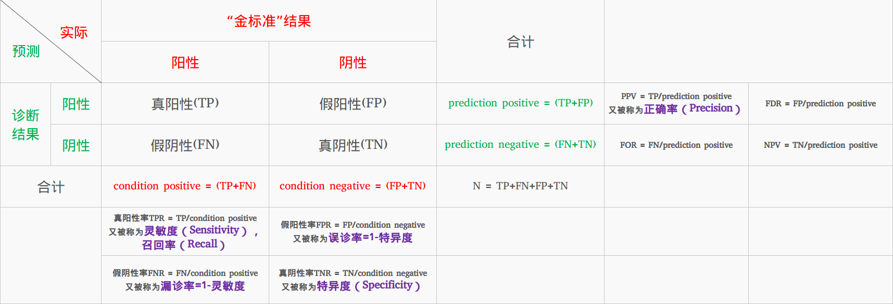
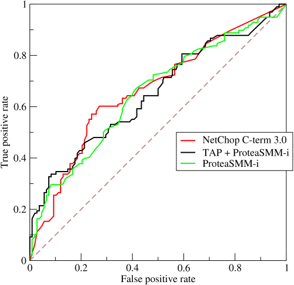
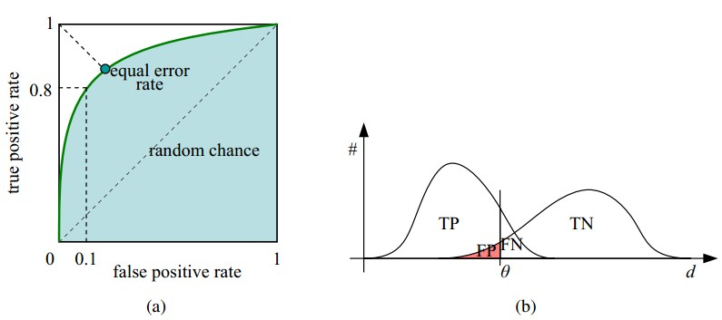
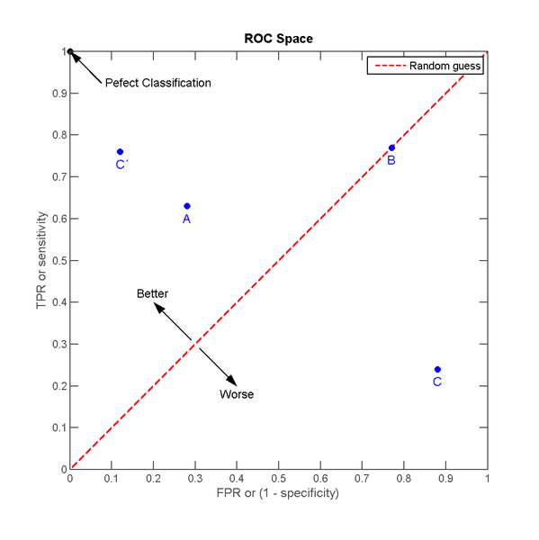
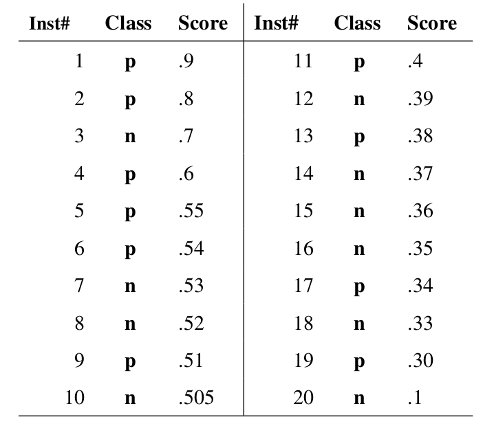
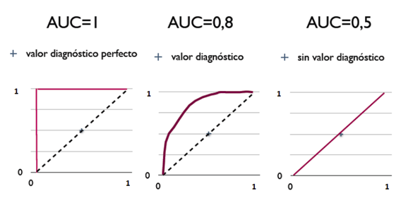

# 
Area Under Curve

  

## Background
----
ROC（Receiver Operating Characteristic）曲线和AUC（Area Under the Curve）值常用来评价二值分类器（binary classifier）。

实际检测时，有四种情况：
1. 真阳性（True Positive，TP）
2. 假阳性（False Positive，FP）
3. 真阴性（True Negative，TN）
4. 假阴性（False Negative，FN）

* 正确率（Precision）：

$$
Precision=/frac{TP}{TP+FP}
$$

* 真阳性率（True Positive Rate，TPR），灵敏度（Sensitivity），召回率（Recall）：

$$
Sensitivity=Recall=TPR=/frac{TP}{TP+FN}
$$

* 真阴性率（True Negative Rate，TNR），特异度（Specificity）：

$$
Specificity=TNR=/frac{TN}{FP+TN}
$$

* 假阴性率（False Negatice Rate，FNR）：

$$
FNR=/frac{FN}{TP+FN}
$$

* 假阳性率（False Positice Rate，FPR）：

$$
FPR=/frac{FP}{FP+TN}
$$

* 阳性似然比（Positive Likelihood Ratio (LR+)）：

$$
LR+=/frac{TPR}{FPR}=/frac{Sensitivity}{1−Specificity}
$$

* 阴性似然比（Negative Likelihood Ratio (LR−)）：

$$
LR−=/frac{FNR}{TNR}=/frac{1−Sensitivity}{Specificity}
$$

* Youden指数（Youden Index）：

$$
Youden index=Sensitivity+Specificity−1=TPR−FPR
$$

  

## ROC - Receiver Operating Characteristic Curve
----
ROC曲线是反映敏感性和特异性连续变量的综合指标。曲线上每个点反映对同一信号刺激的感受性。

  

* 横坐标：伪正类率（False Positive Rate，FPR)，预测为正但实际为负的样本占所有负样本比例；
* 纵坐标：真正类率（True Positive Rate，TPR），预测为正且实际为正的样本占所有正样本比例。

在一个二分类模型，假设采用逻辑回归分类器，其对每个实例为正类概率，通过设定一个阈值，如0.6，概率大于等于0.6为正类。可算出一组（FPR，TPR），在平面中得到对应坐标点。随着阈值减小，越来越多实例分为正类，但这些正类中也掺杂负例，即TPR和FPR同时增大。阈值最大时，对应坐标点为`(0,0)`，阈值最小时，对应坐标点`(1,1)`。

如下，(a)中实线为ROC曲线，线上每个点对应一个阈值。

  

* 横轴FPR：1-TNR，FPR越大，预测正类中实际负类越多。
* 纵轴TPR：Sensitivity（正类覆盖率），TPR越大，预测正类中实际正类越多。
* 理想目标：`TPR=1`，`FPR=0`，即`(0,1)`点。故ROC曲线越靠`(0,1)`点，越偏离45度对角线越好，Sensitivity、Specificity越大效果越好。

理想情况，TPR接近1，FPR接近0。ROC曲线每个点对应一个threshold。对于分类器，每个threshold下有一个TPR和FPR。比如threshold最大时，`TP=FP=0`，对应于原点；threshold最小时，`TN=FN=0`，对应点`(1,1)`。

  

  

## 画ROC曲线
----
对一个特定分类器和测试数据集，只能得到一个分类结果，即一组FPR和TPR。要得到一个曲线，需一系列FPR和TPR值。Wikipedia上对ROC曲线定义为：

> In signal detection theory, ROC curve is a graphical plot which illustrates the performance of a binary classifier system as its discrimination threshold is varied.

如何理解_discrimination threashold_呢？分类器一个重要功能为*概率输出*，即表示分类器认为某样本具有多大概率属于正样本。通过深入了解分类器内部机理，总能得到一种概率输出，即将一个实数范围通过变换映射到`(0,1)`区间。

假如已得到所有样本概率输出，如何改变_discrimination threashold_？根据每个测试样本属于正样本概率从大到小排序。下图是一个示例，有20个样本，*Class*表示每个测试样本真正标签，*Score*表示每个测试样本属于正样本概率：

  

从高到低，依次将_Score_作为threshold。当样本属于正样本概率大于或等于threshold时，认为正样本。举例，对第4个样本，_Score_值为0.6，那么样本1，2，3，4认为是正样本。每次选取不同threshold，可得到一组FPR和TPR，即ROC曲线上一点。共得到20组FPR和TPR值，画在ROC曲线结果如下：

  

当将threshold设为1和0时，可以得到ROC曲线上`(0,0)`和`(1,1)`两个点。将这些`(FPR,TPR)`对连接，得到ROC曲线。threshold值越多，ROC曲线越平滑。其实，并不要得到每个测试样本是正样本概率，只要得到分类器对该测试样本“评分值”即可（评分值不一定在`(0,1)`区间）。

  

## AUC - Area Under Curve
----
> AUC值越大的分类器，正确率越高。

AUC定义为ROC曲线下面积，显然值不会大于1。由于ROC曲线一般处于`y=x`直线上方，所以AUC取值范围一般在0.5和1之间。使用AUC值作为评价标准是因为很多时候ROC曲线不能清晰说明哪个分类器效果好，而作为一个数值，对应AUC更大的分类器效果更好。

> AUC计算有两种方式，梯形法和ROC AUCH法，都以逼近法求近似值。

AUC值含义是：

> The AUC value is equivalent to the probability that a randomly chosen positive example is ranked higher than a randomly chosen negative example.

首先AUC值是概率值，当随机挑选一个正样本及一个负样本，当前分类算法根据计算得到的Score将正样本排在负样本前面概率是AUC值。AUC值越大，分类算法越可能将正样本排在负样本前面，即更好的分类。

从AUC判断分类器（预测模型）优劣的标准：
* $$AUC = 1$$，完美分类器，存在至少一个阈值得出完美预测。绝大多数场合，不存在完美分类器。
* $$0.5 < AUC < 1$$，优于随机猜测。模型妥善设定阈值的话，有预测价值。
* $$AUC = 0.5$$，跟随机猜测一样，没有预测价值。
* $$AUC < 0.5$$，比随机猜测差，但只要反预测而行，优于随机猜测。

三种AUC值示例：

  

  

## Why AUC and ROC
----
因为ROC曲线有个特性：当测试集正负样本分布变化时，ROC曲线保持不变。在实际数据集中经常出现类不平衡（class imbalance）现象，即负样本比正样本多或相反，且测试数据正负样本分布也可能随时间变化。下图是ROC曲线和Precision-Recall曲线对比：

(a)和(c)为ROC曲线，(b)和(d)为Precision-Recall曲线。(a)和(b)展示分类器在原始测试集（正负样本分布平衡）结果，(c)和(d)将测试集中负样本数量增加到原来10倍后的分类器结果。可看出，ROC曲线基本保持原貌，而Precision-Recall曲线变化较大。