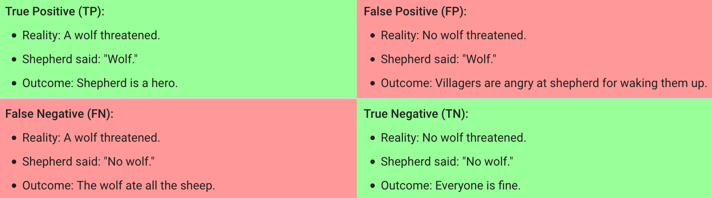
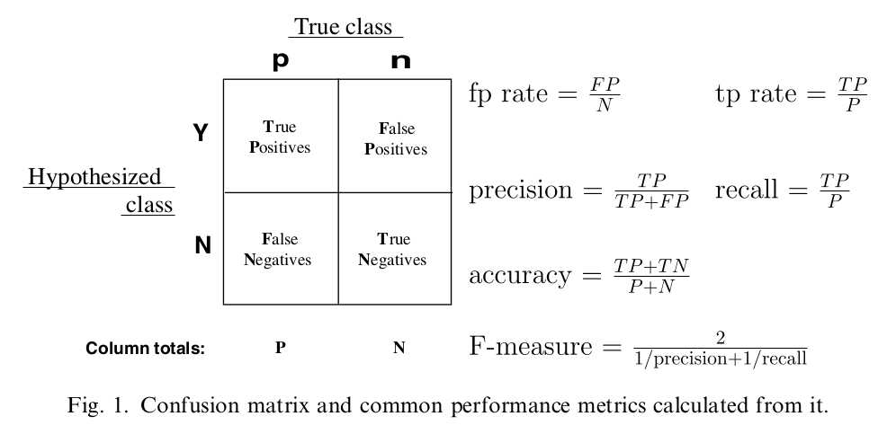
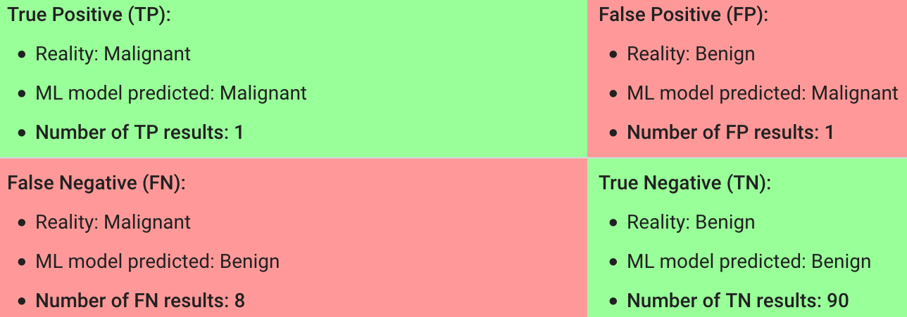

# 
Confusion Matrix

  

## What
----
Make following definitions:
* "Wolf" is a positive class.
* "No wolf" is a negative class.

* A **true positive** is an outcome where the model correctly predicts the positive class. Similarly, a **true negative** is an outcome where the model correctly predicts the negative class.

* A **false positive** is an outcome where the model incorrectly predicts the positive class. And a **false negative** is an outcome where the model incorrectly predicts the negative class.

  

## Accuracy, Precision, Recall & F-measure
----

 

### Accuracy
**Accuracy** is the fraction of predictions model got right:

$$
\mathrm{Accuracy} = \frac{\mathrm{Number\ of\ correct\ predictions}}{\mathrm{Total\ number\ of\ predictions}}
$$

For binary classification, accuracy can be calculated as follows:

$$
\mathrm{Accuracy} = \frac{TP + TN}{TP + TN + FP + FN}
$$

For the following model that classified 100 tumors as malignant (positive class) or benign (negative class):

$$
\mathrm{Accuracy} = \frac{TP + TN}{TP + TN + FP + FN} = \frac{1 + 90}{1 + 90 + 1 + 8} = 0.91
$$

 

### Precision
**Precision** attempts to answer what proportion of positive identifications was actually correct?

$$
\mathrm{Precision} = \frac{TP}{TP + FP}
$$

For the example:
$$
\mathrm{Precision} = \frac{TP}{TP + FP} = \frac{1}{1+1} = 0.5
$$

 

### Recall
**Recall** attempts to answer what proportion of actual positives was identified correctly?

$$
\mathrm{Recall} = \frac{TP}{TP + FN}
$$

For the example:
$$
\mathrm{Recall} = \frac{1}{1+8} = 0.11
$$

  
