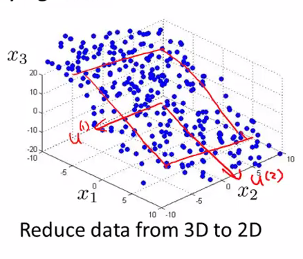
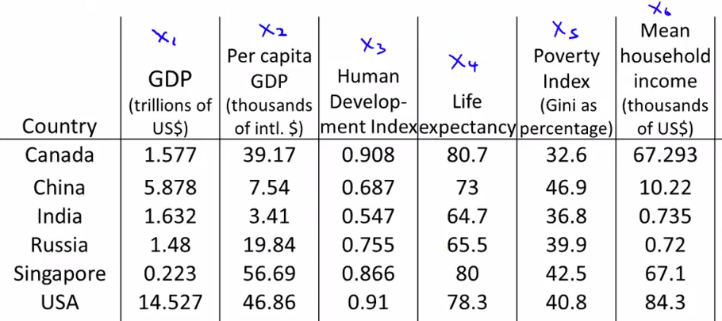
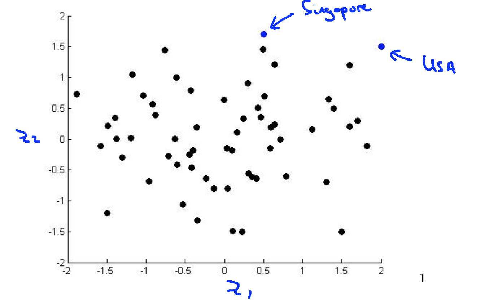
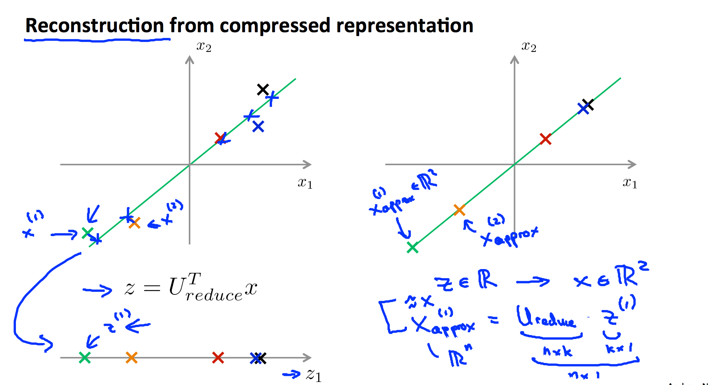

# 
PCA - Principal Component Analysis

  

## What
----
主成分分析（PCA）是最常见的降维算法。PCA是找到一个方向向量（Vector direction），当把所有数据投射到该向量上，投射平均均方误差尽可能小。方向向量是一个经过原点的向量，而投射误差是从特征向量向该方向向量作垂线的长度。

    

假设将特征从n维降到k维，PCA首先找寻k个n维向量，然后将特征投影到这些向量构成的k维空间，并保证投影误差足够小。下图中，为将特征维度从三维降到二位，PCA先找寻两个三维向量$$u^{(1)}}$$和$$u^{(2)}$$，二者构成一个二维平面，然后将三维特征投影到二维平面：

    

由于PCA减小了特征维度，因而可能过拟合。PCA不是必须的，谨记不要提前优化，只有当算法效率不尽如人意时，再考虑使用PCA或其他降维手段。

降维不只加快训练速度，还能帮助在低维空间分析数据。例如下表借助PCA，将特征降到二维并在二维空间观察，很清楚的发现美国和新加坡有高经济水平：

    

    

  

## How
----
假定需将特征维度从$$n$$维降到$$k$$维，则PCA执行流程如下：

1. **特征标准化**，平衡各特征尺度：

$$
x_j^{(i)}=\frac{x_j^{(i)}-\mu_j}{s_j}, \mbox{$\mu_j$ 为特征 $j$ 的均值，$s_j$ 为特征 $j$ 的标准差。}
$$

2. 计算**协方差矩阵**$$\Sigma$$：

$$
\Sigma = \frac{1}{m}\sum\limits_{i=1}^{m}(x^{(i)})(x^{(i)})^T = \frac{1}{m} \cdot X^TX
$$

3. 通过**奇异值分解**（SVD，Singular Value Decomposition）求$$\Sigma$$特征向量（Eigenvectors）：

$$
(U,S,V^T) = SVD(\Sigma)
$$

4. 从$$U$$中取出前$$k$$个左奇异向量，构成$$n * k$$维度的约减矩阵$$U_{reduce}$$:

$$
U_{reduce} = (u^{(1)},u^{(2)},\cdots,u^{(k)})
$$

5. 计算新特征向量：$$z^{(i)}$$

$$
z^{(i)}=U_{reduce}^T \cdot x^{(i)}
$$

  

## 特征还原
----
因为PCA仅保留特征主成分，所以是有损压缩。假定获得新特征向量为：

$$
z = U_{reduce}^Tx
$$

还原后特征$$x_{approx}$$为：

$$
x_{approx}=U_{reduce}z
$$

    </img>

  

## 主成分数量选择
----
从PCA流程可知，需为PCA指定目标维度$$k$$。如果降维不多，则性能提升不大；如果目标维度太小，则又丢失许多信息。使用如下流程评估$$k$$值选取优异：

1. 求各样本的**投影均方误差**：

$$
\frac{1}{m}\sum\limits_{j=1}^{m}||x^{(i)}-x_{approx}^{(i)}||^2
$$

2. 求数据**总变差**：

$$
\frac{1}{m}\sum\limits_{j=1}^{m}||x^{(i)}||^2
$$

3. 评估下式是否成立:

$$
\frac{\frac{1}{m}\sum\limits_{j=1}^{m}||x^{(i)}-x_{approx}^{(i)}||^2}{\frac{1}{m}\sum\limits_{j=1}^{m}||x^{(i)}||^2} \leq \epsilon
$$

其中，$$\epsilon$$可为$$0.01,0.05,0.10,⋯0.01,0.05,0.10,⋯$$。假设$$\epsilon=0.01=0.01$$，意味特征间99%差异性得到保留。