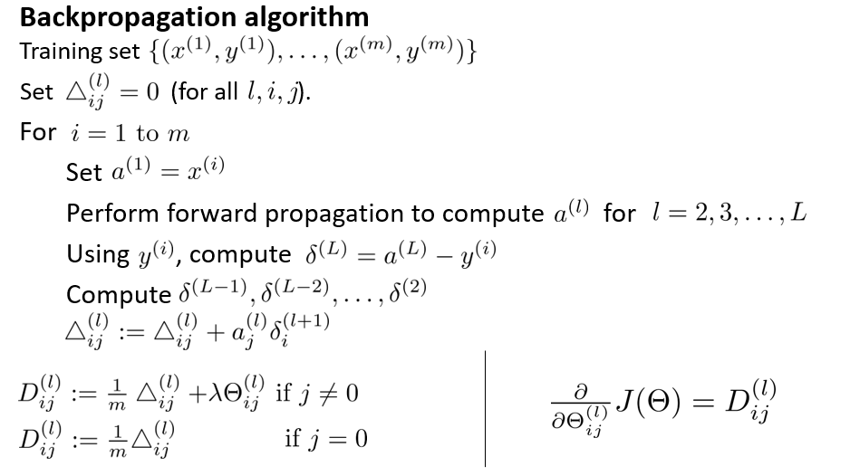
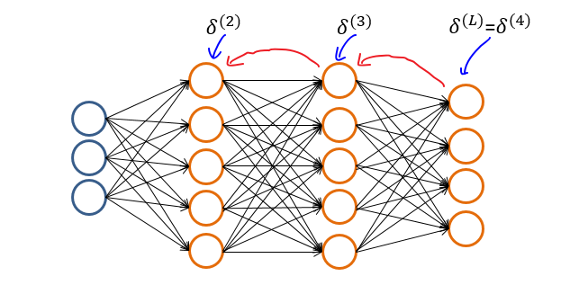
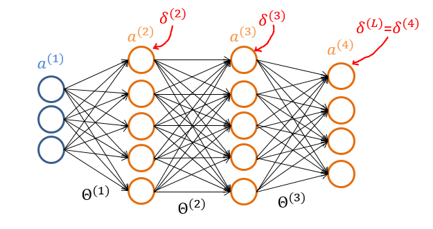

# 
Back Propagation

  

## Why
----
与回归问题一样，也需通过最小化代价函数$$J(\Theta)$$来优化预测精度。但由于神经网络允许多个隐含层，即各层神经元都会产出预测。因此，不能直接用传统回归梯度下降法最小化$$J(\Theta)$$，而需逐层考虑预测误差且逐层优化。为此，在多层神经网络，使用反向传播算法（Backpropagation Algorithm）优化预测。

另一种解释是，神经网络代价函数看上去虽不复杂，但注意到其中$$h_\Theta(x)$$求取实际上由前向传播算法求得。即需从输入层开始，根据每层间的权重矩阵$$\Theta$$依次计算激活单元的值$$a$$。在最优化代价函数时，必然也需最优化每层权重矩阵。

**注意，反向传播算法最优化的是权重，不是输入**。

  

## How
----
反向传播算法，即从输出层开始不断向前迭代，根据上一层误差依次计算当前层误差，以求得代价函数偏导。

反向传播算法计算每一层权重矩阵的偏导是$$\frac{\partial}{\partial\Theta}J(\Theta)$$，算法实际上是对代价函数求导的拆解。

1. 对训练集$$\lbrace (x^{(1)}, y^{(1)}) \cdots (x^{(m)}, y^{(m)})\rbrace$$，初始化每层间误差和矩阵$$\Delta$$，即令所有$$\Delta^{(l)}_{i,j}=0$$，使每个$$\Delta^{(l)}$$为一个全零矩阵。

2. 遍历所有样本实例，对于每个样本实例：

   1. 运行前向传播算法，得到初始预测$$a^{(L)}=h_\Theta(x)$$ 。

   2. 运行反向传播算法，从输出层开始计算每一层预测的**误差（error）**，以此来求取偏导。

      

      输出层误差为预测与训练集结果差值：$$\delta^{(L)} = a^{(L)} - y$$。对隐藏层中每一层误差，都通过上一层误差来计算：$$\delta^{(l)} = (\Theta^{(l)})^T\delta^{(l+1)} .*\ \frac{\partial a^{(l)}}{\partial z^{(l)}}\; \; \; \; \;  \text{for }l := L-1, L-2,\dots,2.$$

      隐藏层中，$$a^{(l)}$$为增加偏置单元后$$g(z^{(l)})$$，$$a^{(l)}$$与$$\Theta^{(l)}$$维度匹配，得以完成矩阵运算。即对隐藏层，有$$a^{(l)} = (g(z^{(l)})$$添加偏置单元$$a^{(l)}_0 = 1)$$。

      解得$$\frac{\partial}{\partial z^{(l)}}g(z^{(l)})=g'(z^{(l)})=g(z^{(l)}) .* \ (1-g(z^{(l)}))$$，则有$$\delta^{(l)} = (\Theta^{(l)})^T\delta^{(l+1)} .*\ a^{(l)} .*\ (1-a^{(l)}), \ \ a^{(l)}_0 = 1$$。

      根据以上公式依次计算每一层误差$$\delta^{(L)}, \delta^{(L-1)},\dots,\delta^{(2)}$$。

   3. 依次求解并累加误差$$\Delta^{(l)}_{i,j} := \Delta^{(l)}_{i,j} + a_j^{(l)} \delta_i^{(l+1)}$$，向量化实现为$$\Delta^{(l)} := \Delta^{(l)} + \delta^{(l+1)}(a^{(l)})^T$$。

3. 遍历全部样本实例，求解完$$\Delta$$后，最后求得偏导$$\frac \partial {\partial \Theta_{i,j}^{(l)}} J(\Theta)=D_{i,j}^{(l)}$$

   - $$D^{(l)}_{i,j} := \dfrac{1}{m}\left(\Delta^{(l)}_{i,j} + \lambda\Theta^{(l)}_{i,j}\right), \text{ if }j\neq0$$
   - $$D^{(l)}_{i,j} := \dfrac{1}{m}\Delta^{(l)}_{i,j}, \text{ if } j=0$$（对应偏置单元）

其中：
* $$\delta^{(l)}$$：第$$l$$层误差向量。
* $$\delta^{(l)}_i$$：第$$l$$层第$$i$$个激活单元误差。
* $$\Delta^{(l)}_{i,j}$$：从第$$l$$层第$$j$$个单元映射到第$$l+1$$层第$$i$$个单元的权重代价偏导（所有样本实例之和）。
* $$D^{(l)}_{i,j}$$：$$\Delta^{(l)}_{i,j}$$的样本均值与正则化项之和。
* 注：无需计算$$\delta^{(1)}$$，因为输入没有误差。

  

## Intuition
----
这里讨论反向传播算法中误差的数学意义：

$$
cost(t) =y^{(t)} \ \log (h_\Theta (x^{(t)})) + (1 - y^{(t)})\ \log (1 - h_\Theta(x^{(t)}))
$$

$$
\delta_j^{(l)} = \dfrac{\partial}{\partial z_j^{(l)}} cost(t)
$$

**因为输入层没有偏差，所以没有$$\delta^{(1)}$$。同理，偏置单元值始终为1，也没有误差，故一般忽略偏置单元项误差**。

 

### 代价函数求导推导过程
代价函数无正则化项时：

$$
\begin{gather*} J(\Theta) = - \frac{1}{m} \sum_{i=1}^m \left[y^{(i)} \log ((h_\Theta (x^{(i)}))) + (1 - y^{(i)})\log (1 - (h_\Theta(x^{(i)})))\right] \end{gather*}
$$

为方便起见，假设样本只有一个：

$$
\begin{gather*} J(\Theta) = -\left[y \log ((h_\Theta (x))) + (1 - y)\log (1 - (h_\Theta(x)))\right] \end{gather*}
$$

由于$$h_\Theta(x) = a^{(L)} = g(z^{(L)})$$，$$g(z) = \frac{1}{1+e^{(-z)}}$$，代入后整理可得：

$$
J(\Theta) = y\log(1+e^{-z^{(L)}}) + (1-y)\log(1+e^{z^{(L)}})
$$

再次为便于计算，用到如上图三层（输入层一般不计数）神经网络。

由于$$z^{(l)} = \Theta^{(l-1)}a^{(l-1)}$$，于是有：

$$
h_\Theta(x)=a^{(4)}= g(z^{(4)})=g(\Theta^{(3)}a^{(3)})
$$

观察考虑各变量与$$\Theta^{(3)}$$间关系，有$$J(\Theta) \rightarrow  a^{(4)}\rightarrow z^{(4)}\rightarrow \Theta^{(3)}$$。要计算$$J(\Theta)$$偏导，要按照关系不断往前看，每一次回头看，就称为一次反向传播。若从微积分角度解释，每次回头看就是$$\Theta^{(3)}$$ 微小改变引起$$z^{(4)}$$改变，$$z^{(4)}$$微小改变引起$$a^{(4)}$$改变，$$a^{(4)}$$微小改变又引起$$ J(\Theta)$$改变。关系方向也可反过来写：$$\Theta^{(3)} \rightarrow z^{(4)} \rightarrow a^{(4)} \rightarrow J(\Theta)$$。

类似微积分链式求导，令$$\delta^{(l)} = \frac{\partial}{\partial z^{(l)}} J(\Theta)$$，则有$$J(\Theta)$$关于$$\Theta^{(3)}$$偏导：

$$
\frac{\partial}{\partial\Theta^{(3)}} J(\Theta) = \frac{\partial J(\Theta)}{\partial z^{(4)}}   \frac{\partial z^{(4)}}{\partial\Theta^{(3)}} = \delta^{(4)}\frac{\partial z^{(4)}}{\partial\Theta^{(3)}}
$$

由于$$z^{(l)} = \Theta^{(l-1)}a^{(l-1)}$$，则有：

$$
\frac{\partial z^{(4)}}{\partial\Theta^{(3)}} = a^{(3)}
$$

对输出层，证得：

$$
\frac{\partial}{\partial\Theta^{(3)}} J(\Theta) =  a^{(3)}\delta^{(4)}$
$$

因为$$g(z) = \frac{1}{1+e^{-z}}$$且$$a^{(L)}=g(z^{(L)})$$，故：

$$
\begin{split}
\delta^{(4)} &= \frac{\partial}{\partial z^{(4)}} J(\Theta) \\
&=y \frac{-e^{-z^{(4)}}} {1+e^{-z^{(4)}}} + (1-y)\frac{e^{z^{(4)}}}{1+e^{z^{(4)}}} \\
&=g(z^{(4)}) - y \\
&= a^{(4)}-y
\end{split}
$$

即证得$$\delta^{(4)} = a^{(4)}-y$$。

对任意输出层$$L$$及$$\Theta^{(L-1)}$$，有$$J(\Theta) \rightarrow  a^{(L)}\rightarrow z^{(L)}\rightarrow \Theta^{(L-1)}$$关系不变，故证得：

$$
\frac{\partial}{\partial\Theta^{(L-1)}} J(\Theta) =  a^{(L-1)}\delta^{(L)}, \ \ \delta^{(L)} = a^{(L)}-y
$$

接下来看$$J(\Theta)$$关于$$\Theta^{(2)}$$的偏导。

仍观察考虑各变量与$$\Theta^{(2)}$$之间关系，有：

$$
J(\Theta)\rightarrow a^{(4)} \rightarrow z^{(4)} \rightarrow a^{(3)} \rightarrow z^{(3)} \rightarrow\Theta^{(2)}
$$

$$
\frac{\partial}{\partial \Theta^{(2)}}J(\Theta) = \frac{\partial J(\Theta)}{\partial z^{(3)}} \frac{\partial z^{(3)}}{\partial \Theta^{(2)}}=\delta^{(3)} \frac{\partial z^{(3)}}{\partial \Theta^{(2)}}=  a^{(2)}\delta^{(3)}
$$

$$
\delta^{(3)} = \frac{\partial}{\partial z^{(3)}}J(\Theta) =\frac{\partial J(\Theta)}{\partial z^{(4)}} \frac{\partial z^{(4)}}{\partial a^{(3)}}\frac{\partial a^{(3)}}{\partial z^{(3)}} = \delta^{(4)}\frac{\partial z^{(4)}}{\partial a^{(3)}}\frac{\partial a^{(3)}}{\partial z^{(3)}}
$$

易求得：

$$
\frac{\partial z^{(4)}}{\partial a^{(3)}}=\Theta^{(3)}
$$

$$
g'(z) =\frac{e^{-z}}{(1+e^{-z})^2}=\frac{(1+e^{-z})-1}{(1+e^{-z})^2}=\frac{1}{1+e^{-z}}-\frac{1}{(1+e^{-z})^2}=g(z)(1-g(z))
$$

即$$g'(z^{(l)})=g(z^{(l)}) .* \ (1-g(z^{(l)}))$$。

有$$a^{(l)} = g(z^{(l)}$$，添加偏置单元$$a^{(l)}_0 = 1$$，则：

$$
\frac{\partial a^{(3)}}{\partial z^{(3)}}=a^{(3)} .*\ (1-a^{(3)})
$$

即证得：

$$
\delta^{(3)}=(\Theta^{(3)})^T\delta^{(4)}.*(a^{(3)})'=(\Theta^{(3)})^T\delta^{(4)}.*\ a^{(3)} .*\ (1-a^{(3)})
$$

对任意隐藏层$$l + 1$$及权重矩阵$$\Theta^{(l)}$$，有$$J(\Theta)\rightarrow a^{(L)} \rightarrow z^{(L)} \rightarrow \dots \rightarrow a^{(l+1)} \rightarrow z^{(l+1)} \rightarrow\Theta^{(l)}$$关系不变，故证得：

$$
\frac{\partial}{\partial\Theta^{(l)}} J(\Theta) =  a^{(l)}\delta^{(l+1)}, \ \ \delta^{(l)} = (\Theta^{(l)})^T\delta^{(l+1)}.*\ a^{(l)} .*\ (1-a^{(l)})\; \; \; \; \;  \text{for }l := L-1, L-2,\dots,2.
$$

再添回为计算方便去掉的$$\frac{1}{m}$$和正则化项（时刻记住偏置单元不正则化）等，即可得$$J(\Theta)$$ 偏导。