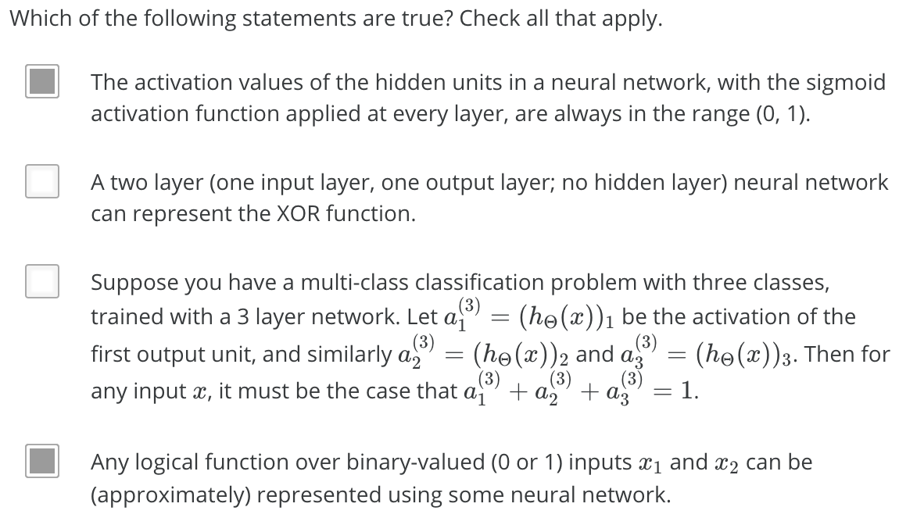
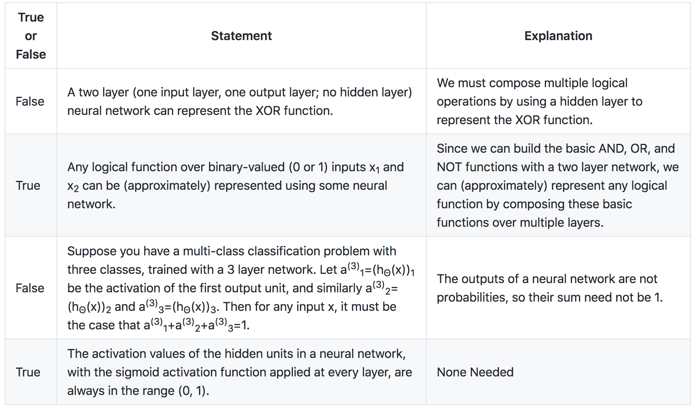
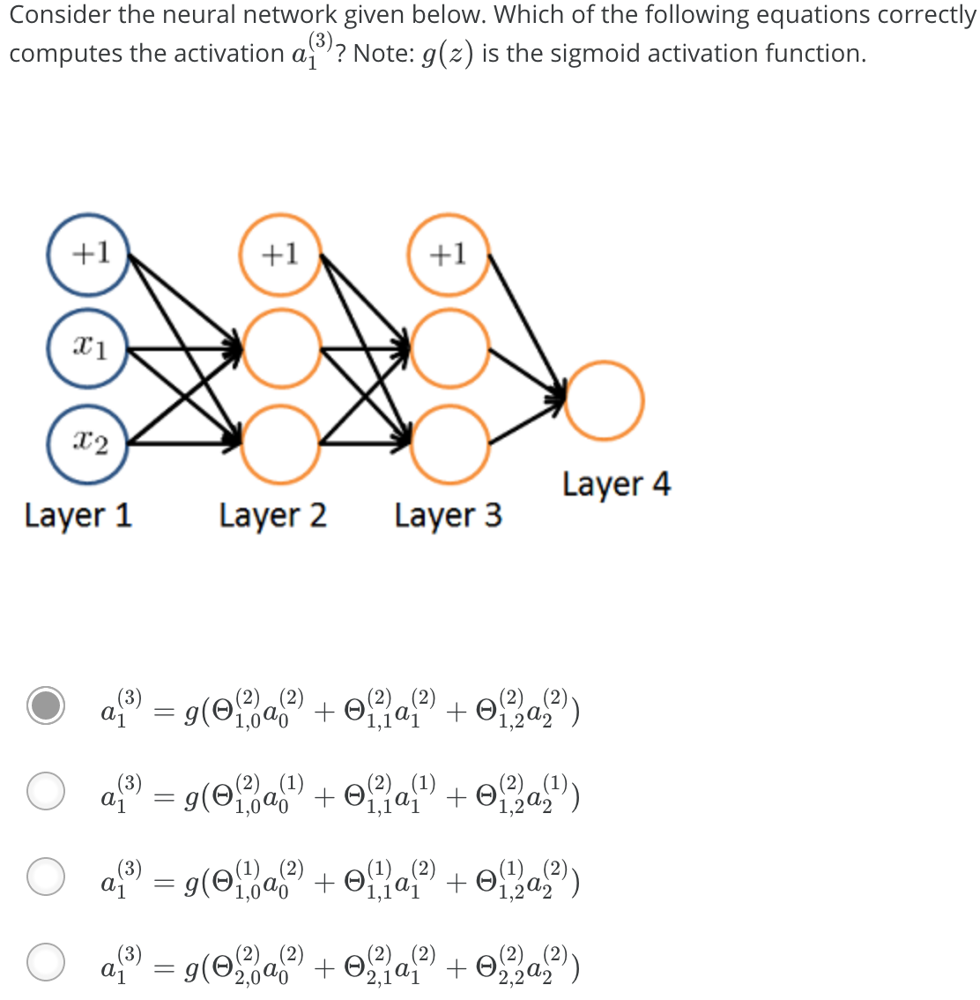
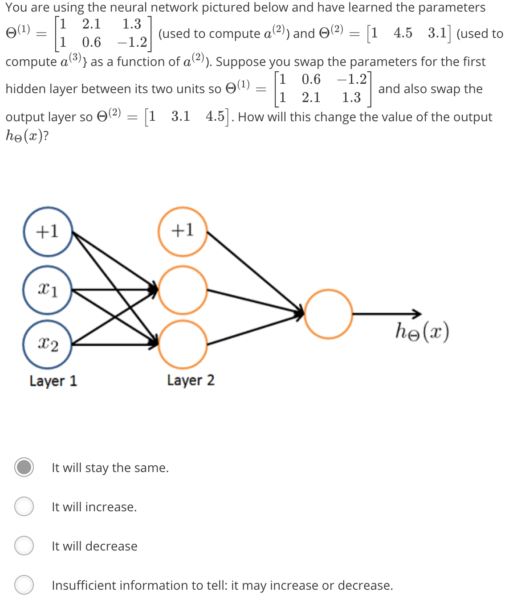

# 
Forward Propagation

  

## What
----
层间神经元通过权值矩阵$$\theta^{l}$$连接。一次信息传递过程可如下描述：
1. 第$$j$$层神经元接收上层传入刺激：

    $$
z^{(j)} = \theta^{(j−1)}a^{(j−1)}
    $$

2. 刺激经激励函数（activation function）$$g$$作用后，产生激活向量$$\alpha^{j}$$，其表示$$j$$层第$$i$$个神经元获得的激活值（activation）：

    $$
a^{(j)} = g(z^{(j)})
    $$
 
这个过程，因为发生顺序是不断地将刺激由前一层传向下一层，称为前向传递（Forward Propagation）。

**对非线性分类，逻辑回归使用多项式扩展特征，导致特征向量维度巨大。神经网络不会增加特征维度，即不会扩展神经网络输入层规模，而通过增加隐含层，矫正隐含层中权值，来不断优化特征。前向传播过程每次在神经元上产出的激励值可看做是优化后的特征。**

习惯于将输入层称为神经网络的第0层，如上图称为三层网络。

  

## Example
----

  

对输入层（Layer 1）所有激活单元应用激活函数，得到隐藏层（Layer 2）激活单元值：

$$
\begin{align*}
a_1^{(2)} = g(\Theta_{10}^{(1)}x_0 + \Theta_{11}^{(1)}x_1 + \Theta_{12}^{(1)}x_2 + \Theta_{13}^{(1)}x_3) \newline
a_2^{(2)} = g(\Theta_{20}^{(1)}x_0 + \Theta_{21}^{(1)}x_1 + \Theta_{22}^{(1)}x_2 + \Theta_{23}^{(1)}x_3) \newline
a_3^{(2)} = g(\Theta_{30}^{(1)}x_0 + \Theta_{31}^{(1)}x_1 + \Theta_{32}^{(1)}x_2 + \Theta_{33}^{(1)}x_3) \newline
\end{align*}
$$

对Layer 2中所有激活单元应用激活函数，得到输出：

$$
h_\Theta(x) = a_1^{(3)} = g(\Theta_{10}^{(2)}a_0^{(2)} + \Theta_{11}^{(2)}a_1^{(2)} + \Theta_{12}^{(2)}a_2^{(2)} + \Theta_{13}^{(2)}a_3^{(2)})
$$

回顾逻辑回归：

$$
h_{\theta}(x) = g(\theta_{0} + \theta_{1}x_{1} + \theta_{2}x_{2}+ \theta_{3}x_{3})
$$

**可发现除了符号表示，其它都一样。其实神经网络好似回归模型，只不过输入变成中间单元$$a_{1}^{(j)}, a_{2}^{(j)}, \dots, a_{n}^{(j)}$$。从输入$$x$$开始，下一层每个激活单元都包含上一层所有信息（单元值）。通过最优化算法不断迭代计算，激活单元得出关于输入$$x$$的更多信息。好像是在给假设函数加多项式。隐藏层单元好似升级版的初始特征，从而能给出更好的预测。**

  

## 向量化表示
----
定义：
$$
a^{(1)} = x = [\begin{matrix}x_0 \\ x_1 \\ x_2 \\ x_3 \end{matrix}]
$$

$$
\Theta^{(1)} = [\begin{matrix}\Theta^{(1)}_{10}& \Theta^{(1)}_{11}& \Theta^{(1)}_{12}& \Theta^{(1)}_{13}\\ \Theta^{(1)}_{20}& \Theta^{(1)}_{21}& \Theta^{(1)}_{22}& \Theta^{(1)}_{23}\\ \Theta^{(1)}_{30}& \Theta^{(1)}_{31}& \Theta^{(1)}_{32} & \Theta^{(1)}_{33}\end{matrix}]
$$

$$
\begin{align*}
a_{1}^{(2)} = g(z_{1}^{(2)}) \newline
a_2^{(2)} = g(z_2^{(2)}) \newline
a_3^{(2)} = g(z_3^{(2)}) \newline
\end{align*}​$$

$$
z^{(2)}=[\begin{matrix}z_1^{(2)}\\ z_1^{(2)} \\ z_1^{(2)}\end{matrix}]​
$$

则有$$a^{(2)}= g(\Theta^{(1)}a^{(1)})=g(z^{(2)})$$。预测结果即$$h_\Theta(x) = a^{(3)} = g(\Theta^{(2)}a^{(2)}) = g(z^{(3)})$$。

即有$$z^{(j)}_i = \Theta^{(j-1)}_{i,0}a^{(j-1)}_{0}+ \Theta^{(j-1)}_{i,1}a^{(j-1)}_{1}+\dots+ \Theta^{(j-1)}_{i,n}a^{(j-1)}_{n}$$，$$z^{(j)} = \Theta^{(j-1)}a^{(j-1)}$，$a^{(j)} = g(z^{(j)})$$，通过该式可计算网络中每一层值。

扩展到所有样本实例：$$z^{(2)}} = \Theta^{(1)} X^{T}$$，这时$$z^{(2)}$$是$$s_2 \times m$$维矩阵。

其中：
* $$m$$：训练集中的样本实例数量。
* $$s_2$$：第二层神经网络中激活单元数量。

  

## Model Examples
----
### AND

$$
\Theta^{(1)} =\begin{bmatrix}-30 & 20 & 20\end{bmatrix}$，$h_\Theta(x) = g(-30+20x_1+20x_2)
$$

回顾Sigmoid函数图像，根据输入有上图中右边表格，即$$h_\theta(x)\approx x_1\ \text{AND}\ x_2$$。这样实现一个能进行与运算的神经网络。

 

### OR

 

### XNOR
> $$\text{XNOR} = (\text{x}_{1}\, \text{AND}\, \text{x}_{2})\, \text{OR} ((\text{NOT}\, \text{x}_{1}) \text{AND} (\text{NOT}\, \text{x}_{2}))$$

构建三个单层神经网络，组合可得新的神经网络，完成XNOR操作：

$$
\Theta^{(1)} =\begin{bmatrix} -30 & 20 & 20 \newline 10 & -20 & -20 \end{bmatrix}
$$

$$
\Theta^{(2)} =\begin{bmatrix}-10 & 20 & 20\end{bmatrix}
$$

$$
\begin{align*}& a^{(2)} = g(\Theta^{(1)} \cdot x) \newline& a^{(3)} = g(\Theta^{(2)} \cdot a^{(2)}) \newline& h_\Theta(x) = a^{(3)}\end{align*}
$$

  

## Quiz
----

Swapping $$\theta^{(1)}$$ swaps the hidden layers output $$\alpha^{(2)}$$. But the swap of $$\theta^{(2)}$$ cancels out the change, so the output will stay as the same.