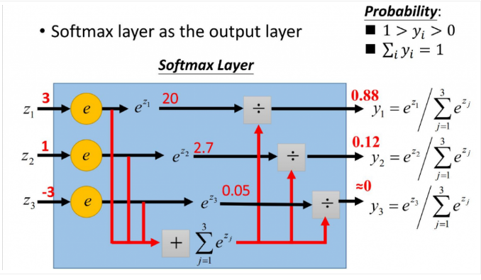
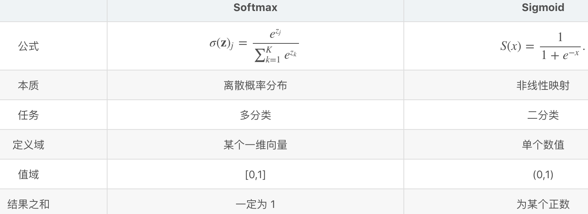

# <center>Softmax</center>

<br></br>


## What
----
处理多分类问题时，分类器最后输出单元需Softmax函数进行数值处理。Softmax函数定义：

$$
S_{i} = \frac{e^{V_{i}}}{\sum^{C}_{i}e^{V_{i}}}
$$

其中：
* $$V_{i}$$是分类器前级输出单元的输出。
* $$i$$表示类别索引，总的类别个数为$$C$$。
* $$S_{i}$$表示当前元素指数与所有元素指数和的比值。



Softmax将多分类输出数值转化为相对概率。比如一个多分类问题，$$C = 4$$，线性分类器输出层包含四个输出值：

$$
V = \begin{bmatrix}
        -3 \\
        2  \\
        -1 \\
        0
    \end{bmatrix}
$$

Softamx处理后数值转为相对概率：

$$
S = \begin{bmatrix}
        0.0057 \\
        0.839  \\
        0.0418 \\
        0.1135
    \end{bmatrix}
$$

Softmax输出表征不同类别相对概率。可看出，$$S_{1} = 0.839$$，概率最大，可判断预测为第1类可能性更大。

实际应用中，Softmax需注意数值溢出。因为有指数运算，如果$$V$$数值很大，指数运算后可能溢出。所以，需对$$V$$中每个元素减去$$V$$中最大值：

$$
D = \mathrm{max}(V) \\
S_{i} = \frac{e^{V_{i}-D}}{\sum^{C}_{i}e^{V_{i}-D}}
$$

```python
scores = np.array([123, 456, 789]) # example with 3 classes and each having large scores
scores -= np.max(scores) # scores becomes [-666, -333, 0]
p = np.exp(scores) / np.sum(np.exp(scores))
```

<br></br>


## Softmax损失函数
----
$$
S_{i} = \frac{e^{S_{y_{i}}}}{\sum^{C}_{j=1}e^{S_{j}}}
$$

其中，$$S_{y_{i}}$$是正确类别对应的线性得分函数，$$S_{i}$$是正确类别对应的Softmax输出。由于$$log$$运算符不影响函数单调性，对$$S_{i}$$进行$$log$$操作：

$$
S_{i}= \log{\frac{e^{S_{y_{i}}}}{\sum^{C}_{j=1}e^{S_{j}}}}
$$

希望$$_{i}$$越大越好，即正确类别对应的相对概率越大越好，就可对$$S_{i}$$加个负号表示损失函数：

$$
L_{i} = -S_{i} = -\log{\frac{e^{S_{y_{i}}}}{\sum^{C}_{j=1}e^{S_{j}}}}
$$

进一步处理，把指数约去：

$$
L_{i} = -\log{\frac{e^{S_{y_{i}}}}{\sum^{C}_{j=1}e^{S_{j}}}} = -(S_{y_{i}} - \log{\sum^{C}_{j=1}e^{S_{j}}}) = -S_{y_{i}} + \log{\sum^{C}_{j=1}e^{S_{j}}}
$$

比如，对于线性输出：
$$
V = \begin{bmatrix}
        -3 \\
        2  \\
        -1 \\
        0
    \end{bmatrix}
$$

假设$$i = 1$$为真实样本，其损失函数为：

$$
L_{i} = -2 + \log{(e^{-3} + e^{2} + e^{-1} + e^{0})} = 0.1755 \\
L_{i} = 3 + \log{(e^{-3} + e^{2} + e^{-1} + e^{0})} = 5.1755
$$

<br></br>


## Softmax vs Sigmod
----
