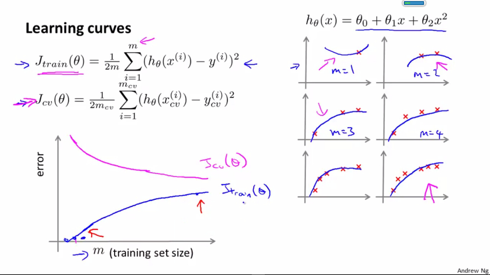
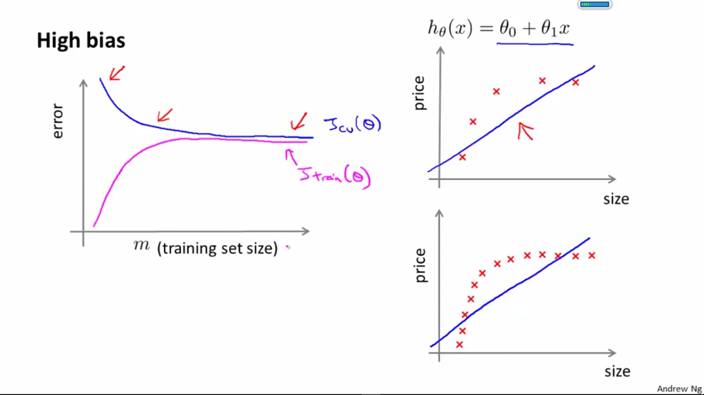
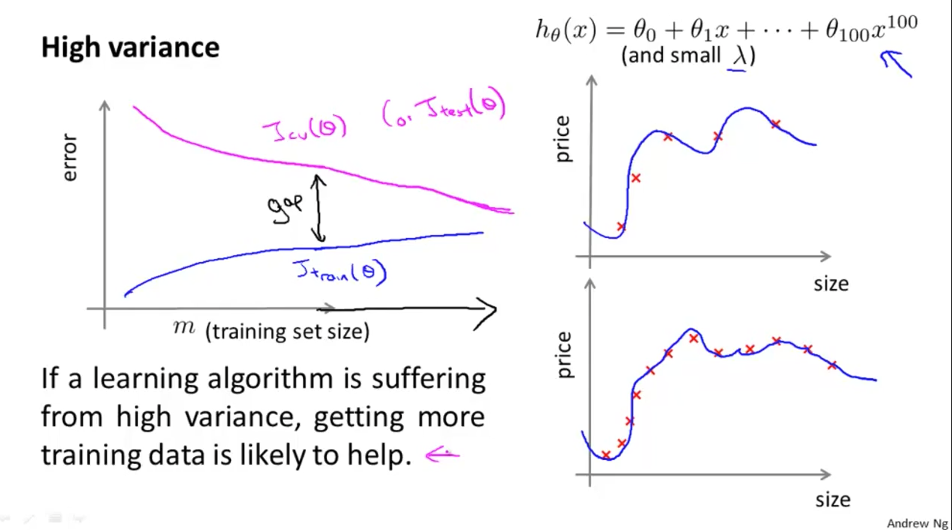

# 
Learning Curve

  

## What
----
学习曲线是一种工具，帮助判断算法是否处于偏差或方差问题。学习曲线是学习算法的**合理检验**（**sanity check**）。学习曲线将训练集误差和交叉验证集误差作为训练集样本数量$$m$$的函数绘制的图表。
​
当训练样本数目$$m$$小时，意味可供学习的知识少，模型在训练阶段不易犯错误（训练集误差低），但也发现不了数据规律（交叉验证集误差高）。当样本数目增多时，意味需学习的知识增多，模型虽然在训练阶段易犯错（训练集误差增高），但更容易探测出数据规律（交叉验证集误差降低）：

  

  

## Experiencing High Bias
----
如果模型出现高偏差（欠拟合），学习曲线随样本数目的变化曲线如下所示，即增加样本数目，仍无法显著降低交叉验证集误差，无法提高模型泛化能力：

  

* Low training set size: causes $$J_{train}(\theta)$$ to be low and $$J_{CV}(\theta)$$ to be high.
* Large training set size: causes both $$J_{train}(\theta)$$ and $$J_{CV}(\theta)$$ to be high with $$J_{train}(\theta) \appox J_{CV}(\theta)$$.

If a learning algorithm is suffering from high bias, getting more training data will not (by itself) help much.

  

  

## Experiencing High Variance
----
如果模型出现高方差（过拟合），学习曲线随样本数目变化的曲线如下所示，即增加样本数目，可显著降低交叉验证集误差，提高模型的泛化能力：

  

* Low training set size: $$J_{train}(\theta)$$ will be low and $$J_{CV}(\theta)$$ will be high.
* Large training set size: $$J_{train}(\theta)$$ increases with training set size and $$J_{CV}(\theta)$$ continues to decrease without leveling off. Also, $$J_{train}(\theta) < J_{CV}(\theta)$$ but the difference between them remains significant.

If a learning algorithm is suffering from high variance, getting more training data is likely to help.

  

