# 
Algoithm Evaluation

  

## General Options
----
想提高预测精度，往往采用：

|            手段           | 场景  |            评价              |
| ------------------------ | ----- | ----------------------- |
| 采集更多样本               | 高方差 | 见多识广会让人变聪明，但也聪明反被聪明误。 |
| 降低特征维度               | 高方差 | 被降的维度也许有用。 |
| 采集更多特征               | 高偏差 | 增加计算负担，也可能导致过拟合。 |
| 高次多项式回归             | 高偏差 | 可能过拟合。 |
| 降低正规化参数$$\lambda$$  | 高方差 | 调节策略缺乏指导，只是猜测性调节。 |
| 增大正规化参数$$\lambda$$  | 高偏差 | 同上。 |

  

## 神经网络方差和偏差
----

  

使用较小神经网络，类似于参数较少情况，易导致高偏差和欠拟合，但计算代价较小。使用较大神经网络，类似于参数较多情况，易导致高方差和过拟合。虽计算代价大，但可通过正则化（增大$$\lambda$$）调整。通常选择较大的神经网络并采用正则化处理会比采用较小的神经网络效果要好。

对于神经网络隐藏层层数选择，通常从一层开始逐渐增加层数。为更好地选择，把数据分为训练集、交叉验证集和测试集，针对不同隐藏层层数神经网络训练。然后选择交叉验证集代价最小。

  

## Big Dataset
----
> It's not who has the best algorithm that wins. It's who has the most data.

下图中，是一个区分容易混淆单词的机器学习案例，所采用的几种算法在训练样本提供的样本越来越多时，都表现得越来越优异：

  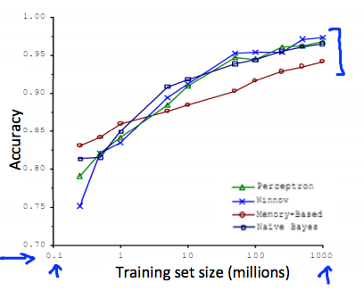

什么时候采用大规模数据集呢？一定要保证模型有足够参数（线索）。对线性和逻辑回归，就是具备足够多特征；对神经网络，就是更多隐藏层单元。足够多特征避免了高偏差（欠拟合），而足够大数据集避免了多特征引起的高方差（过拟合）。

  

## Tips
----
* 在开始，尽量不要将问题复杂化（不要提前优化）。先快速实现简单算法，然后通过交叉验证集评估模型。
* 通过绘制学习曲线，确定面临的问题是高偏差还是高方差，来决定是添加更多训练样本，还是添加更多特征。
* 可手动检查交叉验证集中误差较大的样本，确定错误来源和解决策略。

举例，假定交叉验证集有500个样本，即 $$m_{cv}=500$$。模型错分100个样本，可通过下述手段进行错误分析：
1. 需知道哪些邮件被错分，是假冒伪劣的推销邮件？医药邮件？还是钓鱼邮件？
2. 需知道提供什么线索（特征）能帮助模型区分出这些邮件？

例如，发现有53个样本是钓鱼邮件。因此，需考虑为模型注入识别钓鱼邮件能力。继续观察，发现53封钓鱼邮件中，故意使用错误拼写有5封，来源可疑（发送人可疑）的有16封，使用大量煽动性标点符号的有32封。因此，对识别钓鱼邮件，更适合将煽动性标点符号添加为特征，而不用考虑识别错误拼写。

  

## Exercises
----
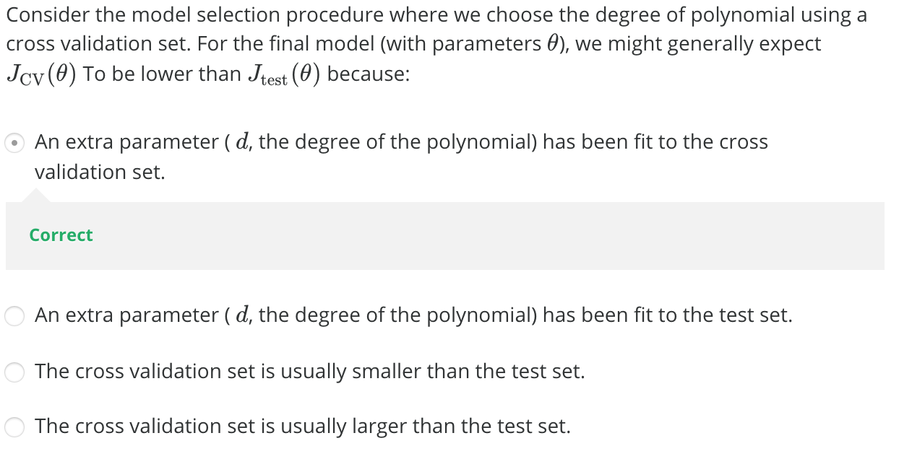

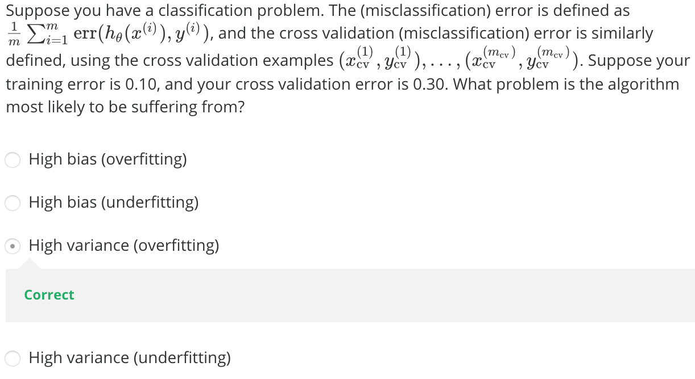

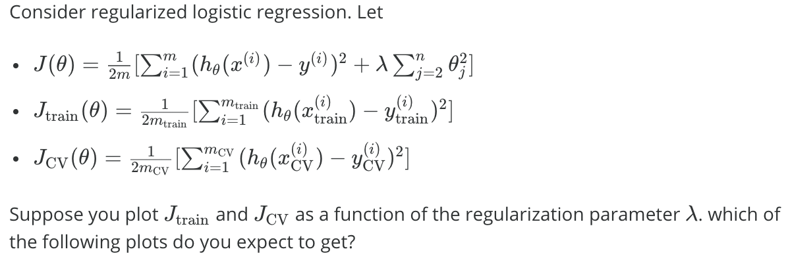
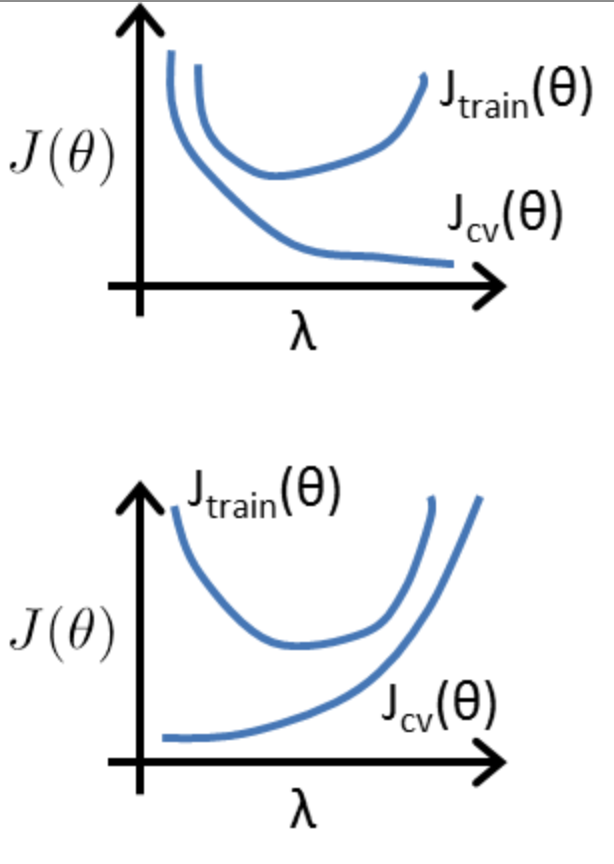
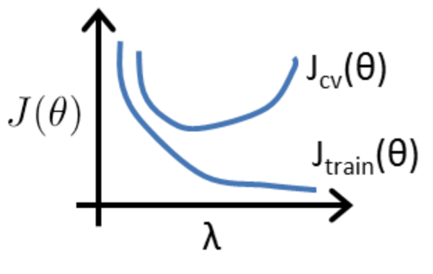
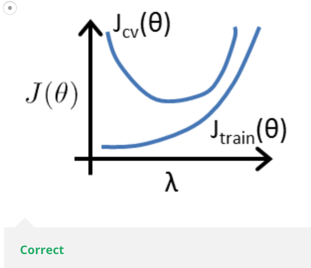

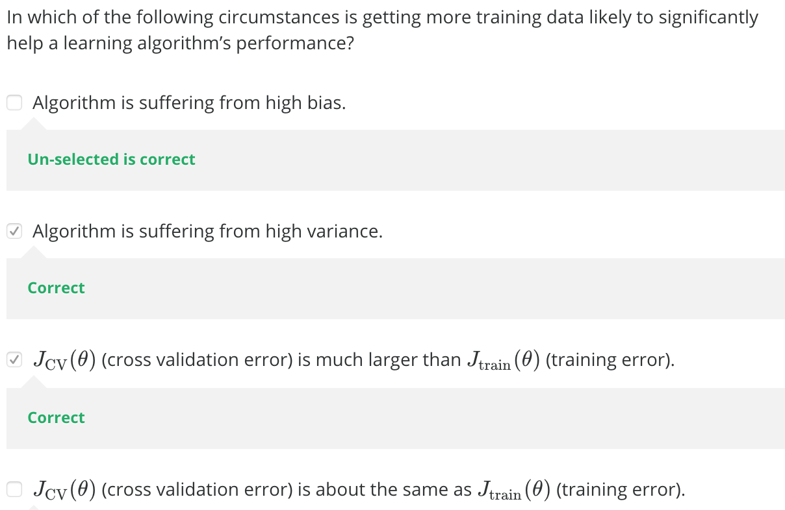

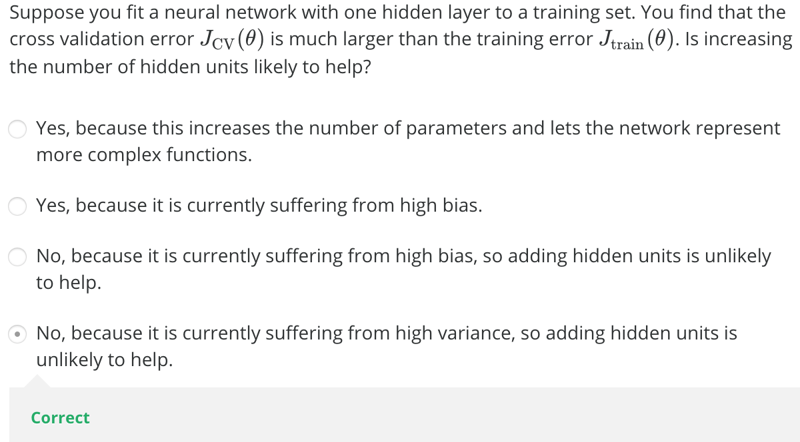

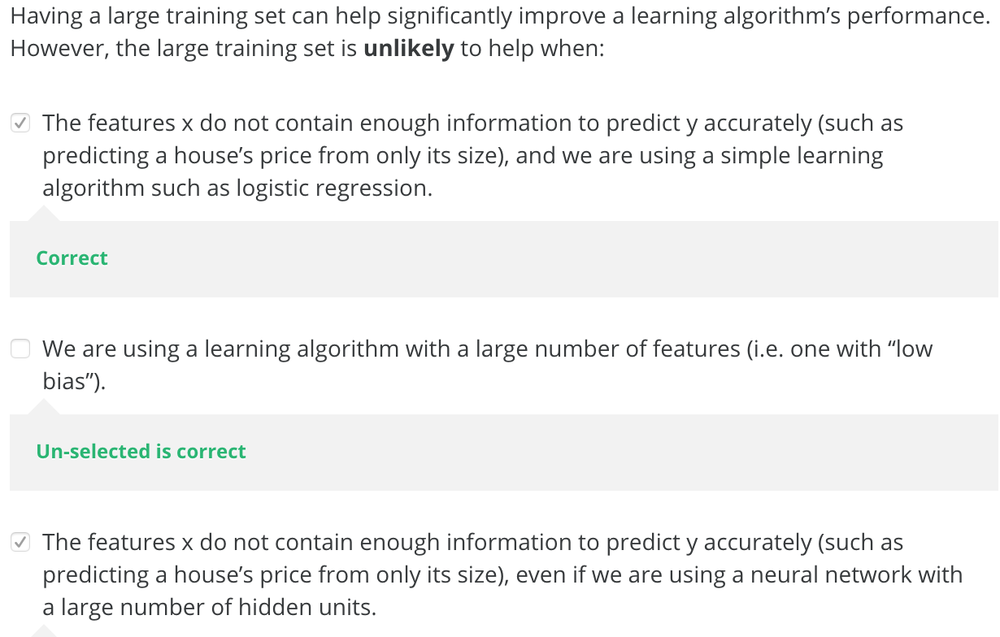
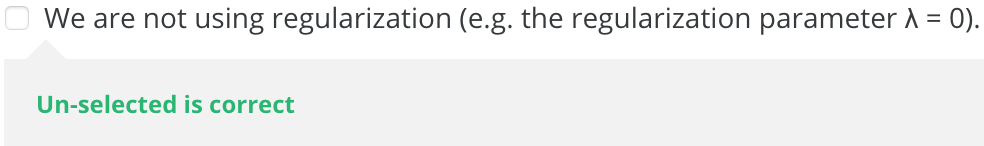