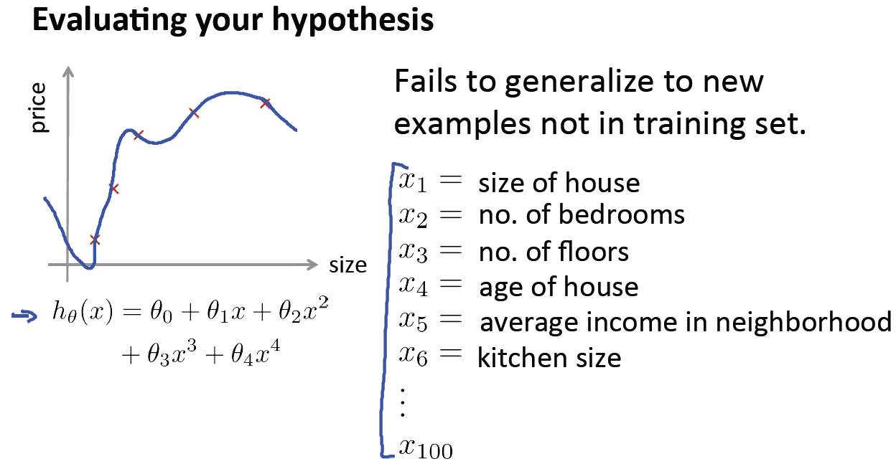
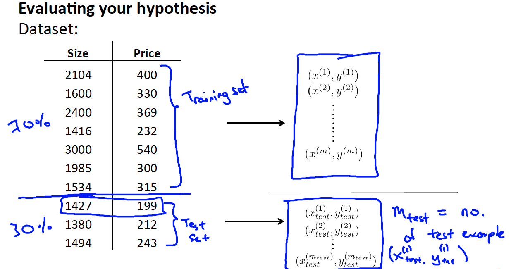

# 
Evaluating Hypothesis

  

## What
----
仅具备一个很小的训练误差不能保证预测函数优秀，因为这仅体现在对训练样本的假设，而无法保证泛化。过拟合就是典型例子：

  

如何判断假设函数是否过拟合？可对假设函数$$h(x)$$画图观察，但对特征变量不止一个情况，想通过画图观察，会变得很难。因此，将数据集划分为：

1. 训练集：70%
2. 测试集：30%

> 进行训练集和测试集划分前，先对数据集乱序。

  

  

## 测试误差
----
引入如下符号：
* $$(x^{(1)}, y^{(1)})$$：训练样本
* $$(x^{(1)}_{test}, y^{(1)}_{test})$$：测试样本
* $$m$$：训练集样本容量
* $$m_{test}$$：测试集样本容量

 

### 线性回归
通过计算测试集代价函数来评估参数$$\theta$$泛化能力：

$$
J_{test} = \frac{1}{2m_{test}} \sum^{m_{test}}{i=1}(h_{\theta}(x^{(i)}_{test}) - y^{(i)}_{test})^{2}
$$

 

### 逻辑回归
测试集的代价函数：

$$
J_{test}(\theta) = - \frac{1}{m_{test}} \sum^{m_{test}}_{i=1} (y^{(i)}_{test}\log h_{\theta}(x^{(i)}_{test}) + (1-y^{(i)}_{test})\log h_{\theta}(x^{(i)}_{test}))
$$

由于逻辑回归是0/1分类问题，预测结果只有正确与错误，所以引入误分率（Misclassification Error）：

$$
\[ err(h_{\theta}x, y) =
  \begin{case}
    1, & \quad \text{if } h_{\theta}(x) \geq 0.5, y = 0 \text{ or } h_{\theta}(x) < 0.5, y = 1\\
    0, & \quad \text{otherwise}
  \end{case}
\]
$$

则逻辑回归中测试误差可表示为：

$$
Test_{error} = \frac{1}{m_{test}}\sum^{m_{test}}{1}err(h_{\theta}(x^{(i)}_{test}), y^{(i)}_{test})
$$
