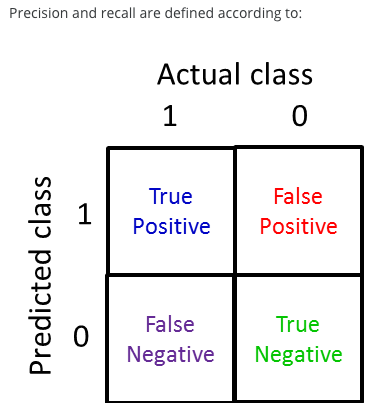

# 
Skewed Classes

  

## What
----
假定通过逻辑回归预测癌症：

$$
\ [ y =
  \begin{case}
    0, &\quad \text{ no cancer} \\
    1, &\quad \taxt{ yes cancer}
  \end{case}
\]
$$

且测试集错误率只有1%。假如测试样本只 0.5%患有癌症，何不让预测函数为：

$$
h_{\theta}(x) = 0
$$

即永远预测不患病，那么准确率会高达95%。引起这个问题原因是样本中出现了偏斜类（Skewed Classes），偏斜即倾斜，大量样本倾斜向某一类型。

  

## Precision and Recall
----
定义：
* 阳性（Positive）：表示正样本。当预测和实际都为正样本时，表示真阳性（True Positive）；如果预测为正样本，而实际为负样本，则表示假阳性（False Positive）。
* 阴性（Negative）：表示负样本。当预测和实际都为负样本时，表示真阴性（True Negative）；如果预测为负样本，而实际为正样本，则表示假阴性（False Negative）。

  

查准率（Precision）：

$$
Precision = \frac{TruePos}{PredicatedPos} = \frac{TruePos}{TruePos + FalsePos}
$$

召回率（Recall）：

$$
Recall = \frac{TruePos}{ActualPos} = \frac{TruePos}{TruePos + FalseNeg}
$$

  

## F-score
----
回到预测患癌例子，假定预测函数为：

$$
\ [ y =
  \begin{case}
    1, &\quad h_{\theta}(x) \geq 0.7 \\
    0, &\quad \text{ otherwise}
  \end{case}
\]
$$
 
即设定预测阈值为0.7。此时，必须有较高把握，才会预测一个患有癌症，避免非癌症患者接受到不必要的治疗，假阳性样本少，此时获得了高查准率。然而，这么预测的代价是有些癌症病患体征不明显，就被认为没有患癌，假阴性样本多，即召回率低。

当尝试构建不同模型，且获了不同查准率和召回率：
|       | Precision | Recall |
| ----- | --------- | ------ |
| 算法 1 | 0.5       | 0.4 |
| 算法 2 | 0.7       | 0.1 |
| 算法 3 | 0.02      | 1.0 |

假定使用平均值权衡：
|       | Precision | Recall | Average |
| ----- | --------- | ------ | ------- |
| 算法 1 | 0.5       | 0.4    | 0.45    |
| 算法 2 | 0.7       | 0.1    | 0.4     |
| 算法 3 | 0.02      | 1.0    | 0.51    |

按照平均值选择算法3，但这不是一个好算法，因为查准率太低。为此，引入$$F_{1}Score$$：

$$
F_{1}Score = 2 \frac{PR}{P+R}
$$

分子是查准率和召回率乘积，只有二者都高时，$$F_{1}Score$$才会较高，特别地：

$$
\begin{case}
  F_{1}Score = 0, &\quad \text{ if } P=0 \text{ or } R=0 \\
  F_{1}Score = 1, &\quad \text{ if } P =1 \text{ and } R=1
\end{case}
$$

|       | Precision | Recall | $$F_{1}Score$$ |
| ----- | --------- | ------ | -------------- |
| 算法 1 | 0.5       | 0.4    | 0.444 |
| 算法 2 | 0.7       | 0.1    | 0.175 |
| 算法 3 | 0.02	     | 1.0    | 0.0392 |
