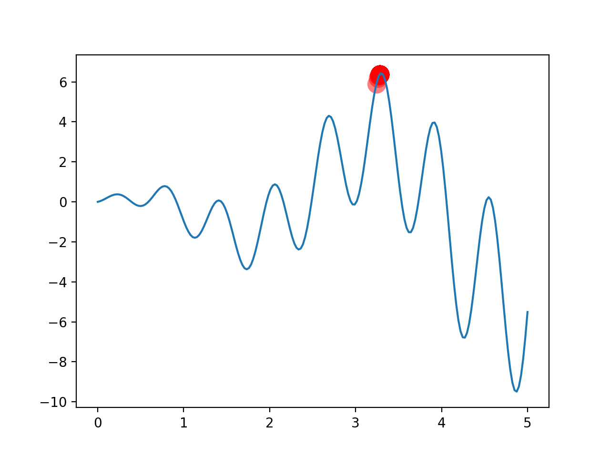
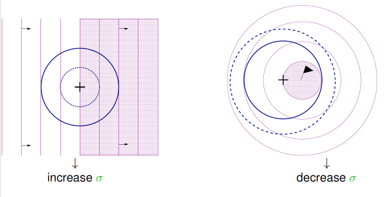
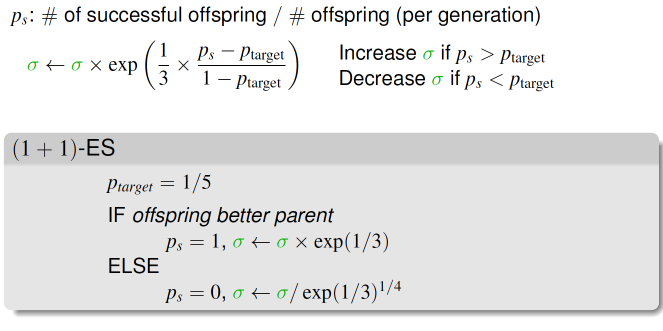

# <center>Evolution Strategy</center>

<br></br>


## ES vs GA
----
* GA选好父母繁殖；ES先繁殖，选好孩子。
* GA用二进制编码DNA；ES的DNA是实数，比如$$1.221$$。
* GA变异DNA是随机让1变成0；ES变异DNA是通过正态分布。

GA的DNA形式类似`11010010`。ES有两条DNA：
1. 第一个DNA控制数值。
2. 第二个DNA控制数值变异强度。

比如一个问题有4个变量，第一个DNA有4个位置存放4个变量值；第二个DNA存放4个变量的变动幅度值。

```
# 4个正态分布的4个平均值.
DNA1=1.23, -0.13, 2.35, 112.5 
# 4个正态分布的4个标准差.
DNA2=0.1, 2.44, 5.112, 2.144  
```

这两条DNA都需crossover和mutate。

<br></br>


## Example
----
找图中最高点：



ES算法就两个功能，`make_kid`和`kill_bad`：

```python
def make_kid(pop, n_kid):
    # 根据正态分布生孩子

def kill_bad(pop, kids):
    # 杀坏孩子和坏父母
```

因为点只有一个，所以DNA长度只有一个。用一个字典存放两种DNA信息。这里DNA存的是均值，`mut_strength`存的是标准差。

```python
# Initialize the pop DNA values.
pop = dict(DNA=5 * np.random.rand(1, DNA_SIZE).repeat(POP_SIZE, axis=0),   
           mut_strength=np.random.rand(POP_SIZE, DNA_SIZE))
```

训练的主循环：

```python
for _ in range(N_GENERATIONS):
    kids = make_kid(pop, N_KID) # 生宝宝
    pop = kill_bad(pop, kids) # 杀宝宝
```

`make_kid()`随机找一对父母，然后将父母DNA和`mut_strength`基因都crossover给kid。再根据`mut_strength`来mutate一下kid的DNA，即用正态分布抽一个 DNA样本，且`mut_strength`也能变异。将变异强度变异后，能在快收敛时自觉逐渐减小变异强度，方便收敛。

```python
def make_kid(pop, n_kid):
    # Generate empty kid holder.
    kids = {'DNA': np.empty((n_kid, DNA_SIZE))}
    kids['mut_strength'] = np.empty_like(kids['DNA'])

    for kv, ks in zip(kids['DNA'], kids['mut_strength']):
        # Crossover (roughly half p1 and half p2).
        p1, p2 = np.random.choice(np.arange(POP_SIZE), size=2, replace=False)
        # Crossover points.
        cp = np.random.randint(0, 2, DNA_SIZE, dtype=np.bool)
        kv[cp] = pop['DNA'][p1, cp]
        kv[~cp] = pop['DNA'][p2, ~cp]
        ks[cp] = pop['mut_strength'][p1, cp]
        ks[~cp] = pop['mut_strength'][p2, ~cp]

        # Mutate (change DNA based on normal distribution)
        ks[:] = np.maximum(ks + (np.random.rand(*ks.shape)-0.5), 0.) # must > 0
        kv += ks * np.random.randn(*kv.shape)
        # Clip the mutated value.
        kv[:] = np.clip(kv, *DNA_BOUND)

    return kids
```

接下来选择适应度靠前的，抛弃掉适应度不佳的：

```python
def kill_bad(pop, kids):
    # Put pop and kids together.
    for key in ['DNA', 'mut_strength']:
        pop[key] = np.vstack((pop[key], kids[key]))

    # Calculate global fitness.
    fitness = get_fitness(F(pop['DNA']))
    idx = np.arange(pop['DNA'].shape[0])
    # Selected by fitness ranking (not value).
    good_idx = idx[fitness.argsort()][-POP_SIZE:]
    for key in ['DNA', 'mut_strength']:
        pop[key] = pop[key][good_idx]

    return pop
```


## (1+1)-ES
----
(1+1)-ES是进化策略一种形式，也是比较方便有效的。统一来说，ES形式都是源自：

$$
\frac{\mu}{\rho}, +, \lambda
$$

其中：
* $$\mu$$表示族群数量。
* $$\rho$$表示从族群中选取的个数，用来生成后代。
* $$\lambda$$是生成的孩子数母。
* 如果采用+形式，是将$$\rho + \lambda$$混合起来进行适者生存。如果是.形式，只使用$$\lambda$$进行适者生存。

<br></br>


## 1/5 Successful Rule
----


`mut_strength`可以采用1/5 successful rule。还没收敛时候（左图），增大`mut_strength。如果快收敛（右图），减小`mut_strength`。判断是否快收敛规则是如果有1/5的变异比原始parent好，就是快收敛。



```python
def kill_bad(parent, kid):
    global mut_strength
    fp = get_fitness(F(parent))[0]
    fk = get_fitness(F(kid))[0]
    p_target = 1/5
    if fp < fk: # kid better than parent
        parent = kid
        ps = 1. # kid win -> ps = 1 (successful offspring)
    else:
        ps = 0.
    # Adjust global mutation strength.
    mut_strength *= np.exp(1/np.sqrt(DNA_SIZE+1) * (ps - p_target)/(1 - p_target))

    return parent
```
