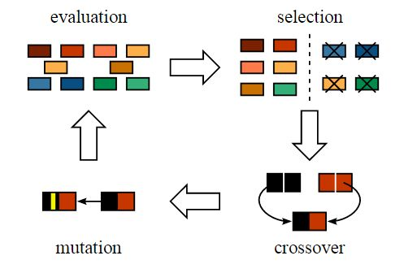

# <center>Generic Algorithm</center>

<br></br>


## Biological Inspiration
----
染色体可被由数字0和1组成的字符串表达：


一条染色体由基因组成，基因是组成DNA的基本结构，DNA上每个基因都编码一个独特性状。比如，头发或眼睛颜色。

<br></br>


## How
----


<br>


### Initialisation
用遗传算法解决背包问题。第一步定义总体。总体中包含了个体，每个个体有自己的染色体。


染色体可表达为二进制数串。假定1代表接基因存活，0意味着丢失。换言之，特定位置上基因代表背包问题表格中的物品。比如第一个位置是Sleeping Bag，此时反映在染色体的基因位置是该染色体的第一个基因。


将图中4条染色体看作总体初始值。

<br>


### Fitness Function
计算前两条染色体适应度分数。对A1染色体100110，有：


对A2染色体001110，有：


对这个问题，当染色体包含更多生存分数时，意味着它适应性更强。因此，染色体1适应性强于染色体2。

<br>


### Selection
开始从总体中选择适合的染色体，让它们互相交配，产生下一代。但这样会导致染色体在几代后差异减小，失去多样性。因此，进行轮盘赌选择法（Roulette Wheel Selection method）。想象有一个轮盘，将它分成$$m$$个部分，$$m$$代表总体中染色体个数。每条染色体在轮盘上占有的区域面积将根据适应度分数成比例表达。


轮盘开始旋转，被固定的指针（fixed point）指到的区域选为第一个亲本。对第二个亲本，进行同样的操作。有时也会在途中标注两个固定指针：


通过这种方法，可在一轮中获得两个亲本，即随机普遍选择法（**Stochastic Universal Selection Method**）。

常见选择方法：
1. 轮盘赌选择（Roulette Wheel Selection）：回放式随机采样方法，选择误差大。
2. 随机竞争选择（Stochastic Tournament）：每次按轮盘赌选择一对个体，然后让这两个个体竞争，适应度高的被选中。如此反复，选满为止。
3. 最佳保留选择：首先按轮盘赌选择方法执行选择操作，然后将当前群体中适应度最高的个体结构完整复制到下一代群体中。
4. 无回放随机选择，或期望值选择（Excepted Value Selection）：根据每个个体在下一代群体中的生存期望进行随机选择。方法如下:
5. 均匀排序：对所有个体按期适应度大小排序，基于排序分配各个体被选中的概率。
6. 最佳保存策略：当前群体中适应度最高的个体不参与交叉运算和变异运算，而用它代替本代群体中经过交叉、变异等操作后所产生的适应度最低的个体。
7. 随机联赛选择：每次选取几个个体中适应度最高的个体遗传到下一代群体中。
8. 排挤选择：新生成的子代来代替或排挤相似的旧父代个体，提高多样性。

<br>


### Crossover
上一步，已选择出可产生后代的亲本染色体。用生物学的话，交叉指繁殖。对染色体1和4（在上步选出）进行交叉：


这是交叉最基本形式，称为**单点交叉（One Point Crossover）**。随机选择一个交叉点，将交叉点前后染色体部分进行染色体间交叉对调，就产生新的后代。

如果设置两个交叉点，就是**多点交叉（Multi Point Crossover）**：


<br>


### Mutation
由上述过程产生的后代是否有父母一样的性状呢？答案是否。在后代生长过程中，体内基因会发生变化，使得它们与父母不同。这个过程称为**变异（Mutation）**。变异可理解为染色体上的随机变化。正因为变异，种群中才存在多样性。


变异完成后，就得到新个体，进化也完成了：



在进行完一轮遗传变异后，用适应度函数对新后代验证。如果适应度足够，用它们从总体中替代适应度不够的染色体。有如下几个最佳适应度水平判断标准：
* $$n$$次迭代后，总体没有太大改变。
* 事先好进化次数。
* 当适应度函数已达到定义的值。

以下变异算子适用于二进制编码和浮点数编码个体：
* 基本位变异（Simple Mutation）：对个体编码串中以变异概率、随机指定的某一位或某几位仅因座上的值做变异运算。
* 均匀变异（Uniform Mutation）：用符合某一范围内均匀分布的随机数，以某一较小概率替换个体编码串中各个基因座上的原有基因值。特别适用于算法初级运行阶段。
* 边界变异（Boundary Mutation）：随机取基因座上两个对应边界基因值之一去替代原有基因值。特别适用于最优点位于或接近可行解边界时的问题。
* 非均匀变异：对原有基因值做随机扰动，以扰动后的结果作为变异后的新基因值。对每个基因座以相同概率变异运算后，相当于整个解向量在解空间中作一次轻微变动。
* 高斯近似变异

<br></br>


## Example
----
### 求解函数
求解函数$$f(x) = x + 10\times\sin{5x} + 7\times\cos{4x}$$在区间$$[0,9]$$最大值。

* 适应性函数：本身就是求解最大值，函数本身就可当做适应性函数。
* 候选程序群体：题目给出了探索的解空间，在$$[0, 9]$$之间比如划分成90000，精确到4位小数，$$216 < 90000 < 217$$，需17位二进制表示这些解。即，一个解的编码是一个17位二进制串。

```python
import math
import random
import operator

class GA():
    def __init__(self, length, count):
        self.length = length  # 染色体长度
        self.count = count  # 种群中的染色体数量
        self.population = self.gen_population(length, count)  # 随机生成初始种群


    def evolve(self, retain_rate=0.2, random_select_rate=0.5, mutation_rate=0.01):
        """
        进化
        对当前一代种群依次进行选择、交叉并生成新一代种群，然后对新一代种群进行变异。
        """
        parents = self.selection(retain_rate, random_select_rate)
        self.crossover(parents)
        self.mutation(mutation_rate)


    def gen_chromosome(self, length):
        """
        随机生成长度为length的染色体，每个基因的取值是0或1。用一个bit表示一个基因。
        """
        chromosome = 0
        for i in xrange(length):
            chromosome |= (1 << i) * random.randint(0, 1)

        return chromosome


    def gen_population(self, length, count):
        """
        获取初始种群（一个含有count个长度为length的染色体的列表）
        """
        return [self.gen_chromosome(length) for i in xrange(count)]


    def fitness(self, chromosome):
        """
        计算适应度，将染色体解码为0~9之间数字，代入函数计算。
        因为是求最大值，所以数值越大，适应度越高。
        """
        x = self.decode(chromosome)

        return x + 10*math.sin(5*x) + 7*math.cos(4*x)


    def selection(self, retain_rate, random_select_rate):
        """
        选择
        先对适应度从大到小排序，选出存活的染色体，再进行随机选择，选出适应度虽然小，但是幸存下来的个体
        """
        # 对适应度从大到小进行排序
        graded = [(self.fitness(chromosome), chromosome) for chromosome in self.population]
        graded = [x[1] for x in sorted(graded, reverse=True)]
        # 选出适应性强的染色体
        retain_length = int(len(graded) * retain_rate)
        parents = graded[:retain_length]
        # 选出适应性不强，但是幸存的染色体
        for chromosome in graded[retain_length:]:
            if random.random() < random_select_rate:
                parents.append(chromosome)

        return parents


    def crossover(self, parents):
        """
        染色体的交叉、繁殖，生成新一代的种群。
        """
        # 新出生的孩子，最终会被加入存活下来的父母之中，形成新一代的种群。
        children = []
        # 需要繁殖的孩子的量。
        target_count = len(self.population) - len(parents)
        # 开始根据需要的量进行繁殖。
        while len(children) < target_count:
            male = random.randint(0, len(parents)-1)
            female = random.randint(0, len(parents)-1)
            if male != female:
                cross_pos = random.randint(0, self.length)  # 随机选取交叉点
                mask = 0  # 生成掩码，方便位操作
                for i in xrange(cross_pos):
                    mask |= (1 << i) 
                male = parents[male]
                female = parents[female]
                # 孩子将获得父亲在交叉点前的基因和母亲在交叉点后（包括交叉点）的基因
                child = ((male & mask) | (female & ~mask)) & ((1 << self.length) - 1)
                children.append(child)
        # 经过繁殖后，孩子和父母的数量与原始种群数量相等，在这里可以更新种群。
        self.population = parents + children


    def mutation(self, rate):
        """
        变异
        对种群中的所有个体，随机改变某个个体中的某个基因
        """
        for i in xrange(len(self.population)):
            if random.random() < rate:
                j = random.randint(0, self.length-1)
                self.population[i] ^= 1 << j


    def decode(self, chromosome):
        """
        解码染色体，将二进制转化为属于[0, 9]的实数
        """
        return chromosome * 9.0 / (2**self.length-1)


    def result(self):
        """
        获得当前代的最优值，这里取的是函数取最大值时x的值。
        """
        graded = [(self.fitness(chromosome), chromosome) for chromosome in self.population]
        graded = [x[1] for x in sorted(graded, reverse=True)]

        return ga.decode(graded[0])     


if __name__ == '__main__':
    ga = GA(17, 300)  # 染色体长度为17，种群数量为300。

    for x in xrange(200):  # 200次进化迭代
         ga.evolve()

    print ga.result()  # 7.85672650701
```
