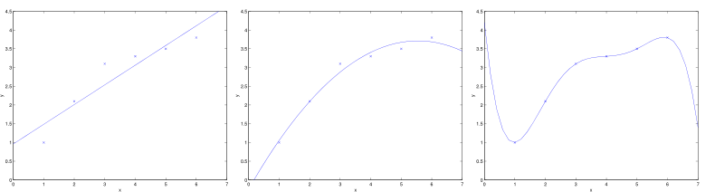

# 
Underfitting & Overfitting

  

* 欠拟合 Underfitting：数据距离拟合曲线较远。如下左图。
* 过拟合 Overfitting：过度拟合，貌似拟合几乎每一个数据，但是丢失了信息规律。如下右图。

## 局部加权线性回归 LWR
----
为解决欠拟合和过拟合问题，引入局部加权线性回归（Locally Weight Regression）。在一般线性回归算法中，对某个输入向量$$x$$，这样预测输出$$y$$：
1. 修正$$\theta$$来最小化$$\sum_{i}(y_{i}-\theta^{T}x^{(i)})^{2}$$。
2. 进行预测：$$\theta^{T}x$$

在LWR中：
1. 修正$$\theta$$来最小化$$\sum_{i}w^{i}(y_{i}-\theta^{T}x^{(i)})^{2}$$。
2. 进行预测：$$\theta^{T}x$$

在LWR中，对一个输入$$x$$预测时，赋予$$x$$周围点不同的权值。距离$$x$$越近，权重越高。整个学习过程中误差将会取决于$$x$$周围的误差，而不是整体误差，这也是局部一词由来。

通常，$$w^{(i)}$$服从高斯分布，在$$x$$周围呈指数型衰减：

$$
w^{(i)} = e^{-\frac{(x^{(i)} - x)^{2}}{2\tau^{2}}}
$$

其中，$$\tau$$值越小，则靠近预测点的权重越大，而远离预测点的权重越小。另外，LWR属于非参数（non-parametric）学习算法。

> 非参数学习算法指没有明确参数（比如上述的$$\theta$$取决于当前要预测的$$x$$），每进行一次预测，需重新训练。一般线性回归属于参数（parametric）学习算法，参数在训练后不改变。