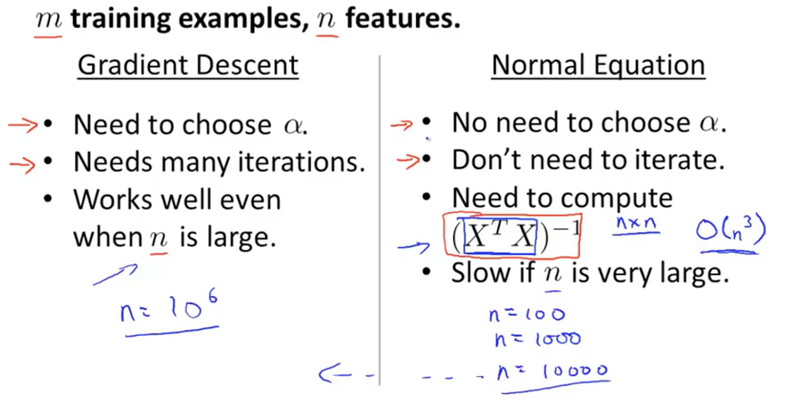
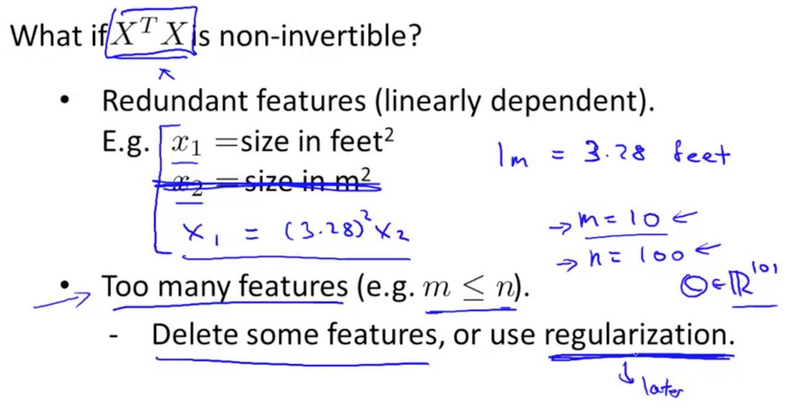
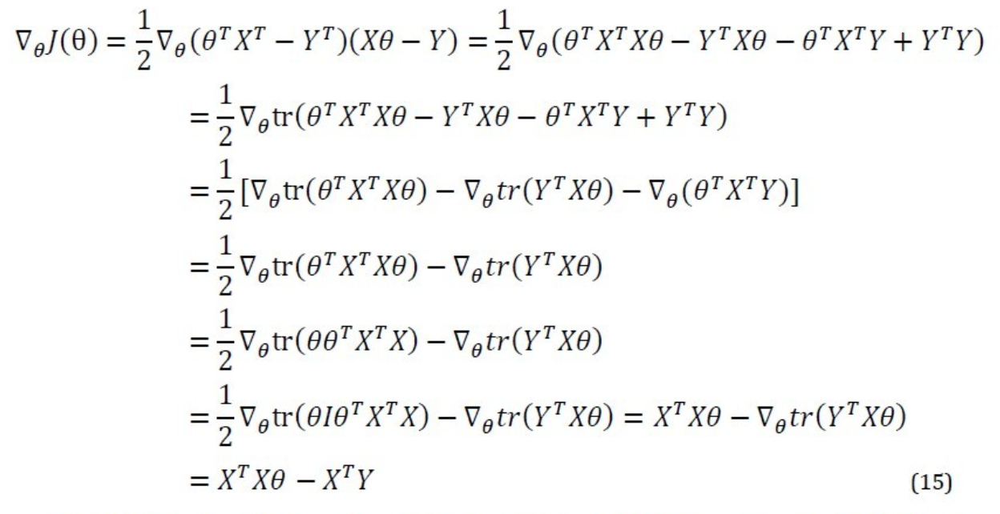

# 
Normal Equation

  

## Why & How
----
对于线性回归问题，除了用梯度下降求最优值，还可使用正规方程。正规方程法，即令$$\frac{\partial}{\partial{\theta_{j}}}J(\theta_{j})=0$$，通过解析函数方式直接计算得出参数向量值，$$\theta = (X^{T}X)^{-1}X^{T}y$$。

例子：
1. 在数据集加上一列$$x_0$$，值都为1。
2. 将所有变量放入矩阵$$X$$中（包括$$x_0$$）。
3. 将预测值放入向量$$y$$中。
4. 通过公式$$\theta = (X^{T}X)^{-1}X^{T}y$$算出$$\theta$$值。

  

> Octave代码：`theta = inv(X'*X)*X'*y`。
>
> $$X^{-1}$$表示矩阵$$X$$的逆。Octave中，`inv`函数计算矩阵逆，还有`pinv`函数。
>
> `X'`为在Octave中表示矩阵$$X$$转置，即$$X^T$$。

  

## 正规方程 vs 梯度下降
----

  

$$
\begin{array}{c|c|c}
\mathbf{} & \mathbf{Gradient Descent} & \mathbf{Normal Equation} \\
\hline
\text{Learning Rate:}\alpha & \text{Need to choose.} & \text{No need to choose.} \\
\text{Computing Iterations} & \text{Need} & \text{No iteration.} \\
\text{Large Features} & \text{Can work.}O(kn^2) & \text{Can't work.} O(X^{T}X)^{-1} = O(n^{3}) \\
\text{Feature Scaling} & \text{Need} & \text{No need.} \\
\text{Fitting Scenarion} & \text{Work well when n is large 各类模型} & \text{Slow if n is very large 只适用线性模型，且矩阵需可逆。}
\end{array}
$$

  

## Normal Equation Noninvertibility
----
当$$X^TX$$不可逆时，可能是使用了冗余特征，或太多特征（特征数量超过样本量）。这种情况可删掉一些特征或使用正则化：

  

  

## 正规方程法推导过程（一）
----
$$
\begin{split}
J(\theta) &= \frac{1}{2m} \sum\limits_{i=1}^{m}(h_{\theta}(x^{(i)}) - y^{(i)})^{2} \\
& = \frac{1}{2m}||X\theta-y||^{2} \\
& = \frac{1}{2m}(X\theta-y)^{T}(X\theta-y)
\end{split}
$$

展开上式得：

$$
J(\theta) = \frac{1}{2m}(\theta^{T}X^{T}X\theta - \theta^{T}X^{T}y - y^{T}X\theta + y^{T}y)
$$

注意到$$\theta^{T}X^{T}y$$与$$y^{T}X\theta$$都为标量，实际上是等价的，则：

$$
J(\theta) = \frac{1}{2m}(X^{T}X\theta-2\theta^{T}X^{T}y+y^{T}y)
$$

接下来对$$J(\theta)$$求偏导，根据矩阵求导法则$$\frac{dX^{T}AX}{dX}=(A+A^{\mathrm{T}})X$$和$$\frac{dX^{T}A}{dX}=A$$，有：

$$
\frac{\partial{J(\theta)}}{\partial\theta} = \frac{1}{2m}(2X^{T}X\theta - 2X^{T}y) = X^{T}X\theta - X^{T}y
$$

令$$\frac{\partial{J(\theta)}}{\partial\theta}=0$$, 则有

$$
\theta = {(X^{T}X)}^{-1}X^{T}y
$$

  

## 正规方程法推导过程（二）
----
定义梯度符号为$$\nabla$$，则$$J$$的梯度表示为：

$$
\nabla_\theta J = \begin{bmatrix} \frac{\partial J}{\partial\theta_0} & \cdots & \frac{\partial J}{\partial\theta_n} \end{bmatrix}^{\rm T} \in \mathbb{R}^{n+1} \tag 1
$$

再比如，对函数映射（$$m \times n$$的矩阵到实数的映射）：

$$
\mathit{f}:\mathbb{R}^{m \times n} \to \mathbb{R}
$$

则f梯度表示为：

$$
\nabla_A f(A) = 
\begin{bmatrix}
\frac{\partial f}{\partial A_11 } & \cdots & \frac{\partial f}{\partial A_{1n}} \\
\vdots & \ddots & \vdots \\
\frac{\partial f}{\partial A_{m1}} & \cdots & \frac{\partial f}{\partial A_{mn}}
\end{bmatrix}
\tag 2
$$

其中$$A$$是$$m \times n$$矩阵。比如对$$2 \times 2$$矩阵$$A$$，有函数$$f$$，定义为：

$$
f(A)=\frac{3}{2}A_{11}+5A^{2}_{12}+A_{21}A_{22}
$$

则得到：

$$
\nabla_a f(A) = 
\begin{bmatrix}
\frac{3}{2} & 10A_{12} \\
A_{22} & A_{21}
\end{bmatrix}
$$

对于$$n \times n$$矩阵，定义矩阵迹为：

$$
\text{trA} = \sum_{i=1}^{n}A_{ii}
\tag {3}
$$

把梯度和迹组合，得到如下性质：
1. trAB = trBA
2. trABC = trCAB = trBCA
3. trA = tr$$ \text{A}^{T} $$
4. tr(A + B) = tr(A) + tr(B)
5. traA = a * trA
6. tra = a
    其中，a是一个实数，A、B和C为$$n \times n$$矩阵。
7. $$\nabla_A \text{trAB} = \text{B}^{T}$$
8. $$\nabla_{A^{T}}f(A) = (\nabla_Af(A))^{T}$$
9. $$\nabla_{A}trABA^{T}C = CAB + C^{T}AB^{T}$$

 

### 矩阵表示目标函数
训练数据集合是$$m \times n$$矩阵，其中$$m$$是样本个数，$$n$$为每个样本的维度。对于每个样本目标值，按顺序排列为$$m \times 1$$向量。因而，数据矩阵为：

$$
X = 
\begin{bmatrix}
(x^{1})^{T} \\
\vdots \\
(x^{m})^{T}
\end{bmatrix}
\tag {4}
$$

$$
Y = \begin{bmatrix} y^{1} & \cdots & y^{m} \end{bmatrix}^{\rm T} \tag {5}
$$

因此，得到：

$$
X\theta - Y = 
\begin{bmatrix}
(x^{1})^{T}\theta \\
\vdots \\
(x^{m})^{T}\theta
\end{bmatrix}
-
\begin{bmatrix}
y^{1} \\
\vdots \\
y^{m}
\end{bmatrix}
=
\begin{bmatrix}
h_{\theta}(x^{1}) - y^{1} \\
\vdots \\
h_{\theta}(x^{m}) - y ^{m}
\end{bmatrix}
\tag {6}
$$

所以，得到目标函数$$J$$向量表达为：

$$
J(\theta) = \frac{1}{2} (X\theta - Y)^{T}(X\theta - Y) = \frac{1}{2} \sum^{m}{i=1}(h_{\theta}(x^{i}) - y^{i})^{2}
\tag {7}
$$

可得到计算$$J$$的梯度公式推导：

  

上述公式中：
1. 第一行展开；
2. 第二行应用性质6；
3. 第三行应用性质4，且$$Y^{T}Y$$为常数；
4. 第四行应用性质3；
5. 第五行应用性质1；
6. 第六行的I是单位矩阵，并应用性质9和7.

得到结果后，令导数为0，得到：

$$
X^{T}X\theta = X^{T}Y \to \theta = (X^{T}X)^{-1}X^{T}Y
\tag {8}
$$

从而求出参数。
