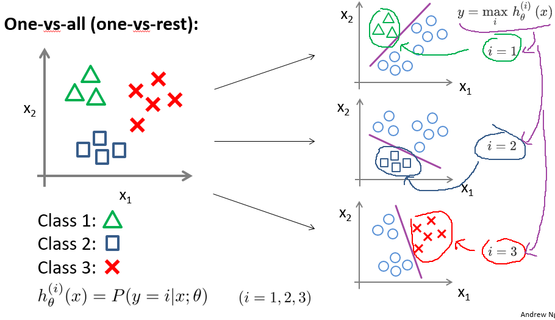

# 
Logistic Regression

  

## What
----
在分类问题中，预测的结果是离散值（结果是否属于某一类），**逻辑回归算法（Logistic Regression）用于解决分类问题**：

- 垃圾邮件判断
- 金融欺诈判断
- 肿瘤诊断

肿瘤诊断问题：

肿瘤诊断问题是二元分类问题（binary class problems）。定义$$y \in\lbrace 0, 1\rbrace$$，其中0表示负向类（negative class），代表恶性肿瘤，1为正向类（positive class）。如图，定义最右边的样本为**偏差项**。

未加入偏差项时，线性回归算法给出品红色的拟合直线，若规定：
* 当$$h_\theta(x) \geqslant 0.5$$，预测$$y = 1$$，正向类；
* 当$$h_\theta(x) \lt 0.5$$，预测$$y = 0$$，负向类。

即以0.5为阈值（threshold），则可根据线性回归结果，得到分类结果$$y$$。

加入偏差项，线性回归算法给出靛青色的拟合直线。如果阈值仍为0.5，算法在某些情况下给出错误结果。不仅如此，线性回归算法值域为全体实数集（$$h_\theta(x) \in R$$），则当线性回归函数给出诸如$$h_\theta(x) = 10000, h_\theta(x) = -10000$$等很大/很小（负数）数值时，结果$$y \in \lbrace 0, 1\rbrace$$，显得怪异。

 

### Logistic Regression vs Liner Regression
区别于线性回归算法，**逻辑回归算法是一个分类算法，其输出值永远在0到1间**，即$$h_\theta(x) \in (0,1)$$。

线性回归结果是连续的，它可以是无限数量的可能值中任一个。在逻辑回归中，结果只是有限数量可能值。

例如，如果X为房屋面积，Y为房屋售价，则可用线性回归预测售价作为房屋大小函数。虽然售价可能不是任何数值，但存在许多可能值，故选线性回归模型。如果根据大小预测房子是否超过2万美元，可使用逻辑回归。

逻辑回归首先把样本映射到$$[0,1]$$之间数值，这归功于Sigmoid函数。

  

## Multiclass Classification: One-vs-all
----

解决多分类问题原理是转化为**多个二元分类问题**，称为One-vs-all。

正式定义：

$$
h_{\theta}^{(i)}(x) = p(y=i|x;\theta), i=(1,2,3....k)
$$

> $$h_{\theta}^{(i)}(x)$$：输出$$y=i$$（属于第$$i$$个分类）可能性。
>
> $$k$$：类别总数，如上图$$k=3$$。

多类别分类问题中$$h_{\theta}(x)$$结果不是一个实数而是一个向量，如果类别总数为$$k$$，$$h_{\theta}(x)$$是一个$$k$$维向量。

对于某样本实例，需计算所有_k_种分类情况得$$h_{\theta}(x)$$。然后看分为哪个类别时预测输出值最大，就说它输出属于哪个，即$$y = \mathop{\max}\limits_i\,h_\theta^{(i)}(x)$$。

  

## Quiz
----

