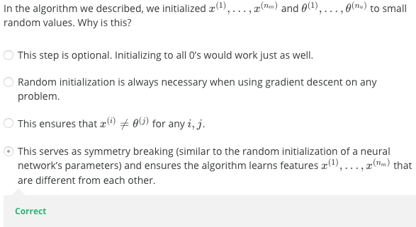

# 
Collaborative Filtering

  

* Based on assumptions:
    1. Users with similar interests have common perferences.
    2. Sufficiently large number of user perferences are avilable.

* User Based

    * Advantage:

        1. No knowledge about item features needed.

    * Problems

        1. New user/item cold start problem.
        2. Sparsity problem: if there are many items to be recommended, user/rating matrix is sparse and it hard to find the users who have rated the same item.
        3. 数百万用户计算，用户之间两两计算相似度，计算量过大。
        4. 人是善变的。
        5. Popularity Bias: Tend to recommend only popular items.

* Item Based

    * 优势

        1. 计算性能高，通常用户数量远大于物品数量，实际计算物品之间的相似度，可以只选择同一个大分类下的类似物品来计算，以此减少计算量。
        2. 可预先保留结果。
        3. 物品不善变。
        4. No knowledge about item features needed.
        5. Reduced sparsity problem.

  

## Background
----
每部电影都有评价其内容的特征向量$$x$$：

| Movie/User           | Alice(1) | Bob(2) | Carol(3) | Dave(4) | $$x_1$$ | $$x_2$$ |
|:---------------------|:---------|:-------|:---------|:--------|:--------|:--------|
| Love at last         | 5        | 5      | 0        | 0       | 0.9     | 0       |
| Romance for ever     | 5        | ?      | ?        | 0       | 1.0     | 0.01    |
| Cute puppies of love | ?        | 4      | 0        | ?       | 0.99    | 0       |
| Nonstop car chases   | 0        | 0      | 5        | 4       | 0.1     | 1.0     |
| Swords vs. karate    | 0        | 0      | 5        | ?       | 0       | 0.9     |

假定有各用户对电影偏爱评估$$\theta$$：

$$
\theta^{(1)} = \begin{pmatrix} 0 \\ 5 \\ 0 \end{pmatrix},
\theta^{(2)} = \begin{pmatrix} 0 \\ 5 \\ 0 \end{pmatrix},
\theta^{(3)} = \begin{pmatrix} 0 \\ 0 \\ 5 \end{pmatrix},
\theta^{(4)} = \begin{pmatrix} 0 \\ 5 \\ 0 \end{pmatrix}
$$

且，不知道电影的指数：

| Movie/User           | Alice(1) | Bob(2) | Carol(3) | Dave(4) | $$x_1$$ | $$x_2$$ |
|:---------------------|:---------|:-------|:---------|:--------|:--------|:--------|
| Love at last         | 5        | 5      | 0        | 0       | ?       | ?       |
| Romance for ever     | 5        | ?      | ?        | 0       | ?       | ?       |
| Cute puppies of love | ?        | 4      | 0        | ?       | ?       | ?       |
| Nonstop car chases   | 0        | 0      | 5        | 4       | ?       | ?       |
| Swords vs. karate    | 0        | 0      | 5        | ?       | ?       | ?       |

 

### 目标优化
通过$$\theta^{(1)}, ..., \theta^{(n_u)}$$学习$$x^{(i)}$$：

$$
\min_{x^{(i)}} = \frac{1}{2} \sum_{j:r(i,j)=1} \left( (\theta^{(j)})^T x^{(i)} - y^{(i,j)}\right) ^2
+ \frac{\lambda}{2} \sum_{k=1}^n (x_k^{(i)})^2
$$

则对所有电影指数$$x^{(1)},...,x^{(n_m)}$$：

$$
\min_{x^{(i)},...,x^{(n_m)}} = \frac{1}{2} \sum_{i=1}^{n_m} \sum_{j:r(i,j)=1}  \left( (\theta^{(j)})^T x^{(i)} - y^{(i,j)}\right) ^2
+ \frac{\lambda}{2} \sum_{i=1}^{n_m} \sum_{k=1}^n (x_k^{(i)})^2
$$

  

## 协同过滤算法
----
现在有了评价用户的$$\theta$$和评价商品的$$x$$，且：

- 给定$$\theta$$及用户对商品评价，能估计$$x$$。
- 给定$$x$$能估计$$\theta$$。

因此，构成$$ \theta -> x -> \theta -> x ...$$优化序列，这便构成了协同过滤算法，即同时优化商品和用户具有的参数。

  

## 目标优化
----
1. 推测用户喜好

    给定$$x^{(1)},...,x^{(n_m)}$$，估计$$\theta^{(1)},...,\theta^{(n_u)}$$：

    $$
    \min_{\theta^{(1)}, ..., \theta^{(n_u)}} = \frac{1}{2} \sum_{j=1}^{n_u} \sum_{i:r(i,j)=1} \left((\theta^{(j)})^Tx^{(i)}-y^{(i,j)}\right)^2
    + \frac{\lambda}{2} \sum_{j=1}^{n_u} \sum_{k=1}^n(\theta_k^{(j)})^2
    $$

2. 推测商品内容

    给定$$\theta^{(1)},...,\theta^{(n_u)}$$，估计$$x^{(1)},...,x^{(n_m)}$$：

    $$
    \min_{x^{(i)},...,x^{(n_m)}} = \frac{1}{2} \sum_{i=1}^{n_m} \sum_{j:r(i,j)=1}  \left( (\theta^{(j)})^T x^{(i)} - y^{(i,j)}\right) ^2
    + \frac{\lambda}{2} \sum_{i=1}^{n_m} \sum_{k=1}^n (x_k^{(i)})^2
    $$

3. 协同过滤

    同时优化$$x^{(1)},...,x^{(n_m)}$$及$$\theta^{(1)},...,\theta^{(n_u)}$$：

    $$
    \min J(x^{(i)},...,x^{(n_m)} ; \theta^{(1)}, ..., \theta^{(n_u)})
    $$

    即：

    $$
    \min_{x^{(i)},...,x^{(n_m)} ; \theta^{(1)}, ..., \theta^{(n_u)}}
    \frac{1}{2} \sum_{(i,j):r(i,j)=1}  \left( (\theta^{(j)})^T x^{(i)} - y^{(i,j)}\right) ^2
    + \frac{\lambda}{2} \sum_{i=1}^{n_m} \sum_{k=1}^n (x_k^{(i)})^2
    + \frac{\lambda}{2} \sum_{j=1}^{n_u} \sum_{k=1}^n(\theta_k^{(j)})^2
    $$

    $$\sum_{(i,j):r(i,j)=1}$$反映了用户和商品所有有效配对。

  

## 算法流程
----
使用协同过滤的推荐算法流程为：
1. 随机初始化$$x^{(i)},...,x^{(n_m)} ; \theta^{(1)}, ..., \theta^{(n_u)}$$为较小值，与神经网络参数初始化类似。为避免系统陷入僵死，不使用0值初始化。

2. 使用梯度下降法最小化$$J(x^{(i)},...,x^{(n_m)};\theta^{(1)}, ..., \theta^{(n_u)})$$。对$$j=1,2,..,n_u$$，$$i=1,2,...,n_m$$，参数更新式为：

    $$
    \begin{align*}
    & x_k^{(i)} = x_k^{(i)} - \alpha \left( \sum_{j:r(i,j)=1}\big((\theta^{(j)})^T x^{(i)} - y^{(i,j)}\big) \theta_k^{(j)} + \lambda x_k^{(i)}\right) \\
    & \theta_k^{(j)} = \theta_k^{(j)} - \alpha\left(\sum_{i:r(i,j)=1}\big((\theta^{(j)})^T x^{(i)} - y^{(i,j)}\big) x_k^{(i)} + \lambda\theta_k^{(j)} \right)
    \end{align*}
    $$

3. 如果用户偏好向量为$$\theta$$，商品特征向量为$$x$$，可预测用户评价为$$\theta^T x$$。

因为协同过滤算法$$\theta$$和$$x$$相互影响，因此，二者没必要使用偏置$$\theta_0$$和$$x_0$$，即$$x \in R^n$$、$$\theta \in R^n$$。

当获得电影$$i$$特征向量后，可通过计算$$||x^{(j)}-x^{(i)}||$$比较电影$$j$$与电影$$i$$相似度。