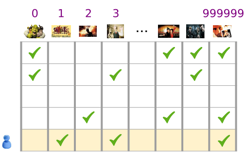
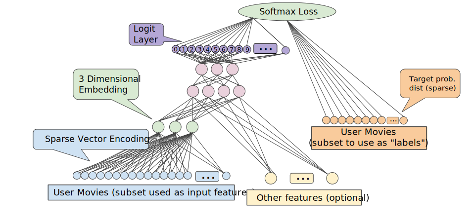
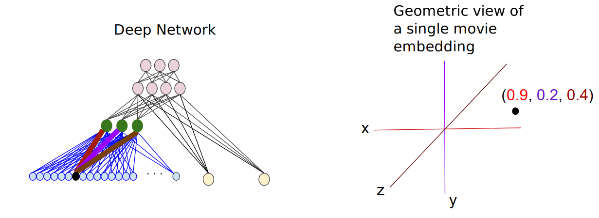

# <center>Embedding</center>


<br></br>


## What
----
Embedding在数学上表示一个映射，即函数$$f: X -> Y$$。该函数有两个特征：
1. injective，即单射函数，每个$$Y$$只有唯一的$$X$$对应，反之亦然。
2. structure-preserving，即结构保存。比如在$$X$$所属空间上$$X_{1} < X_{2}$$，那么映射后在$$Y$$所属空间上$$Y_{1} < Y_{2}$$。

嵌套本质是将稀疏不连续对象映射到实数向量。比如300维度英语单词嵌套：

```
blue:  (0.01359, 0.00075997, 0.24608, ..., -0.2524, 1.0048, 0.06259)
blues:  (0.01396, 0.11887, -0.48963, ..., 0.033483, -0.10007, 0.1158)
orange:  (-0.24776, -0.12359, 0.20986, ..., 0.079717, 0.23865, -0.014213)
```

向量中这些单独维度没有意义，只是向量的位置、距离关系的整体图式表达。分类器和神经网络普遍工作于实数向量Real number vector。训练最好是基于密集向量dense vector，全部所有数值共同定义对象。但对机器学习，很多输入比如单词，没有自然向量表现形式。嵌套函数就是一个标准且有效的函数，把稀疏离散discrete/sparse对象变为连续向量表示法。

嵌套也作为机器学习输出值。由于嵌套将物体映射为向量，程序可使用向量空间相似方法估算物体间相似性。一个用途是发现最近邻对象。比如下面是每个单词三个最近邻单词，用角度来展示：

```
blue:  (red, 47.6°), (yellow, 51.9°), (purple, 52.4°)
blues:  (jazz, 53.3°), (folk, 59.1°), (bluegrass, 60.6°)
orange:  (yellow, 53.5°), (colored, 58.0°), (bright, 59.9°)
```


<br></br>


## 推荐系统
----
嵌入层可用来处理推荐系统中稀疏矩阵问题。推荐系统有两种类型：
1. 基于内容过滤：基于物品或产品数据。比如，让用户填喜欢的电影。如果喜欢科幻电影，就推荐科幻电影。这种方法需大量产品元数据。
2. 协同过滤：找到和目标相似的人。假设爱好相同，看他们喜欢什么。在大数据集中，这个方法和元数据相比效果更好。另外一点是，询问用户行为和观察他们行为之间有出入，需要心理学解释。

为解决这问题，可创建巨大的所有用户对所有电影的评价矩阵。在很多情况下，这个矩阵非常稀疏。创建矩阵后，可通过梯度下降算法训练神经网络，预测每个用户会给每部电影打多少分。

**Categorical data** is most efficiently represented via sparse tensors, which are tensors with very few non-zero elements. If building a movie recommendation model, we can assign a unique ID to each possible movie, and then represent each user by a sparse tensor of the movies they have watched.



In order to use such representations within machine learning, we need a way to represent each sparse vector as a vector of numbers so that semantically similar items have similar distances in the vector space.

The simplest way is to define a giant input layer with a node for every word in vocabulary, or at least a node for every word that appears in the data. If 500,000 unique words, we could represent a word with a length 500,000 vector and assign each word to a slot in the vector.

More typically the vector might contain counts of the words in a larger chunk of text. This is known as a "bag of words" representation. In a bag-of-words vector, several of the 500,000 nodes would have non-zero value.

But however we determine the non-zero values, one-node-per-word gives us very sparse input vectors—very large vectors with relatively few non-zero values. Sparse representations have a couple of problems that can make it hard for a model to learn effectively.

One proble is it is lack of meaningful relations between vectors. For example, if you feed the pixel values of RGB channels into an image classifier, it makes sense to talk about "close" values. Reddish blue is close to pure blue. But a vector with a 1 at index 1247 for "horse" is not any closer to a vector with a 1 at index 50,430 for "antelope" than it is to a vector with a 1 at index 238 for "television".

<br></br>


## Obtaining Embeddings
----
In general, when you have sparse data (or dense data that you'd like to embed), you can create an embedding unit that is just a special type of hidden unit of size _d_. This embedding layer can be combined with any other features and hidden layers. As in any DNN, the final layer will be the loss that is being optimized. For example, let's say we're performing collaborative filtering. We can model this as a supervised learning problem by randomly setting aside (or holding out) a small number of the movies that the user has watched as the positive labels, and then optimize a softmax loss.



As another example if we want to create an embedding layer for words in a real-estate ad as part of a DNN to predict housing prices, then we'd optimize an $$L_{2}$$ Loss using the known sale price of homes in training data as the label.

When learning a $$d$$-dimensional embedding, each item is mapped to a point in a $$d$$-dimensional space so that the similar items are nearby in this space. The edge weights between an input node and the nodes in the $$d$$-dimensional embedding layer correspond to the coordinate values for each of the $$d$$ axes.


