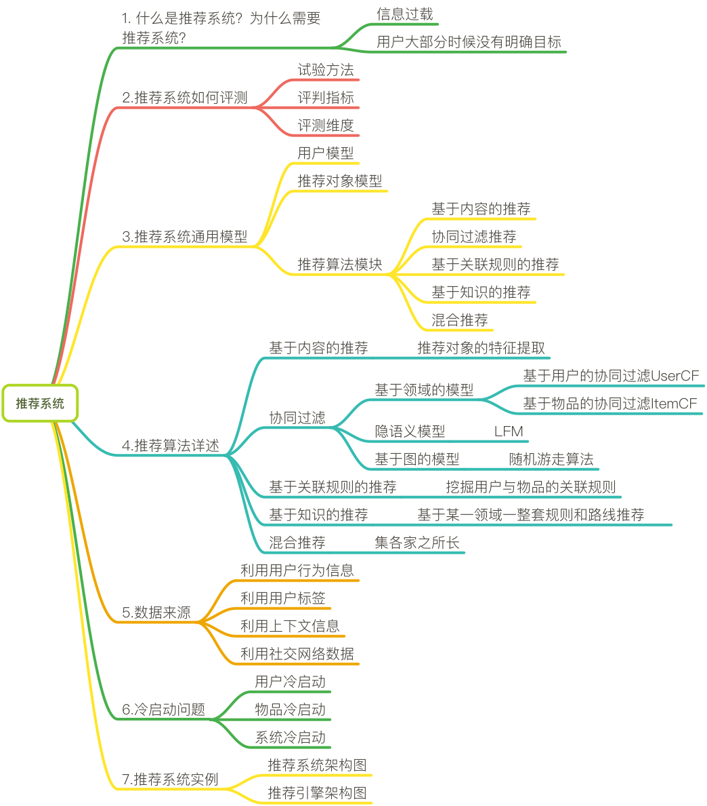
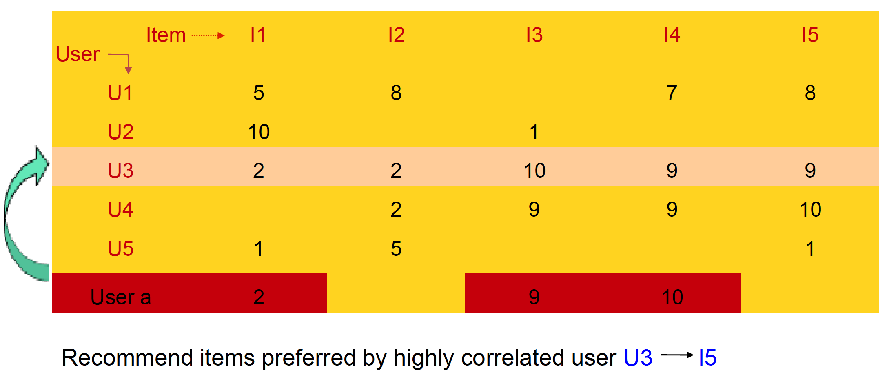
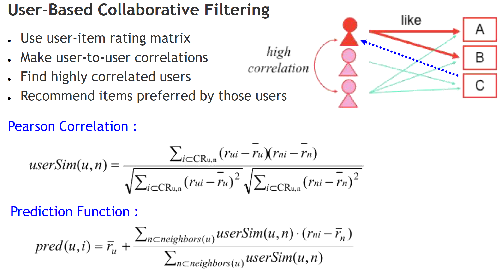
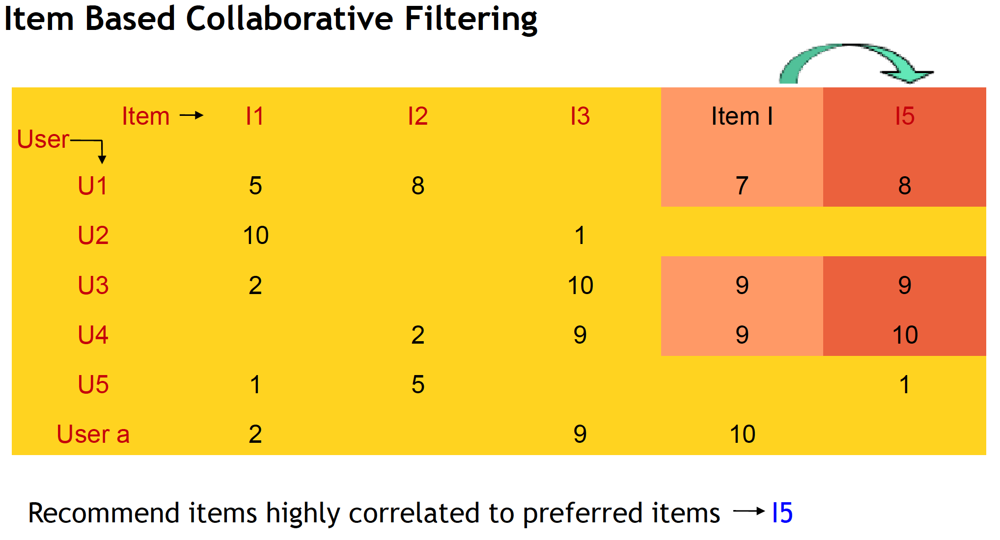
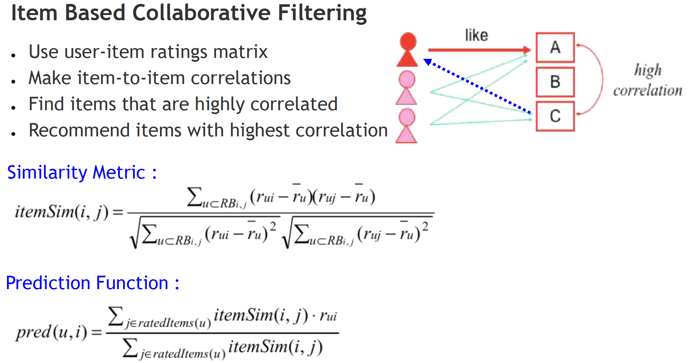
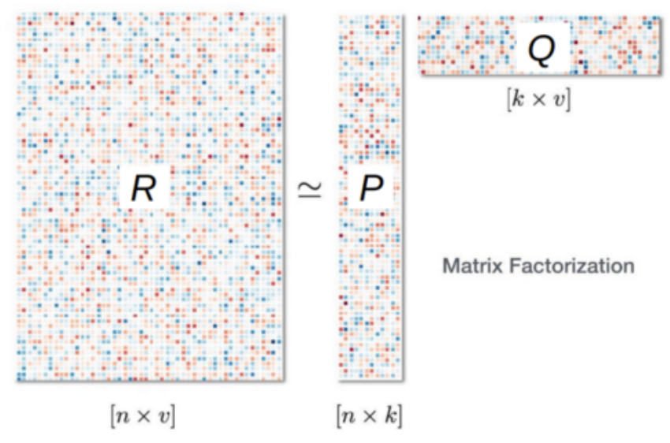
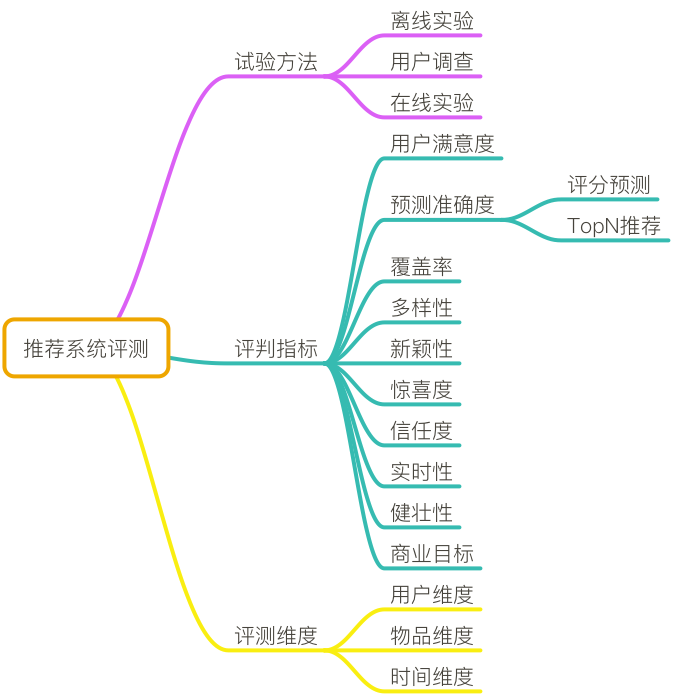

# 
Recommendation System Overview

  

  

## Collaborative Filtering
----
Based on assumptions:
1. Users with similar interests have common perferences.
2. Sufficiently large number of user perferences are avilable.

User的推荐更社会化，反映了用户所在的小型兴趣群体中物品的热门程度。Item的推荐更加个性化，反映了用户自己的兴趣传承。

* 输入：仅依赖于惯用数据（例如评价、购买、下载等用户偏好行为）
* 类型：
    1. 基于邻域的协同过滤（基于用户和基于项）
    2. 基于模型的协同过滤（矩阵因子分解、受限玻尔兹曼机、贝叶斯网络等等）
* 优点：
    1. 需要最小域
    2. 不需要用户和项
    3. 大部分场景中能够产生足够好的结果
* 缺点：
    1. 冷启动问题
    2. 需标准化产品
    3. 需很高的用户和项的比例（1：10）
    4. 流行度偏见（长尾时表现不够好）
    5. 难于提供解释

 

### 相似度计算
1. 欧式距离 Edclidean Distance

    向量欧式距离：

    $$
    d(x,y) = \sqrt{\sum{(x_i-y_i)^2}}
    $$

    相似度：

    $$
    sim(x,y) = \frac{1}{1+d(x,y)}
    $$

2. 皮尔逊相关系数 Pearson Correlation Coefficient

    协方差，衡量2个向量变化趋势是否一致：

    $$
    cov(x, y) = \frac{\sum_{n}^{i=1} (x_{i}-\overline{x})(y_{i}-\overline{y})}{n-1}
    $$

    标准差：

    $$
    \sigma_{x} = \sqrt{\frac{1}{n} \sum^{N}_{i=1}(x_{i} - \overline(x))^{2}}
    $$

    皮尔逊相关系数使用协方差除以2个向量标准差得到，值范围$$[-1，1]$$：

    $$
    \rho_{x,y} = corr(x, y) = \frac{cov(x,y)}{\sigma_x \sigma_y}
    $$

3. Cosine相似度 Cosine Similarity

    $$
    T(x,y) = \frac{x \dot y}{\|x\|^{2} \times \|y\|^{2}} = \frac{\sum x_i y_i}{\sqrt{x_i^2}\sqrt{y_i^2}}
    $$

 

### 邻居选择
通过相似度计算出若干最相似邻居后，选择邻居有以下方式：
1. 基于固定数量：选择固定数量的邻居，有可能把相似度较小的对象也引入。
2. 基于相似度门槛：先用相似度门槛筛选出邻居一个集合，再从集合选出相似度较大的邻居。可避免把相似度较小对象引入，效果更好。

 

### User Based CF

Advantage:
- No knowledge about item features needed.

Problems:
- New user/item cold start problem.
- Sparsity problem: if there are many items to be recommended, user/rating matrix is sparse and it hard to find the users who have rated the same item.
- Popularity Bias: Tend to recommend only popular items.
- 数百万用户计算，用户之间两两计算相似度，计算量过大。
- 人是善变的。

 

### Item Based CF

Advantages:
- No knowledge about item features needed.
- Better scalability, because correlations between limited number of items instead of very large number of users.
- Reduced sparsity problem.
- 可预先保留结果。
- 物品不善变

Problems:
- New item/user cold start problem.

 

### Matrix Factorization
Matrix factorization based methods attempt to reduce dimensionality of the interaction matrix and approximate it by two or more small matrices with $$k$$ latent components.

  

## Content Based
----
Recommend items similar to those a user has liked (browsed/purchased) in the past. Or ecommendations are based on the content of items rather on other user's opinion.

* 简介：向用户推荐和其过去喜欢项的内容（例如元数据、描述、话题等等）相似的项
* 输入：仅依赖于项和用户的内容/描述
* 类型：
    1. 信息检索
    2. 机器学习（例如朴素贝叶斯、支持向量机、决策树等等）
* 优点：
    1. No cold start and sparsity.
    2. 不需惯用数据。
    3. 没有流行度偏见。
    4. 可使用用户内容特性提供解释。
* 缺点：
    1. 项内容须是机器可读和有意义的。Data should be in structured format.
    2. 难联合多个项的特性。Unable to use quality judgements from other users.
    3. 难有意外，缺少多样性。

  

## 混合推荐算法
----
* 简介：综合利用协同过滤推荐算法和基于内容的推荐算法。
* 输入：同时使用用户和项内容特性与惯用数据，同时从两种输入类型中获益。
* 类型：加权；混合；特性组合；案列；特征增强；元层次。
* 优点：
    1. 由于单独使用协同过滤推荐算法和基于内容的推荐算法，没有冷启动问题。
    2. 没有流行度偏见。
    3. 可产生意外，实现多样性。
* 缺点：
    1. 需大量工作才能得到平衡。

  

## 流行度推荐算法
----
* 简介：推荐流行项的方法 (例如最多下载、最多看过、最大影响的项)。
* 输入：惯用数据和项的内容（例如类目）。
* 优点：
    1. 容易实现。
    2. 良好的基准算法。
    3. 有助于解决冷启动问题。
* 缺点：
    1. 需标准化产品。
    2. 常需要一些项的类型进行分类。
    3. 不会推荐新项（很少有机会被观测到）。
    4. 推荐列表不会改变太大。

  

## 高级非传统推荐算法
----
* 类型：深度学习；上下文感知推荐；张量分解；分解机；社会推荐。
* 优点：
    1. 利于勉强维持最终性能百分点。
* 缺点：
    1. 难于理解。
    2. 缺乏推荐工具支持。

  

## Evaluation
----

1. 准确率：度量预测值与真实值的误差。

    $$
    RMSE = \frac{\sqrt{\sum_{u,i \in T}(r_{ui}-\hat{r}_{ui})^2}}{T}
    $$

2. 召回率：度量正确推荐数量占测试集用户行为列表的比例。

    $$
    Recall = \frac{\sum_{u \in U}|R(u) \cap T(u)|} {\sum_{u \in U}|T(u)|}{\sum_{u \in U}|T(u)|}
    $$

3. 覆盖率：对物品长尾的发掘能力。

    通过推荐的商品占总商品的比例：

    $$
    Coverage = \frac{U_(u \in U) R(u)}{|I|}
    $$

    或通过推荐物品的熵值得到覆盖率，熵值越大，覆盖率越大：

    $$
    H = -\sum^{n}_{i=1}p(i)\log p(i)
    $$

4. 用户满意度

    没法离线计算，只能通过用户调查或在线实验获得。

5. 多样性：推荐列表需覆盖用户不同的兴趣领域。

    $$
    Diversity = 1 - \frac{\sum_{i,j \in R(u), i \neq j}S(i,j)}{\frac{1}{2} |R(u)| (|R(u)|-1)}
    $$

6. 新颖性

    指给用户推荐那些他们以前没听说过的物品。最简单办法是，把用户之前对其有过行为的物品从推荐列表中过滤掉。

7. 信任度

    如果用户信任推荐系统，会增加用户和推荐系统交互。度量只能通过问卷调查方式。

8. 实时性

  

## 冷启动
----
3类：
1. 用户冷启动：当新用户到来时，没有他的行为数据，无法根据历史行为预测兴趣。
2. 物品冷启动：如何解决将新物品推荐给可能对它感兴趣的用户。
3. 系统冷启动：系统新上线，用户、物品数据少。

解决方案：
1. 提供非个性化推荐：最简单例子是线推荐热门排行榜，然后等用户数据收集到一定时，再切换为个性化推荐。
2. 利用用户注册时提供的年龄、性别等数据做粗粒度的个性化。
3. 要求用户首次登录时提供反馈，比如输入感兴趣的标签。
4. 对新物品，利用内容信息，推荐给喜欢过和它们相似的物品的用户。
5. 系统冷启动时，可引入专家知识，通过一定高效方式迅速建立起物品的相关度表。

  

## References
----
* [Hulu's Recommendation System](https://web.archive.org/web/20170406065247/http://tech.hulu.com/blog/2011/09/19/recommendation-system.html)
* [Facebook如何向十亿人推荐东西](https://www.infoq.cn/article/2015/06/facebook-recommender-system)
* [Netflix System Architectures for Personalization and Recommendation](https://medium.com/netflix-techblog/system-architectures-for-personalization-and-recommendation-e081aa94b5d8)
* [A Practical Guide to Building Recommender Systems](https://buildingrecommenders.wordpress.com/)
* [Machine Learning for Recommender Systems](https://medium.com/recombee-blog/machine-learning-for-recommender-systems-part-1-algorithms-evaluation-and-cold-start-6f696683d0ed)
* [一文简单理解“推荐系统”原理及架构](http://developer.51cto.com/art/201811/586070.htm)
* [读书笔记 |《推荐系统实践》- 个性化推荐系统总结](https://www.jianshu.com/p/319e4933c5ba)