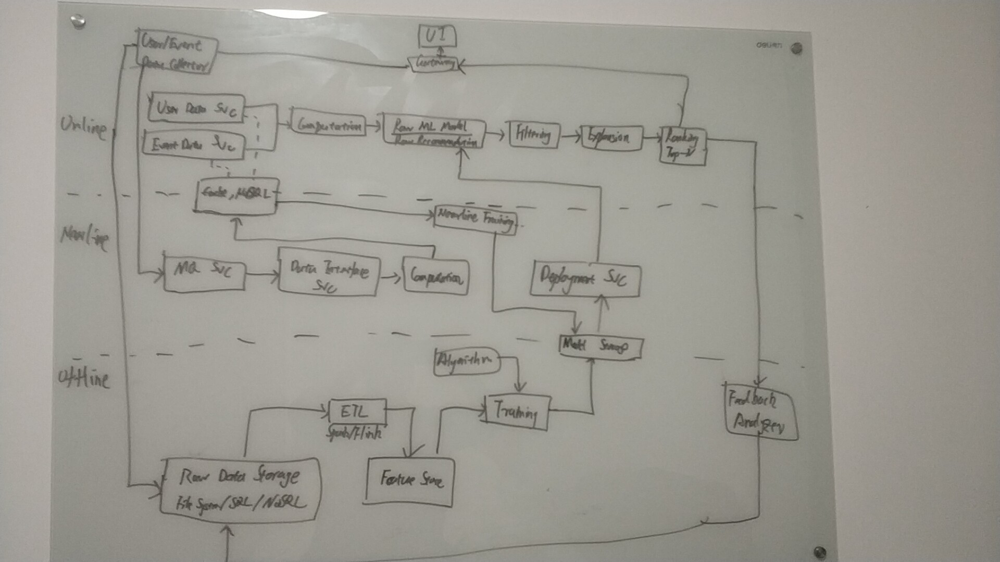
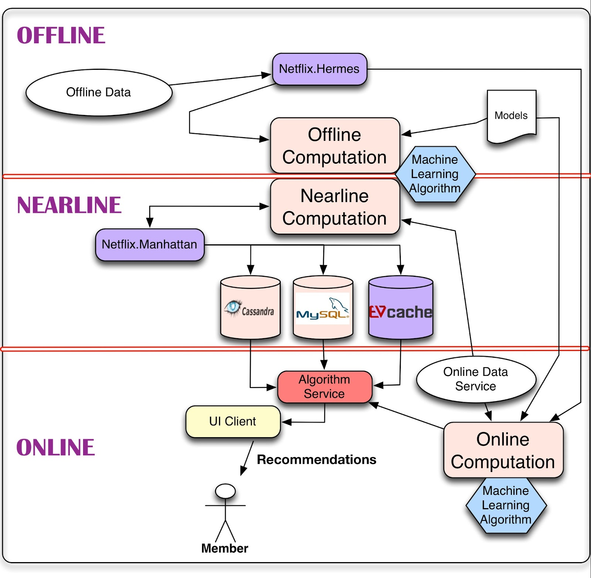
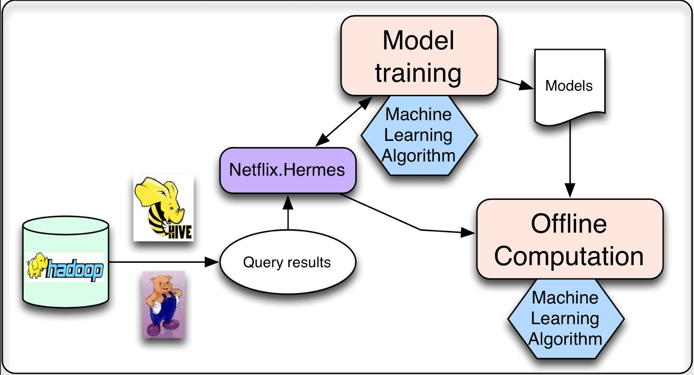
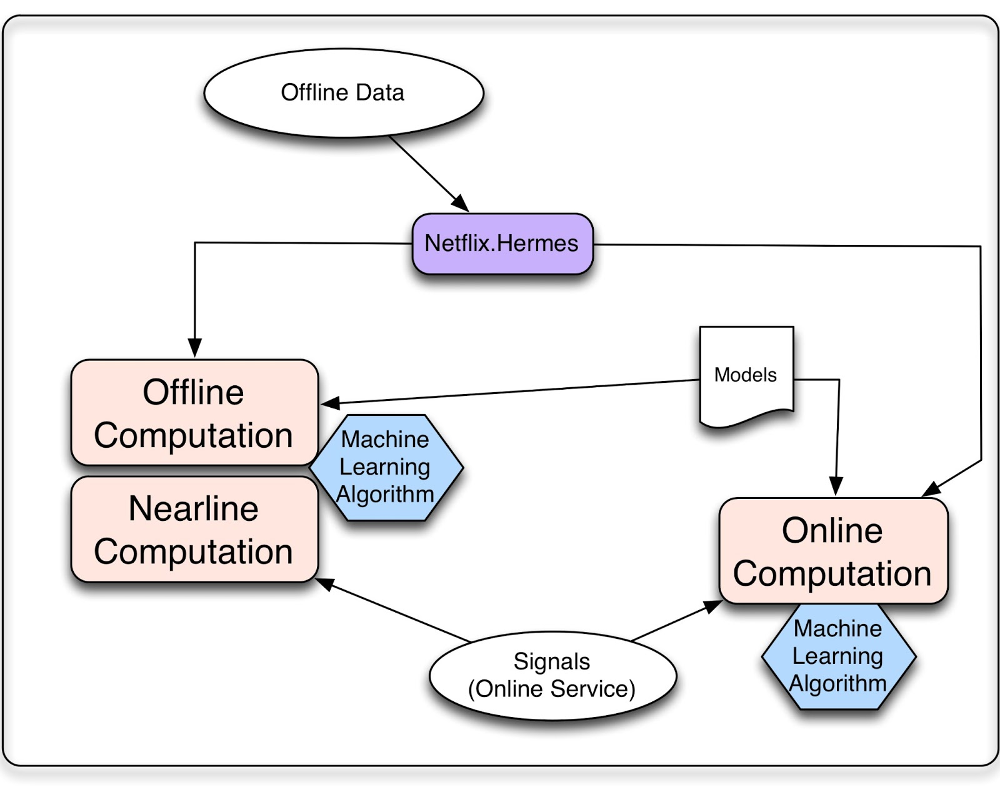
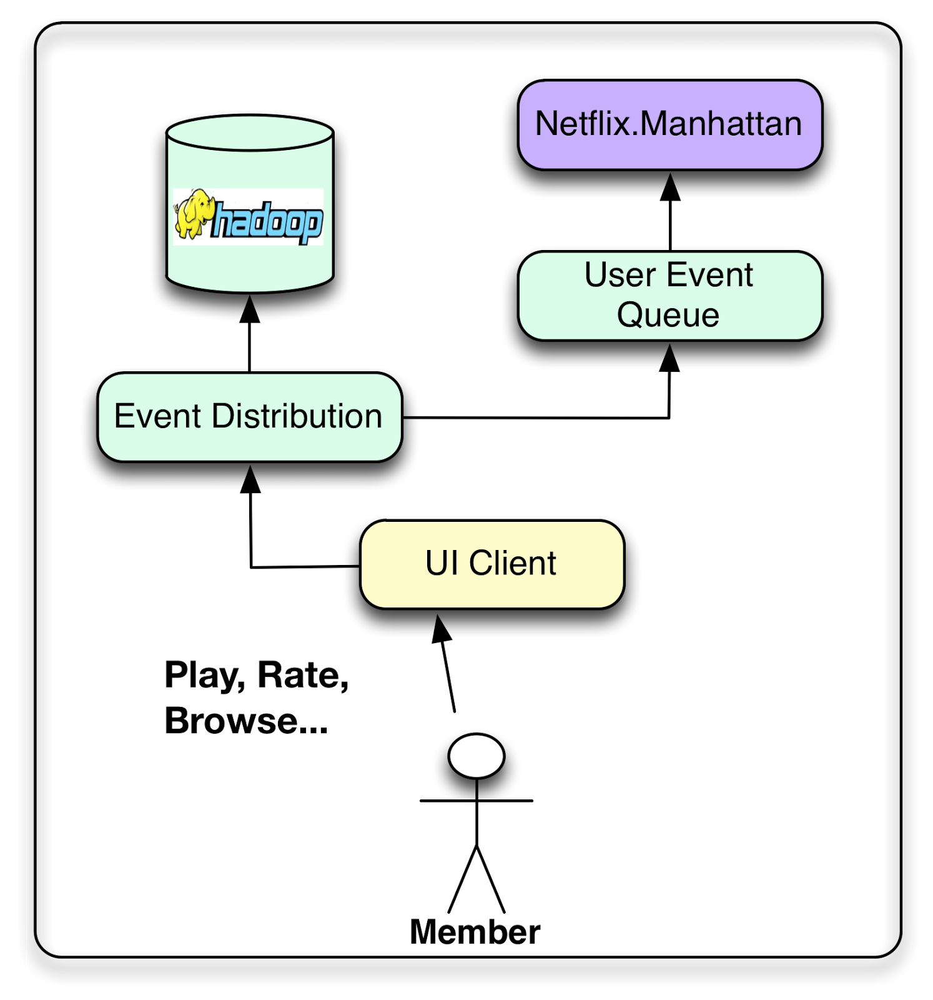
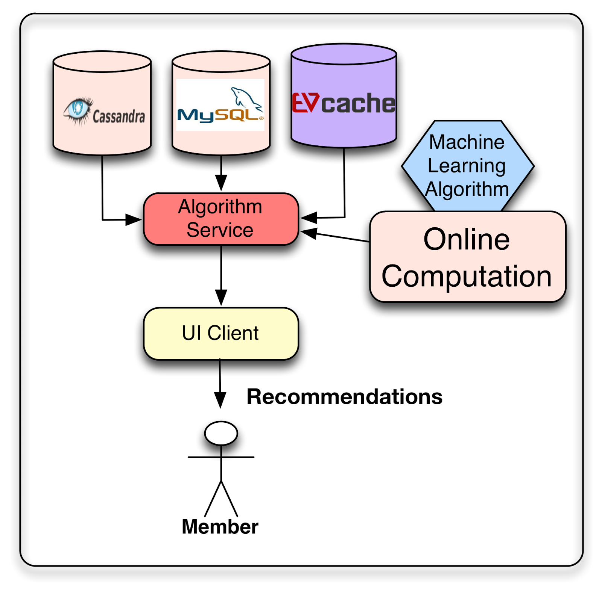

# 
Recommendation System

  

## Architecture
----

  

* 分为离线、近线和在线三部分：

    1. 离线：负责批量数据处理和模型训练，因为离线系统SLA要求低。
    2. 近线：负责数据更新、以及模型部署更新，负责平衡离线和在线的优缺点。
    3. 在线：负责推荐、过滤、解释和排序，因为SLA要求高。

* Gateway负载收集用户和Event数据，并且反馈推荐结果。

* User/Event Data Collector负责把用户和Event相关数据存入离线存储或近线存储。

 

### Online
1. User/Event Data Service

    负责从在线存储（Redis或NoSQL数据库）提取User和Event相关数据。在线存储中的数据应该是近线计算预处理过的数据。

2. Computation

    负责初步处理User和Event数据，寻找较大概率可匹配User的Event数据，其中也可能包含机器学习模型。比如对User A过往记录，判断哪些主题的Event概率较大。然后再去相关的数据库拉取具体Event供后续预测。

3. Raw Recommendation

    After generating the list of user's historical preferences on shows and topics, we put all of those similar shows into raw recommendations.

4. Filtering

    Raw recommendation results cannot directly be presented. Need to filter out events the user has already seen or engaged with, so we can increase the recommendations shows a little more precise.

5. Explanation

    It generates some reasoning for every recommendation result using the user's historical behaviors. For example, we will recommend "American Dad" to a user who had previously watched "Family Guy." The explanation will say, "We recommend 'American Dad' to you because you have watched 'Family Guy'". 

6. Ranking - TopK

 

## Nearline
1. Data Interface Service

    1. 负责新的User和Event数据更新。
    2. 根据前端记录的User和Event相关信息（比如User选择哪些Event、哪些Event越来越火热），更新数据库中相关数据特征。

2. Deployment Service

    负责模型生命周期管理。

  

## Netflix
----

  

**Online components are subject to an availability and response time . This can make it harder to fit complex and computationally costly algorithms in this approach. So it is important to think of a fast fallback mechanism such as reverting to a precomputed result.**

Offline systems have simpler engineering requirements. New algorithms can be deployed in production without the need to put too much effort into performance tuning. This flexibility supports agile innovation.

**Nearline computation can be seen as a compromise between the two previous modes.** Computation is performed exactly like in the online case. However, we remove the requirement to serve results as soon as they are computed and can instead store them, allowing it to be asynchronous. **The nearline computation is done in response to user events so that the system can be more responsive between requests. This opens the door for potentially more complex processing to be done per event.** An example is to update recommendations to reflect that a movie has been watched immediately after a member begins to watch it. Results can be stored in an intermediate caching or storage back-end. Nearline computation is also a natural setting for applying incremental learning algorithms.

In any case, the choice of online/nearline/offline processing is not an either/or question. All approaches can and should be combined.

 

### Offline Jobs

  

There are two main kinds of tasks: model training and batch computation of intermediate or final results. Although most of the models are trained offline in batch mode, we also have some online learning techniques where incremental training is indeed performed online. Batch computation of results is the offline computation process defined above in which we use existing models and corresponding input data to compute results that will be used at a later time either for subsequent online processing or direct presentation to the user.

 

### Signals & Models

  

Regardless of whether we are doing an online or offline computation, we need to think about how an algorithm will handle three kinds of inputs: models, data, and signals. Models are usually small files of parameters that have been previously trained offline. Data is previously processed information that has been stored in some sort of database, such as movie metadata or popularity. We use the term “signals” to refer to fresh information we input to algorithms. This data is obtained from live services and can be made of user-related information, such as what the member has watched recently, or context data such as session, device, date, or time.

 

### Event & Data Distribution

  

Our goal is to collect as many user events as possible. These actions can be related to clicks, browsing, viewing, or even the content of the viewport at any time. Here we try to make a distinction between data and events. We think of events as small units of time-sensitive information that need to be processed with the least amount of latency possible. These events are routed to trigger a subsequent action or process, such as updating a nearline result set. On the other hand, we think of data as more dense information units that might need to be processed and stored for later use. Here the latency is not as important as the information quality and quantity.

At Netflix, near-real-time event flow is managed through an internal framework called Manhattan. Manhattan is a distributed computation system that is central to our algorithmic architecture for recommendation. It is somewhat similar to Twitter’s Storm.

 

### Recommendation Results

  

Recommendation results can be serviced directly from lists that we have previously computed or they can be generated on the fly by online algorithms. Of course, we can think of using a combination of both where the bulk of the recommendations are computed offline and we add some freshness by post-processing the lists with online algorithms that use real-time signals.

At Netflix, we store offline and intermediate results in various repositories to be later consumed at request time: the primary data stores we use are Cassandra, EVCache, and MySQL. MySQL allows for storage of structured relational data that might be required for some future process through general-purpose querying. However, the generality comes at the cost of scalability issues in distributed environments. Cassandra and EVCache both offer the advantages of key-value stores. Cassandra works well in some situations, however in cases where we need intensive and constant write operations we find EVCache to be a better fit. 

  

## Performance
----
可能有上万个用户和Event，如何快速推荐呢？

1. Dimensionality reduction techniques such as clustering.

    因为是对用户推荐Event，可以对Event做聚类，尽量选取相似的。

2. 外排序

    对raw recommendation结果，可能很多。可以分散在各个“桶”中，各个桶单独排序，选取Top-K，再对所有的Top-K进行归并排序。

3. 数据预处理

    - 可以先对Event打标记，根据用户感兴趣的标记类型选择数据，减少检索数量。
    - Reduce the number of customers by randomly sampling the customers or discarding customers with few purchases.
    - Reduce the number of items by discarding very popular or unpopular items.

  

## Challenge
----
1. 冷启动

    3类：

    1. 用户冷启动：当新用户到来时，没有他的行为数据，无法根据历史行为预测兴趣。
    2. 物品冷启动：如何解决将新物品推荐给可能对它感兴趣的用户。
    3. 系统冷启动：系统新上线，用户、物品数据少。

    解决方案：

    1. 提供非个性化推荐：最简单例子是线推荐热门排行榜，然后等用户数据收集到一定时，再切换为个性化推荐。
    2. 利用用户注册时提供的年龄、性别等数据做粗粒度的个性化。
    3. 要求用户首次登录时提供反馈，比如输入感兴趣的标签。
    4. 对新物品，利用内容信息，推荐给喜欢过和它们相似的物品的用户。
    5. 系统冷启动时，可引入专家知识，通过一定高效方式迅速建立起物品的相关度表。

2. 高并发

3. 数据缺失

    现实场景存在用户或物品信息不完善，或部分信息有误。

4. 非结构化信息

    比如图片、视频和音频等。

5. 噪音

    产生垃圾数据，这是ETL和特征工程要解决的。

6. 评估推荐算法价值

    怎么衡量推荐系统价值产出，怎么为推荐系统制定业务指标，通过指标提升推荐系统效果的同时促进业务发展。

  
